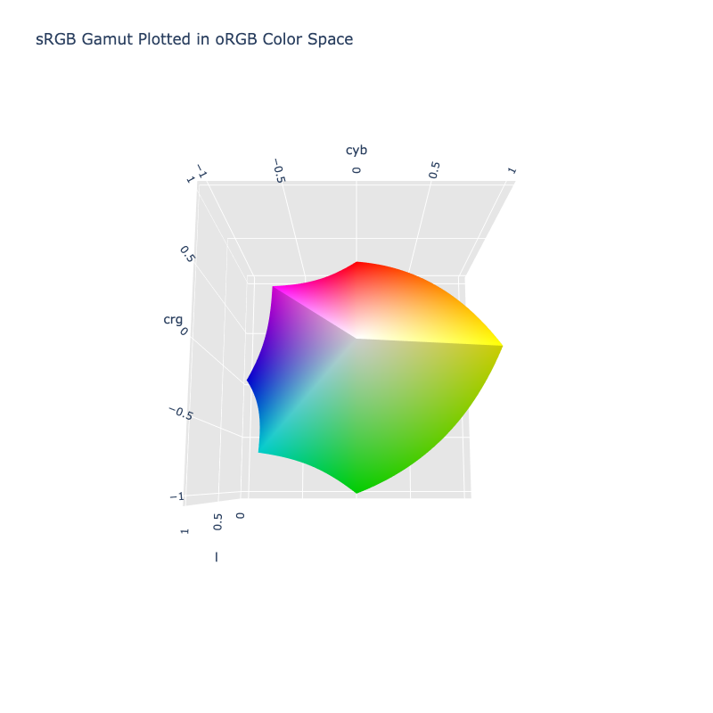

# oRGB

/// failure | The oRGB color space is not registered in `Color` by default
///

/// html | div.info-container
//// info | Properties
    attrs: {class: inline end}

**Name:** `orgb`

**White Point:** D65

**Coordinates:**

Name  | Range^\*^
----- | -----
`l`   | [0, 1]
`cyb` | [-1, 1]
`crg` | [-1, 1]

^\*^ Range denotes _in gamut_ colors, but the color space supports an extended range beyond the gamut.
////

//// html | figure


///// html | figcaption
The sRGB gamut represented within the oRGB color space.
/////
////

A new color model that is based on opponent color theory. Like HSV, it is designed specifically for computer graphics.
However, it is also designed to work well for computational applications such as color transfer, where HSV falters.
Despite being geared towards computation, oRGB's natural axes facilitate HSV-style color selection and manipulation.
oRGB also allows for new applications such as a quantitative cool-to-warm metric, intuitive color manipulations and
variations, and simple gamut mapping. This new color model strikes a balance between simplicity and the computational
qualities of color spaces such as CIELab.

[Learn more](https://graphics.stanford.edu/~boulos/papers/orgb_sig.pdf).
///

## Channel Aliases

Channels | Aliases
-------- | -------
`l`      | `luma`
`cyb`    |
`crb`    |

## Input/Output

The oRGB space is not currently supported in the CSS spec, the parsed input and string output formats use the
`#!css-color color()` function format using the custom name `#!css-color --orgb`:

```css-color
color(--orgb l cyb crb / a)  // Color function
```

The string representation of the color object and the default string output use the
`#!css-color color(--orgb l cyb crg / a)` form.

```py play
Color("orgb", [0.299, 0.00002, 0.99998])
Color("orgb", [0.67882, 0.75654, 0.4464]).to_string()
```

## Registering

```py
from coloraide import Color as Base
from coloraide.spaces.orgb import oRGB

class Color(Base): ...

Color.register(oRGB())
```
