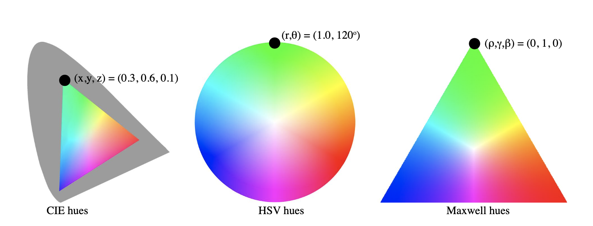

# Prismatic

!!! failure "The oRGB color space is not registered in `Color` by default"

<div class="info-container" markdown>
!!! info inline end "Properties"

    **Name:** `prismatic`

    **White Point:** D65

    **Coordinates:**

    Name | Range
    ---- | -----
    `l`  | [0, 1]
    `r`  | [0, 1]
    `g`  | [0, 1]
    `b`  | [0, 1]

<figure markdown>



<figcaption markdown>
Prismatic Illustrations
</figcaption>
</figure>

The Prismatic model introduces a simple transform of the RGB color cube into a light/dark dimension and a 2D hue. The
hue is a normalized (barycentric)triangle with pure red, green, and blue at the vertices, often called the Maxwell Color
Triangle.  Each cross section of the space is the same barycentric triangle, and the light/dark dimension runs zero to
one for each hue so the whole color volume takes the form of a prism.

[Learn more](http://psgraphics.blogspot.com/2015/10/prismatic-color-model.html).
</div>

## Channel Aliases

Channels | Aliases
-------- | -------
`l`      | `lightness`
`r`      | `red`
`g`      | `green`
`b`      | `blue`

## Input/Output

The Prismatic space is not currently supported in the CSS spec, the parsed input and string output formats use
the `#!css-color color()` function format using the custom name `#!css-color --prismatic`:

```css-color
color(--prismatic l r g b / a)  // Color function
```

The string representation of the color object and the default string output use the
`#!css-color color(--prismatic l r g b / a)` form.

```playground
Color("prismatic", [1, 1, 0, 0])
Color("prismatic", [1, 0.60714, 0.39286, 0], 1).to_string()
```

## Registering

```py
from coloraide import Color as Base
from coloraide.spaces.prismatic import Prismatic

class Color(Base): ...

Color.register(Prismatic())
```
