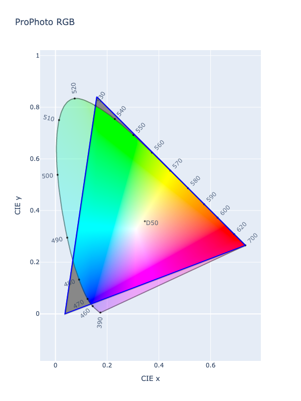

# ProPhoto

/// success | The ProPhoto color space is registered in `Color` by default
///

/// html | div.info-container
//// info | Properties
    attrs: {class: inline end}

**Name:** `prophoto-rgb`

**White Point:** D50

**Coordinates:**

Name | Range^\*^
---- | -----
`r`  | [0, 1]
`g`  | [0, 1]
`b`  | [0, 1]

^\*^ Range denotes _in gamut_ colors, but the color space supports an extended range beyond the gamut.
////

//// html | figure


///// html | figcaption
CIE 1931 xy Chromaticity -- ProPhoto RGB Chromaticities
/////
////

The ProPhoto RGB color space, also known as ROMM RGB (Reference Output Medium Metric), is an output referred RGB color
space developed by Kodak. It offers an especially large gamut designed for use with photographic output in mind. The
ProPhoto RGB color space encompasses over 90% of possible surface colors in the [CIE L\*a\*b\*](#cielab) color space,
and 100% of likely occurring real-world surface colors documented by Pointer in 1980.

_[Learn about ProPhoto](https://en.wikipedia.org/wiki/ProPhoto_RGB_color_space)_
///

## Channel Aliases

Channels | Aliases
-------- | -------
`r`      | `red`
`g`      | `green`
`b`      | `blue`

## Input/Output

Parsed input and string output formats support all valid CSS forms:

```css-color
color(prophoto-rgb r g b / a)  // Color function
```

When manually creating a color via raw data or specifying a color space as a parameter in a function, the color
space name is always used:

```py
Color("prophoto-rgb", [0, 0, 0], 1)
```

The string representation of the color object and the default string output will be in the
`#!css-color color(prophoto-rgb r g b / a)` form.

```py play
Color("prophoto-rgb", [0.78951, 0.62329, 0.21172], 1)
Color("prophoto-rgb", [0.70225, 0.27572, 0.10355]).to_string()
```

## Registering

```py
from coloraide import Color as Base
from coloraide.spaces.prophoto_rgb import ProPhotoRGB

class Color(Base): ...

Color.register(ProPhotoRGB())
```
