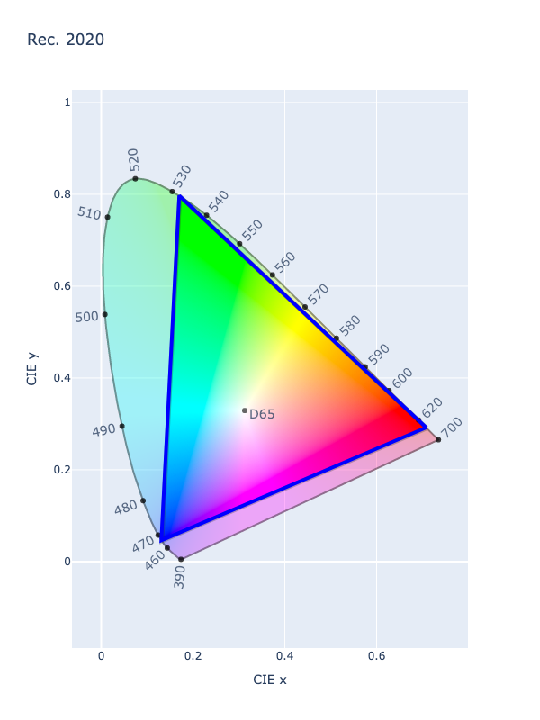

# Linear REC. 2020

/// success | The Linear Rec. 2020 color space is registered in `Color` by default
///

/// html | div.info-container
//// info | Properties
    attrs: {class: inline end}

**Name:** `rec2020-linear`

**White Point:** D65

**Coordinates:**

Name | Range^\*^
---- | -----
`r`  | [0, 1]
`g`  | [0, 1]
`b`  | [0, 1]

^\*^ Range denotes _in gamut_ colors, but the color space supports an extended range beyond the gamut.
////

//// html | figure


///// html | figcaption
CIE 1931 xy Chromaticity -- Rec. 2020 Chromaticities
/////
////

The Linear Rec. 2020 space is the same as [Rec. 2020](./rec2020.md) *except* that the transfer function is linear-light
(there is no gamma-encoding).

_[Learn about REC.2020](https://en.wikipedia.org/wiki/Rec._2020)_

///

## Channel Aliases:**

Channels | Aliases
-------- | -------
`r`      | `red`
`g`      | `green`
`b`      | `blue`

## Input/Output

Linear Rec. 2020 is not supported via the CSS spec and the parser input and string output only supports the
`#!css-color color()` function format using the custom name `#!css-color --rec2020-linear`:

```css-color
color(--rec2020-linear r g b / a)  // Color function
```

When manually creating a color via raw data or specifying a color space as a parameter in a function, the color
space name is always used:

```py
Color("rec2020-linear", [0, 0, 0], 1)
```

The string representation of the color object and the default string output will be in the
`#!css-color color(--rec2020-linear r g b / a)` form.

```py play
Color("rec2020-linear", [0.6274, 0.0691, 0.01639])
Color("rec2020-linear", [0.7513, 0.41509, 0.04951]).to_string()
```

## Registering

```py
from coloraide import Color as Base
from coloraide.spaces.rec2020_linear import Rec2020Linear

class Color(Base): ...

Color.register(Rec2020Linear())
```
