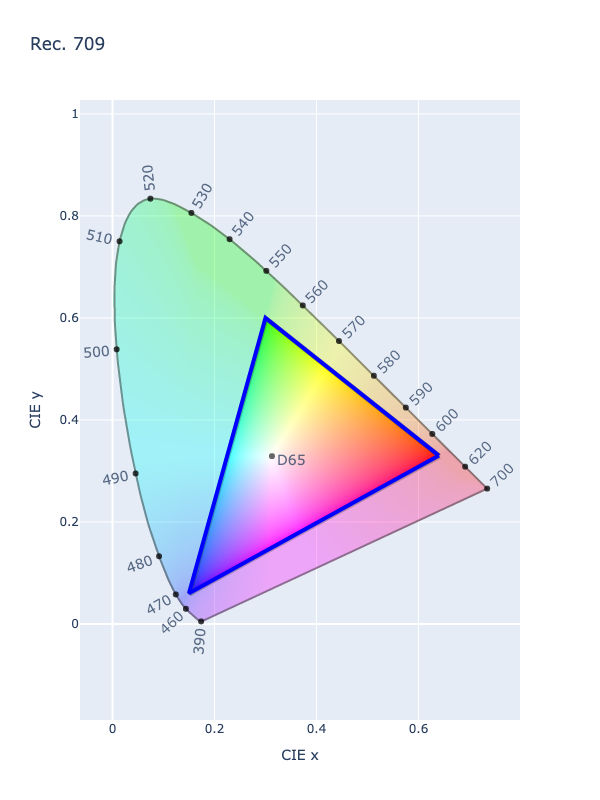

# Rec. 709

/// new | New 2.4
///

/// failure | The Rec. 709 color space is not registered in `Color` by default
///

/// html | div.info-container
//// info | Properties
    attrs: {class: inline end}

**Name:** `rec709`

**White Point:** D65

**Coordinates:**

Name | Range^\*^
---- | -----
`r`  | [0, 1]
`g`  | [0, 1]
`b`  | [0, 1]

^\*^ Range denotes _in gamut_ colors, but the color space supports an extended range beyond the gamut.
////

//// html | figure


///// html | figcaption
CIE 1931 xy Chromaticity -- Rec. 709 Chromaticities
/////
////

Rec. 709 (also known as Rec.709, BT.709, and ITU 709) is a standard developed by ITU-R for image encoding and signal
characteristics of high-definition television (HDTV). The color space is similar to [sRGB](./srgb.md) in the fact that
the primary chromaticities and white points are identical, the difference is the transfer function that more resembles
[Rec. 2020](./rec2020.md), though the precision of the constants are at 10 bit instead of 12 bit or greater.

_[Learn about Rec. 709](https://en.wikipedia.org/wiki/Rec._709)_
///

## Channel Aliases

Channels | Aliases
-------- | -------
`r`      | `red`
`g`      | `green`
`b`      | `blue`

## Input/Output

Rec. 709 is not supported via the CSS spec and the parser input and string output only supports the
`#!css-color color()` function format using the custom name `#!css-color --rec709`:

```css-color
color(--rec709 r g b / a)  // Color function
```

When manually creating a color via raw data or specifying a color space as a parameter in a function, the color
space name is always used:

```py
Color("rec709", [0, 0, 0], 1)
```

The string representation of the color object and the default string output will be in the
`#!css-color color(--rec709 r g b / a)` form.

```py play
Color("rec709", [1, 0, 0], 1)
Color("rec709", [1, 0.60879, 0], 1).to_string()
```

## Registering

```py
from coloraide import Color as Base
from coloraide.spaces.rec709 import Rec709

class Color(Base): ...

Color.register(Rec709())
```
