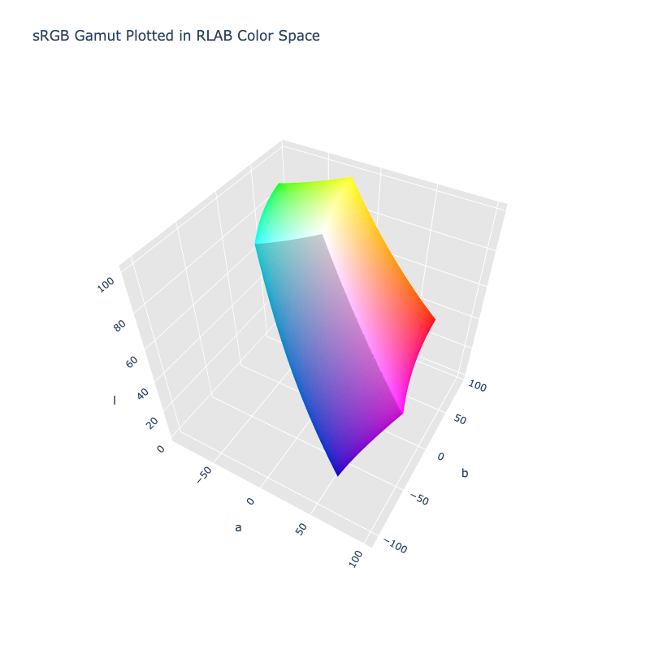

# RLAB

!!! failure "The RLAB color space is not registered in `Color` by default"

<div class="info-container" markdown>
!!! info inline end "Properties"

    **Name:** `rlab`

    **White Point:** D65

    **Coordinates:**

    Name | Range
    ---- | -----
    `l`  | [0, 100]
    `a`  | [-125, 125]
    `b`  | [-125, 125]

    ^\*^ Space is not bound to the range and is only used as a reference to define percentage inputs/outputs in
    relation to the Display P3 color space.

<figure markdown>



<figcaption markdown>
The sRGB gamut represented within the RLAB color space.
</figcaption>
</figure>

The RLAB color-appearance space was developed by Fairchild and Berns for cross-media color reproduction applications in
which images are reproduced with differing white points, luminance levels, and/or surrounds.

[Learn more](https://scholarworks.rit.edu/cgi/viewcontent.cgi?article=1153&context=article).
</div>

## Channel Aliases

Channels | Aliases
-------- | -------
`l`      | `lightness`
`a`      |
`b`      |

## Input/Output

The RLAB space is not currently supported in the CSS spec, the parsed input and string output formats use the
`#!css-color color()` function format using the custom name `#!css-color --rlab`:

```css-color
color(--rlab l a b / a)  // Color function
```

The string representation of the color object and the default string output use the
`#!css-color color(--rlab l a b / a)` form.

```playground
Color("rlab", [51.012, 79.742, 57.26])
Color("rlab", [72.793, 25.151, 74.11]).to_string()
```

## Registering

```py
from coloraide import Color as Base
from coloraide.spaces.rlab import RLAB

class Color(Base): ...

Color.register(RLAB())
```
