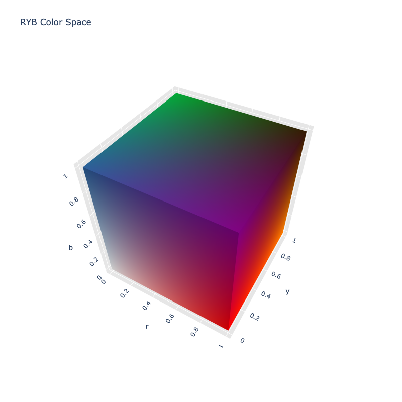

# RYB

/// failure | The RYB color space is not registered in `Color` by default
///

/// html | div.info-container
//// info | Properties
    attrs: {class: inline end}

**Name:** `ryb`

**White Point:** D65 / 2˚

**Coordinates:**

Name | Range
---- | -----
`r`  | [0, 1]
`y`  | [0, 1]
`b`  | [0, 1]

////

//// html | figure

```py play wheel
Color('ryb', [1, 0, 0]).harmony('wheel', space='ryb')
```
///// html | figcaption
The RYB color wheel.
/////
////

The RYB color model is a subtractive color model in which red, yellow and blue pigments or dyes are added together
in various ways to reproduce different colors. RYB is the classical way of thinking about colors. While in schools it
is often still taught that red, yellow, and blue are the primary colors (for pigments), modern wisdom shows that these
"primaries" are not sufficient. Spaces like CMYK which use cyan, magenta and yellow can create a much wider array of
colors, even red, yellow, and blue. We've also since learned that the primary colors of light (which operates in an
additive color space) are red, green, and blue.

Even though in modern day electronic screens and printing we rely on color models such as RGB and CMYK, RYB still holds
a special place with artists. Color harmony is often used as the model when talking about color harmonies.

There is no standard RYB color model. No standard primaries. The RYB model that ColorAide implements is based on the
work of Nathan Gossett and Baoquan Chen at the University of Minnesota at Twin Cities. Their paper devised an approach
of using trilinear interpolation to create a transform from RYB to sRGB. The bases of the model uses colors similar to
Johannes Itten's color wheel (which we showed an example of above), but in all the literature, there are variants of the
same color wheel and no precise color codes.

ColorAide implements Gossett and Chen's algorithm to convert from RYB to sRGB, but also uses an algorithm that employs
Newton's method to approximates the reverse transform. Additionally, their paper implements an easing function that
biases the color transforms to corners of the cube. While we've also implemented this behavior to be true to the paper,
the color spaces does not utilize this biasing by default, but we provide an alternative version that does. The biasing
does not improve the color space, but limits the intermediate colors, essentially clumping them near the corners of the
RYB color cube which was a requirement for the types of data representations that they were performing.

Notice how the colors in the "biased" RYB  are more concentrated at the corners while in the normal RYB they blend more.

//// tab | RYB

////

//// tab | RYB Biased

////


While precisely emulating paint mixing was not entirely the focus, the RYB space does do a better job than other color
spaces.

```py play
Color.interpolate(['color(--ryb 0 0 1)', 'color(--ryb 0 1 0)'], space='ryb')
Color.interpolate(['color(--ryb 1 0 0)', 'color(--ryb 0 1 0)'], space='ryb')
Color.interpolate(['color(--ryb 1 0 1)', 'color(--ryb 0 1 0)'], space='ryb')
```

It should also be noted that when mixing all the colors, you do not get black, but a muddy brown, much like with
paint. To be precise, the color black is not defined within this color space.

```py play
Color.interpolate(['color(--ryb 0 0 0)', 'color(--ryb 1 1 1)'], space='ryb')
Color.interpolate(['color(--ryb 0 0 1)', 'color(--ryb 1 1 1)'], space='ryb')
```

It should be noted that the RYB model does a great job at translating colors within the RYB color gamut, but translation
of colors outside the gamut will have poor conversions.

[Learn more](http://bahamas10.github.io/ryb/assets/ryb.pdf).
///

## Channel Aliases

Channels | Aliases
-------- | -------
`r`      | `red`
`y`      | `yellow`
`b`      | `blue`

## Input/Output

RYB is not currently supported in the CSS spec, the parsed input and string output formats use the
`#!css-color color()` function format using the custom name `#!css-color --ryb`:

```css-color
color(--ryb r y b / a)  // Color function
```

The string representation of the color object and the default string output use the
`#!css-color color(--ryb r y b / a)` form.

```py play
Color("ryb", [1, 0, 0])
Color("ryb", [1, 1, 0]).to_string()
```

## Registering

```py
from coloraide import Color as Base
from coloraide.spaces.ryb import RYB

class Color(Base): ...

Color.register(RYB())
```

## RYB Biased

The biased RYB from Gosset and Chen's paper can be used via the `ryb-biased` color space, CSS custom name
`#!css-color --ryb-biased`. It has the same channel ranges as `ryb`, but conversions will be biased to the corners of
the RYB cube.

```py play
Color.interpolate(Color('ryb', [1, 0, 0]).harmony('wheel', space='ryb'), space='ryb')
Color.interpolate(Color('ryb-biased', [1, 0, 0]).harmony('wheel', space='ryb-biased'), space='ryb-biased')
```

Space can be registered via:

```py
from coloraide import Color as Base
from coloraide.spaces.ryb import RYBBiased

class Color(Base): ...

Color.register(RYBBiased())
```
