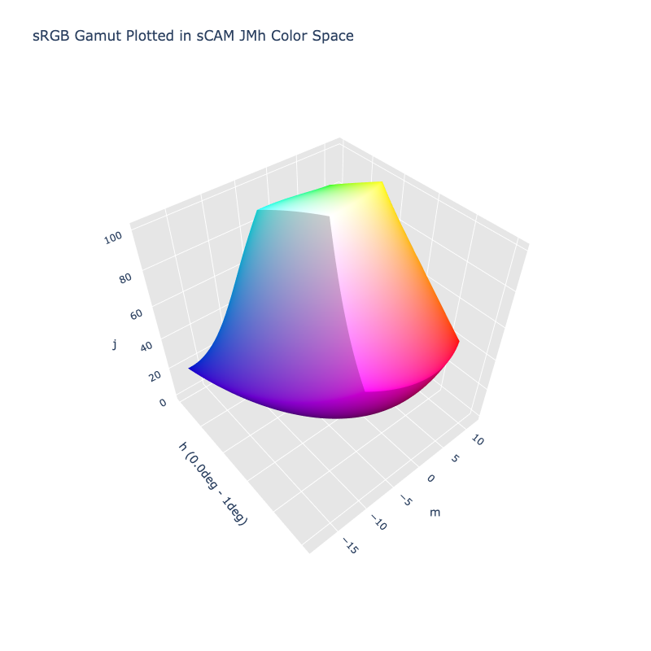

# sCAM JMh

> [!failure] The sCAM JMh color space is not registered in `Color` by default

/// html | div.info-container
> [!info | inline | end] Properties
> **Name:** `scam-jmh`
>
> **White Point:** D65 / 2˚
>
> **Coordinates:**
>
> Name | Range^\*^
> ---- | -----
> `j`  | [0, 100]
> `m`  | [0, 25]
> `h`  | [0, 360)
>
> ^\*^ Space is not bound to the range and is only used as a reference to define percentage inputs/outputs in
> relation to the Display P3 color space.


//// figure-caption
The sRGB gamut represented within the sCAM JMh color space.
////

A color appearance model (CAM) is a mathematical model that seeks to describe the perceptual aspects of human color
vision, i.e. viewing conditions under which the appearance of a color does not tally with the corresponding physical
measurement of the stimulus source.

The simple Color Appearance Model (sCAM) is a CAM model that is built on top of the simple Uniform Color Space (sUCS)
whose structure is based on that of [IPT](./ipt.md) and [CAM16-UCS](./cam16-ucs.md) for their hue linearity, and
space uniformity, respectively. The model has a simple structure but provides comprehensive functions for color related
applications.

The model defines numerous different attributes:

Name | Description
---- | -----------
J    | Lightness
C    | Chroma
h    | hue
Q    | Brightness
M    | Colorfulness
D    | Saturation
V    | Vividness
W    | Whiteness
K    | Blackness
H    | Hue Quadrature

A color space can be constructed by using a subset of these attributes: JMh, JCh, QMh, etc. The provided color
spaces uses JMh.

[Learn more](https://opg.optica.org/oe/fulltext.cfm?uri=oe-29-4-6036&id=447640).
///

## Channel Aliases

Channels | Aliases
-------- | -------
`j`      | `lightness`
`m`      | `colorfulness`
`h`      | `hue`

## Input/Output

The sCAM JMh space is not currently supported in the CSS spec, the parsed input and string output formats use the
`#!css-color color()` function format using the custom name `#!css-color --scam-jmh`:

```css-color
color(--scam-jmh j m h / a)  // Color function
```

The string representation of the color object and the default string output use the
`#!css-color color(--scam-jmh j m h / a)` form.

```py play
Color("scam-jmh", [54.635, 15.852, 29.937], 1)
Color("scam-jmh", [74.208, 11.547, 67.919], 1).to_string()
```

## Registering

```py
from coloraide import Color as Base
from coloraide.spaces.scam import sCAMJMh

class Color(Base): ...

Color.register(sCAMJMh())
```
