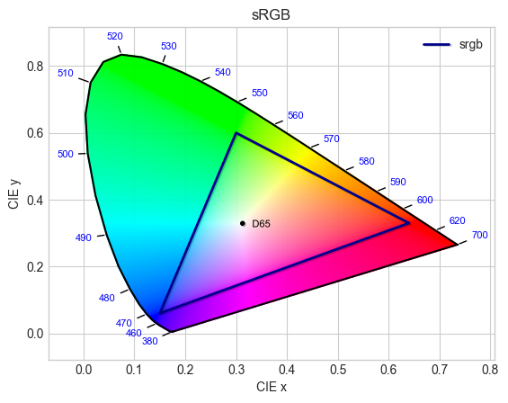

# sRGB

/// success | The sRGB color space is registered in `Color` by default
///

/// html | div.info-container
//// info | Properties
    attrs: {class: inline end}

**Name:** `srgb`

**White Point:** D65

**Coordinates:**

Name | Range^\*^
---- | -----
`r`  | [0, 1]
`g`  | [0, 1]
`b`  | [0, 1]

^\*^ Range denotes _in gamut_ colors, but the color space supports an extended range beyond the gamut.
////

//// html | figure


///// html | figcaption
CIE 1931 xy Chromaticity -- sRGB Chromaticities
/////
////

The sRGB space is a standard RGB (red, green, blue) color space that HP and Microsoft created cooperatively in 1996 to
use on monitors, printers, and the Web. sRGB stands for "Standard RGB". It is the most widely used color space and is
supported by most operating systems, software programs, monitors, and printers.

_[Learn about sRGB](https://en.wikipedia.org/wiki/SRGB)_
///

## Channel Aliases

Channels | Aliases
-------- | -------
`r`      | `red`
`g`      | `green`
`b`      | `blue`

## Input/Output

Parsed input and string output formats support all valid CSS forms:

```css-color
black                  // Color name
#RRGGBBAA              // Hex
rgb(r g b / a)         // RGB function
rgb(r, g, b)           // Legacy RGB Function
rgba(r, g, b, a)       // Legacy RGBA function
color(srgb r g b / a)  // Color function
```

When manually creating a color via raw data or specifying a color space as a parameter in a function, the color
space name is always used:

```py
Color("srgb", [0, 0, 0], 1)
```
The string representation of the color object will always default to the `#!css-color color(srgb r g b / a)`
form, but the default string output will be the `#!css-color rgb(r g b / a)` form.

```py play
Color('red').to_string()
Color('orange').to_string(comma=True)
Color('yellow').to_string(percent=True)
Color('green').to_string(names=True)
Color('blue').to_string(hex=True)
Color('indigo').to_string(color=True)
```

## Registering

```py
from coloraide import Color as Base
from coloraide.spaces.srgb.css import sRGB

class Color(Base): ...

Color.register(sRGB())
```
