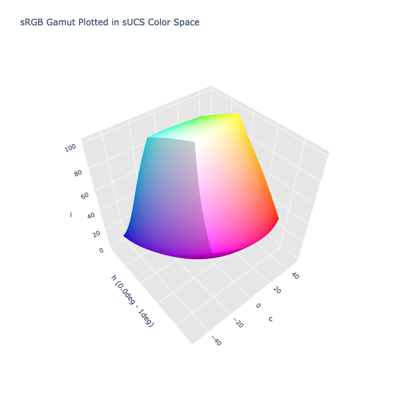

# sUCS

> [!failure] The sUCS color space is not registered in `Color` by default

/// html | div.info-container
> [!info | inline | end] Properties
> **Name:** `sucs`
>
> **White Point:** D65 / 2˚
>
> **Coordinates:**
>
> Name | Range^\*^
> ---- | -----
> `jz`  | [0, 100]
> `mz`  | [0, 65]
> `hz`  | [0, 360)
>
> ^\*^ Space is not bound to the range and is only used as a reference to define percentage inputs/outputs in
> relation to the Display P3 color space.


//// figure-caption
The sRGB gamut represented within the sUCS color space.
////

The sUCS (simple Uniform Color Space) is a new uniform color space developed as the base on which [sCAM](./scam_jmh.md)
(simple Color Apperance Model) was built upon. The structure of sUCS is based on the structure of [IPT](./ipt.md) and
[CAM16-UCS](./cam16-ucs.md) for their hue linearity, and space uniformity, respectively.

> [!note]
> Since sUCS uses the IPT LMS transfrom, the D65 white point we use is the same one that IPT was defined to use:
> `#!py [0.9504, 1.0, 1.0889]`. This is the only D65 white point that will provide a clean transform from the white
> point to an LMS of `#!py [1.0, 1.0, 1.0]`, without adapting the transform to accomodate a different white point. It's
> possible that other implementations may not use this D65 white point and will not have clean conversions.

[Learn more](https://opg.optica.org/oe/fulltext.cfm?uri=oe-29-4-6036&id=447640).
///

## Channel Aliases

Channels | Aliases
-------- | -------
`i`      | `intensity`
`c`      | `chroma`
`h`      | `hue`

## Input/Output

The sUCS space is not currently supported in the CSS spec, the parsed input and string output formats use the
`#!css-color color()` function format using the custom name `#!css-color --sucs`:

```css-color
color(--sucs i c h / a)  // Color function
```

The string representation of the color object and the default string output use the
`#!css-color color(--sucs i c h / a)` form.

```py play
Color("sucs", [54.706, 55.669, 29.936], 1)
Color("sucs", [54.635, 15.852, 29.936], 1).to_string()
```

## Registering

```py
from coloraide import Color as Base
from coloraide.spaces.sucs import sUCS

class Color(Base): ...

Color.register(sUCS())
```
