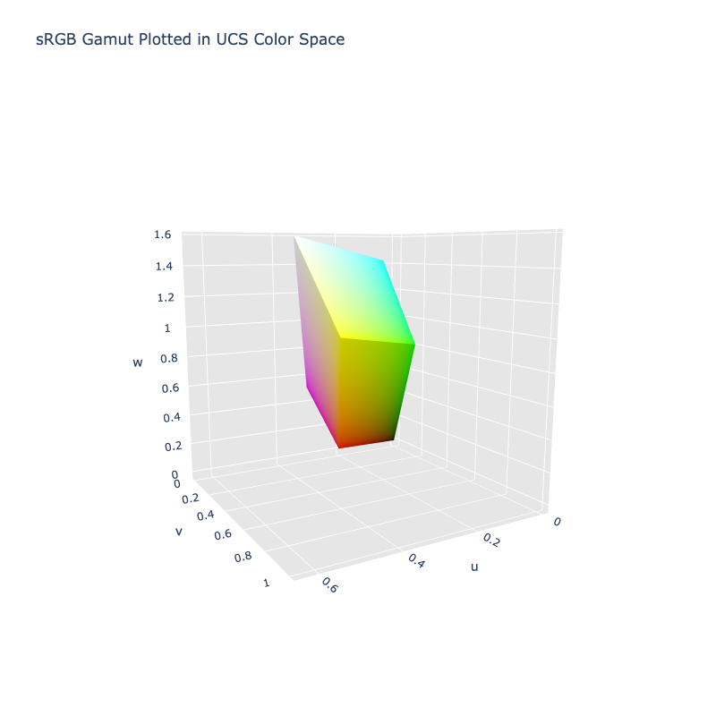

# CIE 1960 UCS

/// new | New 2.4
///

/// failure | The CIE 1960 UCS color space is not registered in `Color` by default
///

/// html | div.info-container
//// info | Properties
    attrs: {class: inline end}

**Name:** `ucs`

**White Point:** D65

**Coordinates:**

Name | Range^\*^
---- | -----
`u`  | [0.0, 1.0]
`v`  | [0.0, 1.0]
`w`  | [0.0, 1.0]

^\*^ Space is not bound to the range and is used to define percentage inputs/outputs.
////

//// html | figure


///// html | figcaption
The sRGB gamut represented within the CIE 1960 UCS color space.
/////
////

The CIE 1960 color space ("CIE 1960 UCS", variously expanded Uniform Color Space, Uniform Color Scale, Uniform
Chromaticity Scale, Uniform Chromaticity Space) is another name for the (u, v) chromaticity space devised by David
MacAdam. The color space is implemented using the relation between this space and the XYZ space as coordinates U, V, and
W.

[Learn more](https://en.wikipedia.org/wiki/CIE_1960_color_space).
///

## Channel Aliases

Channels | Aliases
-------- | -------
`u`      |
`v`      |
`w`      |

## Input/Output

The UCS space is not currently supported in the CSS spec, the parsed input and string output formats use the
`#!css-color color()` function format using the custom name `#!css-color --ucs`:

```css-color
color(--ucs u v w / a)  // Color function
```

The string representation of the color object and the default string output use the
`#!css-color color(--ucs u v w / a)` form.

```py play
Color("ucs", [0.27493, 0.21264, 0.12243])
Color("ucs", [0.36462, 0.48173, 0.48122]).to_string()
```

## Registering

```py
from coloraide import Color as Base
from coloraide.spaces.ucs import UCS

class Color(Base): ...

Color.register(UCS())
```

<style>
.info-container {display: inline-block;}
</style>
