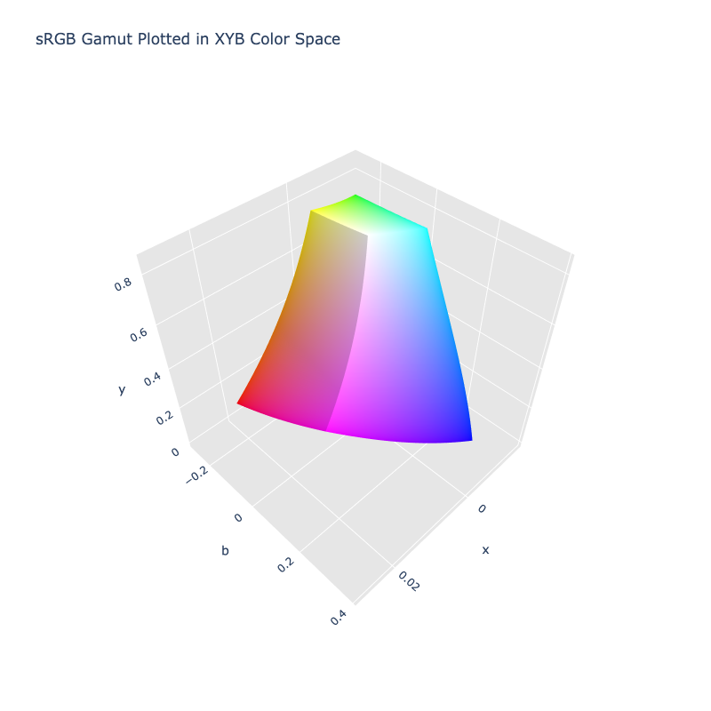

# XYB

/// failure | The XYB color space is not registered in `Color` by default
///

/// html | div.info-container
//// info | Properties
    attrs: {class: inline end}

**Name:** `xyb`

**White Point:** D65

**Coordinates:**

Name | Range^\*^
---- | -----
`x`  | [-0.45, 0.45]
`y`  | [0.0, 0.845]
`b`  | [-0.45, 0.45]

^\*^ Space is not bound to the range and is only used as a reference to define percentage inputs/outputs.
////

//// html | figure


///// html | figcaption
The sRGB gamut represented within the XYB color space.
/////
////

XYB is a color space that was designed for use with the JPEG XL Image Coding System. It is an LMS-based color model
inspired by the human visual system, facilitating perceptually uniform quantization. It uses a gamma of 3 for
computationally efficient decoding.

//// tip | Chroma/Luma Adjustments
Per the creator, the default subtracts the Y component from the B component which makes Y function as lightness and X
and Y like Lab a and b. When X=Y=0, the color is achromatic. You may find other implementations do not do this only
because it is not documented well.
////

[Learn more](https://ds.jpeg.org/whitepapers/jpeg-xl-whitepaper.pdf).
///

## Channel Aliases

Channels | Aliases
-------- | -------
`x`      |
`y`      |
`b`      |

**Inputs**

The XYB space is not currently supported in the CSS spec, the parsed input and string output formats use the
`#!css-color color()` function format using the custom name `#!css-color --xyb`:

```css-color
color(--xyb x y b / a)  // Color function
```

The string representation of the color object and the default string output use the
`#!css-color color(--xyb x y b / a)` form.

```py play
Color("xyb", [0.0281, 0.48819, 0.01157])
Color("xyb", [0.01132, 0.64596, -0.10359]).to_string()
```

## Registering

```py
from coloraide import Color as Base
from coloraide.spaces.xyb import XYB

class Color(Base): ...

Color.register(XYB())
```
