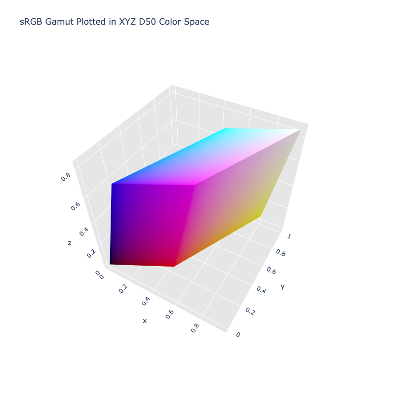

# XYZ D50

!!! success "The XYZ D50 color space is registered in `Color` by default"

<div class="info-container" markdown>
!!! info inline end "Properties"

    **Name:** `xyz-d50`

    **White Point:** D50

    **Coordinates:**

    Name       | Range^\*^
    ---------- | ---------
    `x`        | [0, 1]
    `y`        | [0, 1]
    `z`        | [0, 1]

    ^\*^ Space is not bound to the range and is only used as a reference to define percentage inputs/outputs.

<figure markdown>



<figcaption markdown>
The sRGB gamut represented within the XYZ D50 color space.
</figcaption>
</figure>

XYZ D50 is the same as [XYZ D65](./xyz_d65.md) except it uses a D50 white point.

_[Learn about XYZ](https://en.wikipedia.org/wiki/CIE_1931_color_space)_
</div>

## Channel Aliases

Channels    | Aliases
----------- | -------
`x`         |
`y`         |
`z`         |

## Input/Output

Parsed input and string output formats support all valid CSS forms:

```css-color
color(xyz-d50 x y z / a)  // Color function
```

When manually creating a color via raw data or specifying a color space as a parameter in a function, the color
space name is always used:

```py
Color("xyz-d50", [0, 0, 0], 1)
```

The string representation of the color object and the default string output will be in the
`#!css-color color(xyz x y z / a)` form.

```playground
Color("xyz-d50", [0.43607, 0.22249, 0.01392])
Color("xyz-d50", [0.58098, 0.49223, 0.05045]).to_string()
```

## Registering

```py
from coloraide import Color as Base
from coloraide.spaces.xyz_d50 import XYZD50

class Color(Base): ...

Color.register(XYZD50())
```
