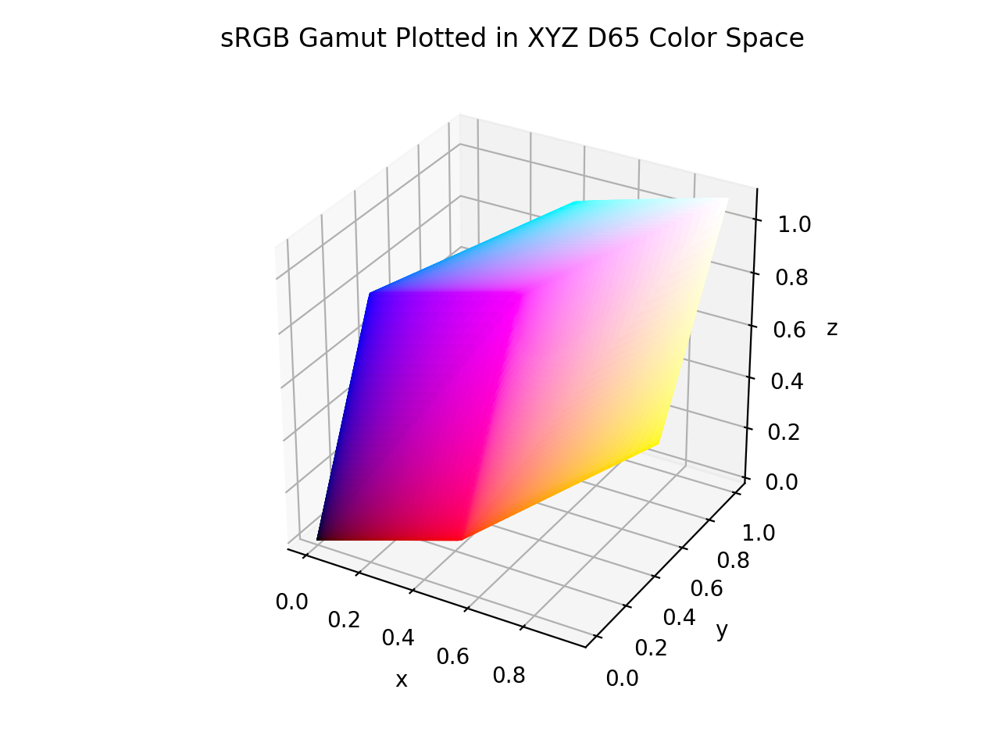

# XYZ D65

/// success | The XYZ D65 color space is registered in `Color` by default
///

/// html | div.info-container
//// info | Properties
    attrs: {class: inline end}

**Name:** `xyz-d65`

**White Point:** D65

**Coordinates:**

Name       | Range^\*^
---------- | ---------
`x`        | [0, 1]
`y`        | [0, 1]
`z`        | [0, 1]

^\*^ Space is not bound to the range and is only used as a reference to define percentage inputs/outputs.
////

//// html | figure


///// html | figcaption
The sRGB gamut represented within the XYZ D65 color space.
/////
////

The CIE 1931 RGB color space and CIE 1931 XYZ color space were created by the International Commission on Illumination
(CIE) in 1931. They resulted from a series of experiments done in the late 1920s by William David Wright using ten
observers and John Guild using seven observers. The experimental results were combined into the specification of the
CIE RGB color space, from which the CIE XYZ color space was derived. The CIE 1931 color spaces are the first defined
quantitative links between distributions of wavelengths in the electromagnetic visible spectrum, and physiologically
perceived colors in human color vision.

_[Learn about XYZ](https://en.wikipedia.org/wiki/CIE_1931_color_space)_
///

## Channel Aliases

Channels    | Aliases
----------- | -------
`x`         |
`y`         |
`z`         |

## Input/Output

Parsed input and string output formats use the `#!css-color color()` format with either `#!css-color xyz-d65`
or `#!css-color xyz` as the identifier with the latter being an alias of the former.

```css-color
color(xyz x y z / a)      // Color function
color(xyz-d65 x y z / a)  // Color function alternate name
```

When manually creating a color via raw data or specifying a color space as a parameter in a function, the color
space name is always used:

```py
Color("xyz-d65", [0, 0, 0], 1)
```

The string representation of the color object and the default string output will be in the 
`#!css-color color(xyz-d65 x y z / a)` form.

```py play
Color("xyz-d65", [0.41239, 0.21264, 0.01933])
Color("xyz-d65", [0.54694, 0.48173, 0.06418]).to_string()
```

## Registering

```py
from coloraide import Color as Base
from coloraide.spaces.xyz_d65 import XYZD65

class Color(Base): ...

Color.register(XYZD65())
```
