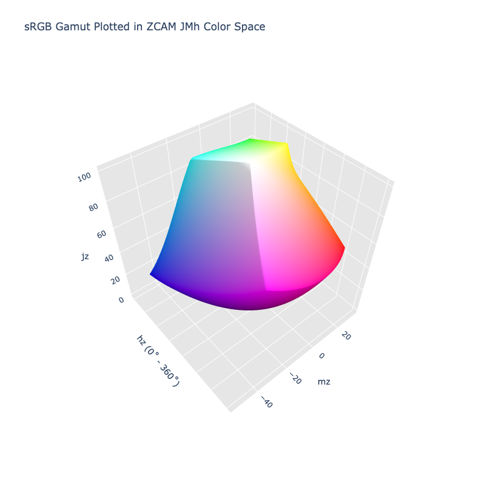

# ZCAM JMh

/// failure | The ZCAM JMh color space is not registered in `Color` by default
///

/// html | div.info-container
//// info | Properties
    attrs: {class: inline end}

**Name:** `zcam-jmh`

**White Point:** D65 / 2˚

**Coordinates:**

Name | Range^\*^
---- | -----
`jz`  | [0, 100]
`mz`  | [0, 60]
`hz`  | [0, 360)

^\*^ Space is not bound to the range and is only used as a reference to define percentage inputs/outputs in
relation to the Display P3 color space.
////


//// figure-caption
The sRGB gamut represented within the ZCAM JMh color space.
////

A color appearance model (CAM) is a mathematical model that seeks to describe the perceptual aspects of human color
vision, i.e. viewing conditions under which the appearance of a color does not tally with the corresponding physical
measurement of the stimulus source.

ZCAM is a CAM model that builds off earlier work done with [Jzazbz](./jzazbz.md) by Safdar. It uses a Perceptual
Quantizer (PQ) curve, developed to uniformly encode a luminance range of 0.001 to 10,000 cd/m2.

The model defines numerous different attributes:

Name | Description
---- | -----------
Jz   | Lightness
Cz   | Chroma
hz   | hue
Qz   | Brightness
Mz   | Colorfulness
Sz   | Saturation
Vz   | Vividness
Kz   | Blackness
Wz   | Whiteness
Hz   | Hue Quadrature

A color space can be constructed by using a subset of these attributes: JzCzhz, JzMzhz, QzMzhz, etc. The provided color
spaces uses JzMzhz.

[Learn more](https://opg.optica.org/oe/fulltext.cfm?uri=oe-29-4-6036&id=447640).
///

## Viewing Conditions

ZCAM is a color appearance model and can be configured with different viewing environments. A ZCAM color space will
also have an associated environment object. This environment object determines the viewing conditions. Colors will
appear different based on the viewing conditions.

Viewing\ Conditions    | Description
---------------------- | -----------
White                  | This is the white point and output white and should be the same as defined in the color class. This is provided as (x, y) chromaticity coordinates. ZCAM expects and was designed for this to be D65.
Reference\ White       | The absolute reference white where `Yw` is scaled to the luminance.
Adapting\ Luminance    | The luminance of the adapting field (`La`). The units are in cd/m2.
Background\ Luminance  | The background luminance (`Yb`) the relative luminance of the nearby background (out to 10°), relative to the reference white's luminance (`Y`). Usually 20 providing a gray world assumption.
Surround               | A description of the peripheral area. Use "dark" for a movie theater, "dim" for e.g. viewing a bright television in a dimly lit room, or "average" for surface colors.
Discounting            | Discounts the illuminant. If true, the eye is assumed to be fully adapted to the illuminant. Otherwise, the degree of discounting is based on other parameters. When the eye is not fully adapted, it can affect the way colors appear and the chromatic response.

ColorAide must provide some defaults, so ZCAM comes with a default set of viewing conditions that uses a D65 white
point, a reference white that uses D65 scaled to 100, an adapting luminance of 64 lux or a value of ~4 cd/m^2^, it uses
the "gray world" assumption and sets the background to 20, an "average" surround and leaves discounting set to
`#!py False`.

The default settings do not have to be used and a new ZCAM variant with different viewing conditions can be created.
When doing this, the space should be derived from the default

```py play
from coloraide import Color as Base
from coloraide.spaces.zcam_jmh import ZCAMJMh, Environment
from coloraide.cat import WHITES
from coloraide import util
import math

cdm2 = 1000 / math.pi

class CustomZCAMJMh(ZCAMJMh):
    NAME = "zcam-custom"
    SERIALIZE = ("--zcam-custom",)
    WHITE = WHITES['2deg']['D65']
    ENV = Environment(
        white=WHITE,
        reference_white=[c * cdm2 for c in util.xy_to_xyz(WHITE)],
        adapting_luminance=cdm2,
        background_luminance=100,
        surround='average',
        discounting=False
    )

class Color(Base): ...

Color.register([ZCAMJMh(), CustomZCAMJMh()])

Color('red').convert('zcam-jmh')
Color('red').convert('zcam-custom')
```

## Channel Aliases

Channels | Aliases
-------- | -------
`jz`      | `lightness`, `j`
`mz`      | `colorfulness`, `m`
`hz`      | `hue`, `h`

## Input/Output

The ZCAM JMh space is not currently supported in the CSS spec, the parsed input and string output formats use
the `#!css-color color()` function format using the custom name `#!css-color --zcam-jmh`:

```css-color
color(--zcam-jmh jz mz hz / a)  // Color function
```

The string representation of the color object and the default string output use the
`#!css-color color(--zcam-jmh jz mz hz / a)` form.

```py play
Color("zcam-jmh", [51.197, 43.776, 42.477], 1)
Color("zcam-jmh", [71.271, 32.313, 75.038], 1).to_string()
```

## Registering

```py
from coloraide import Color as Base
from coloraide.spaces.zcam_jmh import ZCAMJMh

class Color(Base): ...

Color.register(ZCAMJMh())
```
