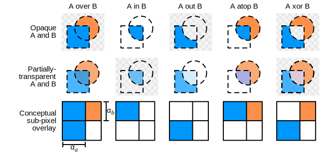
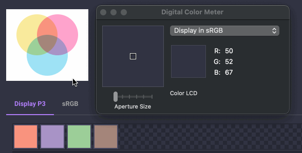
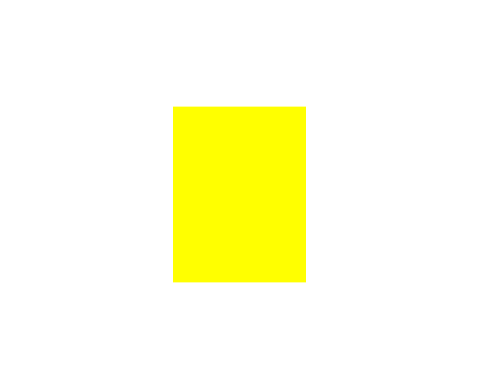
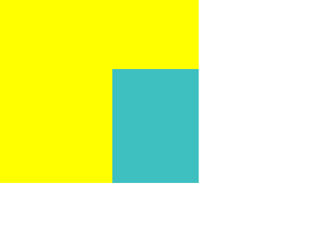

# Compositing and Blending

Alpha compositing and blending are tied together under the umbrella of compositing. Each is just an aspect of
the overall compositing of colors. Blend is run first, followed by alpha compositing.

ColorAide implements both alpha compositing and blending as described in the [Compositing and Blending Level 1][compositing-level-1]
specification. Alpha composting is based on [Porter Duff compositing][porter-duff]. By default, the `compose` method
uses the `normal` blend mode and the `source-over` Porter Duff operator.

## Blending

Blending is the aspect of compositing that calculates the mixing of colors where the source element and backdrop
overlap. Conceptually, the colors in the source element (top layer) are blended in place with the backdrop
(bottom layer).

There are various blend modes, the most common is the `normal` blend mode which is the default blending mode for
browsers. The `normal` blend mode simply returns the top layer's color when one is overlaid onto another.

<span class="isolate blend-normal dual">
  <span class="circle circle-1"></span>
  <span class="circle circle-2"></span>
</span>

But there are many blend modes that could be used, all of which yield different results. If we were to apply a
`multiply` blend mode, we would get something very different:

<span class="isolate blend-multiply dual">
  <span class="circle circle-1"></span>
  <span class="circle circle-2"></span>
</span>

When composing, the blend mode can be controlled separately in ColorAide. Here, we again use the `multiply` example
and replicate it in ColorAide. To apply blending in ColorAide, simply call `compose` with a backdrop color, and the
calling color will be used as the source.

/// tab | Display P3
```py play
c1 = Color('#07c7ed')
c2 = Color('#fc3d99')
c1, c2
c1.compose(c2, blend='multiply', space="display-p3")
```
///

/// tab | sRGB
```py play
c1 = Color('#07c7ed')
c2 = Color('#fc3d99')
c1, c2
c1.compose(c2, blend='multiply', space="srgb")
```
///

/// tip
`compose()` can output the results in any color space you need by setting `out_space`.

```py play
Color('#07c7ed').compose(Color('#fc3d99'), blend='multiply', space='srgb', out_space='hsl')
```
///

/// note | Display Differences
As some browsers apply compositing based on the display's current color space, we've provided examples in both sRGB
and Display P3 so that the examples can be compared on different displays. Which of the above matches your browser?
///

ColorAide allows you to blend a source over multiple backdrops quite easily as well. Simply send in a list, and the
colors will be blended from right to left with the right most color being on the bottom of the stack, and the base color
being used as the source (on the very top).

<span class="isolate blend-multiply">
  <span class="circle circle-1"></span>
  <span class="circle circle-2"></span>
  <span class="circle circle-3"></span>
</span>

/// tab | Display P3
```py play
c1 = Color('#07c7ed')
c2 = Color('#fc3d99')
c3 = Color('#f5d311')
c1, c2, c3
c1.compose([c2, c3], blend='multiply', space="display-p3")
```
///

/// tab | sRGB
```py play
c1 = Color('#07c7ed')
c2 = Color('#fc3d99')
c3 = Color('#f5d311')
c1, c2, c3
c1.compose([c2, c3], blend='multiply', space="srgb")
```
///

Lastly, if for any reason, it is desired to compose with blending disabled (e.g. just run alpha compositing), then you
can simply set `blend` to `#!py3 False`.

[`multiply`](#multiply) is just one of many blend modes that are offered in ColorAide, check out
[Blend Modes](#blend-modes) to learn about other blend modes.

## Alpha Compositing

Alpha compositing or alpha blending is the process of combining one image with a background to create the appearance of
partial or full transparency.

When dealing with layers, there are many possible ways to handle them:



Porter Duff compositing covers all possible configurations of layers. Many of these configurations can be useful for all
sorts of operations, such as masking. While this library [supports all of them](#compositing-operators), the most
commonly used one is [`source-over`](#source-over) which is used to implement simple alpha compositing to simulate
semi-transparent layers on top of each other.

<span class="isolate blend-normal dual">
  <span class="circle circle-1"></span>
  <span class="circle circle-2" style="opacity: 0.5"></span>
</span>

Given two colors, ColorAide can replicate this behavior and determine the resultant color by applying compositing. We
will use the demonstration above and replicate the result in the example below. Below we set the source color to
`#!color Color('#07c7ed').set('alpha', 0.5)` and the backdrop color to `#!color #fc3d99` and run it through the
`compose` method. It should be noted that the default blend mode of `normal` is used in conjunction by default.

/// tab | Display P3
```py play
c1 = Color('#07c7ed').set('alpha', 0.5)
c2 = Color('#fc3d99')
c1, c2
c1.compose(c2, space="display-p3")
```
///

/// tab | sRGB
```py play
c1 = Color('#07c7ed').set('alpha', 0.5)
c2 = Color('#fc3d99')
c1, c2
c1.compose(c2, space="srgb")
```
///

/// note | Display Differences
As some browsers apply compositing based on the display's current color space, we've provided examples in both sRGB
and Display P3 so that the examples can be compared on different displays. Which of the above matches your browser?
///

While the average user will be content with the default alpha compositing, Porter Duff offers many other configurations.
If desired, we can change the Porter Duff operator used and apply different composite logic. For instance, in this case
we can get the resultant of the backdrop over the source color by setting the `operator` to `destination-over`. As the
backdrop is fully opaque, we just get the backdrop color unaltered.

<span class="isolate blend-normal dual">
  <span class="circle circle-2" style="opacity: 0.5"></span>
  <span class="circle circle-1"></span>
</span>

/// tab | Display P3
```py play
c1 = Color('#07c7ed').set('alpha', 0.5)
c2 = Color('#fc3d99')
c1, c2
c1.compose(c2, operator='destination-over', space="display-p3")
```
///

/// tab | sRGB
```py play
c1 = Color('#07c7ed').set('alpha', 0.5)
c2 = Color('#fc3d99')
c1, c2
c1.compose(c2, operator='destination-over', space="srgb")
```
///

You can also apply alpha compositing to multiple layers at once. Simply send in a list of colors as the backdrop, and
the colors will be composed from right to left with the right most color being on the bottom of the stack and the base
color (the source) being on the very top.

Here we are using the normal blend mode and 50% transparency on all the circles with an opaque white background. We will
calculate the center color where all three layers overlap.

<div style="background: white; display: inline-block; padding: 10px;">
<span class="isolate blend-normal">
  <span class="circle circle-1" style="opacity: 0.5"></span>
  <span class="circle circle-2" style="opacity: 0.5"></span>
  <span class="circle circle-3" style="opacity: 0.5"></span>
</span>
</div>

/// tab | Display P3
```py play
c1 = Color('#07c7ed').set('alpha', 0.5)
c2 = Color('#fc3d99').set('alpha', 0.5)
c3 = Color('#f5d311').set('alpha', 0.5)
bg = Color('white')
c1, c2, c3, bg
c1.compose([c2, c3, bg], blend='normal', space="display-p3")
```
///

/// tab | sRGB
```py play
c1 = Color('#07c7ed').set('alpha', 0.5)
c2 = Color('#fc3d99').set('alpha', 0.5)
c3 = Color('#f5d311').set('alpha', 0.5)
bg = Color('white')
c1, c2, c3, bg
c1.compose([c2, c3, bg], blend='normal', space="srgb")
```
///

Lastly, if for any reason, it is desired to run compose with alpha compositing disabled (e.g. just run blending),
then you can simply set `operator` to `#!py3 False`.

Check out [Compositing Operators](#compositing-operators) to learn about the many variations that are supported.

## Complex Compositing

We've covered alpha compositing and blending and have demonstrated their use with simple two color examples and 
multi-layered examples, but what about different blend modes mixed with alpha compositing?

In this example, we will consider three circles, each with a unique color: `#!color #07c7ed`, `#!color #fc3d99`, and
`#!color #f5d311`. We apply 50% transparency to all the circles and place them on a `#!color white` background. We then
perform a `multiply` blend on all the circles but isolate them so the `multiply` blend does not apply to the background.
The circles are all represented with CSS. We will now try and replicate the colors with ColorAide.

So in the code below, we work our way from the bottom of the stack to the top. Since the background is isolated from the
`multiply` blending, in each region, we start by performing a `normal` blend on the bottom circle against the
background. We then apply `multiply` blending on each color that is stacked on top. We've provided both the P3 and sRGB
outputs to make it easy to compare in case your browser blends in one instead of the other.

<div style="background: white; display: inline-block; padding: 10px;">
<span class="isolate blend-multiply">
  <span class="circle circle-1" style="opacity: 0.5"></span>
  <span class="circle circle-2" style="opacity: 0.5"></span>
  <span class="circle circle-3" style="opacity: 0.5"></span>
</span>
</div>

/// tab | Display P3
```py play
c1 = Color('#07c7ed').set('alpha', 0.5)
c2 = Color('#fc3d99').set('alpha', 0.5)
c3 = Color('#f5d311').set('alpha', 0.5)

cw2 = c2.compose('white', blend='normal', space='display-p3')
cw3 = c3.compose('white', blend='normal', space='display-p3')

r1 = c2.compose(cw3, blend='multiply', space='display-p3')
r2 = c1.compose(cw2, blend='multiply', space='display-p3')
r3 = c1.compose(cw3, blend='multiply', space='display-p3')

r1, r2, r3

c1.compose([c2, cw3], blend='multiply', space='display-p3')
```
///

/// tab | sRGB
```py play
c1 = Color('#07c7ed').set('alpha', 0.5)
c2 = Color('#fc3d99').set('alpha', 0.5)
c3 = Color('#f5d311').set('alpha', 0.5)

cw2 = c2.compose('white', blend='normal', space='srgb')
cw3 = c3.compose('white', blend='normal', space='srgb')

r1 = c2.compose(cw3, blend='multiply', space='srgb')
r2 = c1.compose(cw2, blend='multiply', space='srgb')
r3 = c1.compose(cw3, blend='multiply', space='srgb')

r1, r2, r3

c1.compose([c2, cw3], blend='multiply', space='srgb')
```
///

Results may vary depending on the browser, but we can see (ignoring rounding differences) that the colors match up. This
was performed on Chrome in macOS using a display that uses `display-p3`.



## Blend Modes

/// html | div.blend-wrap
<span class="isolate blend-normal">
  <span class="circle circle-1"></span>
  <span class="circle circle-2"></span>
  <span class="circle circle-3"></span>
</span>

//// html | div.blend-content
### Normal

The blending formula simply selects the source color.

_Specified as `#!py3 'normal'`_.
////
///

---

/// html | div.blend-wrap
<span class="isolate blend-multiply">
  <span class="circle circle-1"></span>
  <span class="circle circle-2"></span>
  <span class="circle circle-3"></span>
</span>

//// html | div.blend-content
### Multiply

The source color is multiplied by the destination color and replaces the destination. The resultant color is always at
least as dark as either the source or destination color. Multiplying any color with black results in black. Multiplying
any color with white preserves the original color.

_Specified as `#!py3 'multiply'`_.
////
///

---

/// html | div.blend-wrap
<span class="isolate blend-screen">
  <span class="circle circle-1"></span>
  <span class="circle circle-2"></span>
  <span class="circle circle-3"></span>
</span>

//// html | div.blend-content
### Screen

Multiplies the complements of the backdrop and source color values, then complements the result. The result color is
always at least as light as either of the two constituent colors. Screening any color with white produces white;
screening with black leaves the original color unchanged. The effect is similar to projecting multiple photographic
slides simultaneously onto a single screen.

_Specified as `#!py3 'screen'`_.
////
///

---

/// html | div.blend-wrap
<span class="isolate blend-overlay">
  <span class="circle circle-1"></span>
  <span class="circle circle-2"></span>
  <span class="circle circle-3"></span>
</span>

//// html | div.blend-content
### Overlay

Multiplies or screens the colors, depending on the backdrop color value. Source colors overlay the backdrop while
preserving its highlights and shadows. The backdrop color is not replaced but is mixed with the source color to reflect
the lightness or darkness of the backdrop.

_Specified as `#!py3 'overlay'`_.
////
///

---

/// html | div.blend-wrap
<span class="isolate blend-darken">
  <span class="circle circle-1"></span>
  <span class="circle circle-2"></span>
  <span class="circle circle-3"></span>
</span>

//// html | div.blend-content
### Darken

Selects the darker of the backdrop and source colors. The backdrop is replaced with the source where the source is
darker; otherwise, it is left unchanged.

_Specified as `#!py3 'darken'`_.
////
///

---

/// html | div.blend-wrap
<span class="isolate blend-lighten">
  <span class="circle circle-1"></span>
  <span class="circle circle-2"></span>
  <span class="circle circle-3"></span>
</span>

//// html | div.blend-content
### Lighten

Selects the lighter of the backdrop and source colors. The backdrop is replaced with the source where the source is
lighter; otherwise, it is left unchanged.

_Specified as `#!py3 'lighten'`_.
////
///

---

/// html | div.blend-wrap
<span class="isolate blend-color-dodge">
  <span class="circle circle-1"></span>
  <span class="circle circle-2"></span>
  <span class="circle circle-3"></span>
</span>

//// html | div.blend-content
### Color Dodge

Brightens the backdrop color to reflect the source color. Painting with black produces no changes.

_Specified as `#!py3 'color-dodge'`_.
////
///

---

/// html | div.blend-wrap
<span class="isolate blend-color-burn">
  <span class="circle circle-1"></span>
  <span class="circle circle-2"></span>
  <span class="circle circle-3"></span>
</span>

//// html | div.blend-content
### Color Burn

Darkens the backdrop color to reflect the source color. Painting with white produces no change.

_Specified as `#!py3 'color-burn'`_.
////
///

---

/// html | div.blend-wrap
<span class="isolate blend-hard-light">
  <span class="circle circle-1"></span>
  <span class="circle circle-2"></span>
  <span class="circle circle-3"></span>
</span>

//// html | div.blend-content
### Hard Light

Multiplies or screens the colors, depending on the source color value. The effect is similar to shining a harsh
spotlight on the backdrop.

_Specified as `#!py3 'hard-light'`_.
////
///

---

/// html | div.blend-wrap
<span class="isolate blend-soft-light">
  <span class="circle circle-1"></span>
  <span class="circle circle-2"></span>
  <span class="circle circle-3"></span>
</span>

//// html | div.blend-content
### Soft Light

Darkens or lightens the colors, depending on the source color value. The effect is similar to shining a diffused
spotlight on the backdrop.

_Specified as `#!py3 'soft-light'`_.
////
///

---

/// html | div.blend-wrap
<span class="isolate blend-difference">
  <span class="circle circle-1"></span>
  <span class="circle circle-2"></span>
  <span class="circle circle-3"></span>
</span>

//// html | div.blend-content
### Difference

Subtracts the darker of the two constituent colors from the lighter color. Painting with white inverts the backdrop
color; painting with black produces no change.

_Specified as `#!py3 'difference'`_.
////
///

---

/// html | div.blend-wrap
<span class="isolate blend-exclusion">
  <span class="circle circle-1"></span>
  <span class="circle circle-2"></span>
  <span class="circle circle-3"></span>
</span>

//// html | div.blend-content
### Exclusion

Produces an effect similar to that of the Difference mode but lower in contrast. Painting with white inverts the
backdrop color; painting with black produces no change.

_Specified as `#!py3 'exclusion'`_.
////
///

---

/// html | div.blend-wrap
<span class="isolate blend-hue">
  <span class="circle circle-1"></span>
  <span class="circle circle-2"></span>
  <span class="circle circle-3"></span>
</span>

//// html | div.blend-content
### Hue

Creates a color with the hue of the source color and the saturation and luminosity of the backdrop color.

_Specified as `#!py3 'hue'`_.
////
///

---

/// html | div.blend-wrap
<span class="isolate blend-saturation">
  <span class="circle circle-1"></span>
  <span class="circle circle-2"></span>
  <span class="circle circle-3"></span>
</span>

//// html | div.blend-content
### Saturation

Creates a color with the saturation of the source color and the hue and luminosity of the backdrop color. Painting with
this mode in an area of the backdrop that is a pure gray (no saturation) produces no change.

_Specified as `#!py3 'saturation'`_.
////
///

---

/// html | div.blend-wrap
<span class="isolate blend-luminosity">
  <span class="circle circle-1"></span>
  <span class="circle circle-2"></span>
  <span class="circle circle-3"></span>
</span>

//// html | div.blend-content
### Luminosity

Creates a color with the luminosity of the source color and the hue and saturation of the backdrop color. This produces
an inverse effect to that of the Color mode. This mode is the one you can use to create monochrome "tinted" image
effects like the ones you can see in different website headers.

_Specified as `#!py3 'luminosity'`_.
////
///

---

/// html | div.blend-wrap
<span class="isolate blend-color">
  <span class="circle circle-1"></span>
  <span class="circle circle-2"></span>
  <span class="circle circle-3"></span>
</span>

//// html | div.blend-content
### Color

Creates a color with the hue and saturation of the source color and the luminosity of the backdrop color. This preserves
the gray levels of the backdrop and is useful for coloring monochrome images or tinting color images.

_Specified as `#!py3 'color'`_.
////
///

## Compositing Operators

### Clear

No regions are enabled.

Source | Destination | Result
------ | ----------- | ------
{.trans-bg} | {.trans-bg} | {.trans-bg}

_Specified as `#!py3 'clear'`_.

### Copy

Only the source will be present.

Source | Destination | Result
------ | ----------- | ------
{.trans-bg} | {.trans-bg} | {.trans-bg}

_Specified as `#!py3 'copy'`_.

### Destination

Only the destination will be present.

Source | Destination | Result
------ | ----------- | ------
{.trans-bg} | {.trans-bg} | {.trans-bg}

_Specified as `#!py3 'destination'`_.

### Source Over

Source is placed over the destination.

Source | Destination | Result
------ | ----------- | ------
{.trans-bg} | {.trans-bg} | {.trans-bg}

_Specified as `#!py3 'source-over'`_.

### Destination Over

Destination is placed over the source.

Source | Destination | Result
------ | ----------- | ------
{.trans-bg} | {.trans-bg} |  {.trans-bg}

_Specified as `#!py3 'destination-over'`_.

### Source In

The source that overlaps the destination, replaces the destination.

Source | Destination | Result
------ | ----------- | ------
{.trans-bg} | {.trans-bg} |  {.trans-bg}

_Specified as `#!py3 'source-in'`_.

### Destination In

Destination which overlaps the source, replaces the source.

Source | Destination | Result
------ | ----------- | ------
{.trans-bg} | {.trans-bg} | {.trans-bg}

_Specified as `#!py3 'destination-in'`_.

### Source Out

Source is placed, where it falls outside of the destination.

Source | Destination | Result
------ | ----------- | ------
{.trans-bg} | {.trans-bg} | {.trans-bg}

_Specified as `#!py3 'source-out'`_.

### Destination Out

Destination is placed, where it falls outside of the source.

Source | Destination | Result
------ | ----------- | ------
{.trans-bg} | {.trans-bg} | {.trans-bg}

_Specified as `#!py3 'destination-out'`_.

### Source Atop

Source which overlaps the destination, replaces the destination. Destination is placed elsewhere.

Source | Destination | Result
------ | ----------- | ------
{.trans-bg} | {.trans-bg} | {.trans-bg}

_Specified as `#!py3 'source-atop'`_.

### Destination Atop

Destination which overlaps the source replaces the source. Source is placed elsewhere.

Source | Destination | Result
------ | ----------- | ------
{.trans-bg} | {.trans-bg} | {.trans-bg}

_Specified as `#!py3 'destination-atop'`_.

### XOR

Destination which overlaps the source replaces the source. Source is placed elsewhere.

Source | Destination | Result
------ | ----------- | ------
{.trans-bg} | {.trans-bg} | {.trans-bg}

_Specified as `#!py3 'xor'`_.

### Lighter

Display the sum of the source image and destination image.

Source | Destination | Result
------ | ----------- | ------
{.trans-bg} | {.trans-bg} |  {.trans-bg}

_Specified as `#!py3 'lighter'`_.

--8<--
compositing.md
images.md
--8<--
