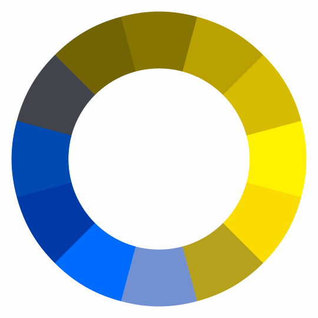
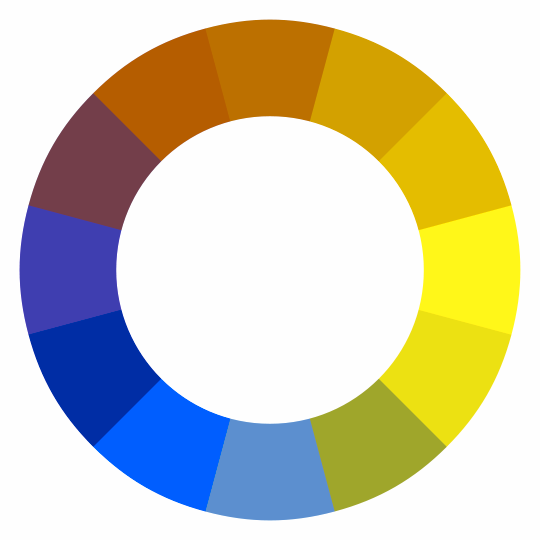
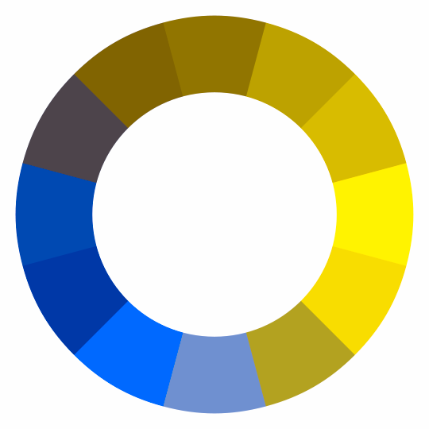
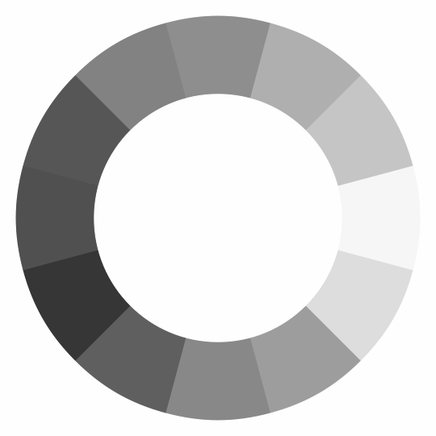

# Color Vision Deficiency Simulation

Color blindness or color vision deficiency (CVD) affects approximately 1 in 12 men (8%) and 1 in 200 women. CVD affects
millions of people in the world, and many people have no idea that they are color blind and not seeing the full spectrum
that others see.

CVD simulation allows those who do not suffer with one of the many different variations of color blindness, to simulate
what someone with a CVD would see. Keep in mind that these are just approximations, and that a given type of CVD can be
quite different from person to person in severity.

While it may be impossible to create a simulation the accurately represents everyone, there are a number of algorithms
that have been implemented and tested to some degree to vet their accuracy and usefulness.

## Types of Color Blindness

The human eye has 3 types of cones that are used to perceive colors. Each of these cones can become deficient, either
through genetics, or other means. Each type of cone is responsible for perceiving either red, green, or blue colors. A
CVD occurs when one or more of these cones are missing or not functioning properly. There are sever cases where one of
the three cones will not perceive color at all, and there are others were the cones may just be less sensitive.

### Dichromacy

Dichromacy is a type of CVD that has the characteristics of essentially causing the person to only have two functioning
cones for perceiving colors. This essentially flattens the color spectrum into a 2D plane. Protanopia describes the CVD
where the cone responsible for red light does not function, deuteranopia describes the CVD affecting the green cone, and
tritanopia describes deficiencies with the blue cone.

=== "Normal"

    

=== "Protanopia"

    

=== "Deuteranopia"

    

=== "Tritanopia"

    

By default, ColorAide uses the [Brettel 1997 method][brettel] to simulate tritanopia and the
[Viénot, Brettel, and Mollon 1999 approach][vienot] to simulate protanopia and and deuteranopia. While Brettel is
probably the best approach for all cases, Viénot is much faster and does quite well for protanopia and deuteranopia.

```playground
inputs = ['red', 'orange', 'yellow', 'green', 'blue', 'indigo', 'violet']
colors = Color(inputs[0]).steps(inputs[1:], steps=10, space='srgb')
colors
ColorRow()
[c.cvd('protan').clip() for c in colors]
ColorRow()
[c.cvd('deutan').clip() for c in colors]
ColorRow()
[c.cvd('tritan').clip() for c in colors]
```

If desired, other approaches can be used, though your mileage may vary. For instance, since the Brettel approach is
slower, it may be desirable to use a faster approach for tritanopia, such as Viénot. Viénot is much faster, and while
not as accurate as Brettel, is probably still better option than using the third approach ([Machado 2009][machado]).

```playground
inputs = ['red', 'orange', 'yellow', 'green', 'blue', 'indigo', 'violet']
colors = Color(inputs[0]).steps(inputs[1:], steps=10, space='srgb')
colors
ColorRow()
[c.cvd('tritan', method='brettel').clip() for c in colors]
ColorRow()
[c.cvd('tritan', method='vienot').clip() for c in colors]
ColorRow()
[c.cvd('tritan', method='machado').clip() for c in colors]
```

### Anomalous Trichromacy

While Dichromacy is probably the more sever case with only two function cones, a more common CVD type is anomalous
trichromacy. In this case, a person will have three function cones, but not all of the cones function with full
sensitivity. Sometimes, the sensitivity can be so low, that their ability to perceive color may be close to someone with
dichromacy.

While dichromacy may be considered a severity 1, a given case of anomalous trichromacy could be anywhere between 0 and
1, where 0 would be no CVD.

Like dichromacy, the related deficiencies are named in a similar manner: protanomaly (reduced red sensitivity),
deuteranomaly (reduced green sensitivity), and tritanomaly (reduced blue sensitivity).

=== "Normal"

    

=== "Protanomaly Severity 0.5"

    

=== "Protanomaly Severity 0.7"

    

=== "Protanomaly Severity 0.9"

    

To represent anomalous trichromacy, ColorAide leans on the [Machado 2009 approach][machado] which has a more nuanced
approach to handling severity levels below 1. This approach did not really focus on tritanopia though, and the suggested
algorithm for tritanopia should only be considered as an approximation. Instead of relying on Machado approach for
tritanomaly, we instead just use linear interpolation between the severity 1 results and the severity 0 (no CVD)
results. With that said, the `method` can always be overridden to use something other than the defaults.

```playground
inputs = ['red', 'orange', 'yellow', 'green', 'blue', 'indigo', 'violet']
colors = Color(inputs[0]).steps(inputs[1:], steps=10, space='srgb')
colors
ColorRow()
[c.cvd('protan', 0.75).clip() for c in colors]
ColorRow()
[c.cvd('deutan', 0.75).clip() for c in colors]
ColorRow()
[c.cvd('tritan', 0.75).clip() for c in colors]
```

### Achromatopsia / Monochromacy

Lastly, achromatopsia (or monochromacy) is a condition where a person will see no color, only shades of gray. There are
actually various reasons for which this may occur, and different classifications based on the type of monochromacy.

=== "Normal"

    

=== "Monochromacy / Achromatopsia"

    

ColorAide does not simulate all the specific types of monochromacy, what it does provide is a simple grayscale.

```playground
inputs = ['red', 'orange', 'yellow', 'green', 'blue', 'indigo', 'violet']
colors = Color(inputs[0]).steps(inputs[1:], steps=10, space='srgb')
colors
ColorRow()
[c.cvd('achroma').clip() for c in colors]
```

If desired, a form of achromatomaly can be approximated by applying a severity. Severity is determined by interpolating
results between full monochromacy and no monochromacy (normal color vision).

```playground
inputs = ['red', 'orange', 'yellow', 'green', 'blue', 'indigo', 'violet']
colors = Color(inputs[0]).steps(inputs[1:], steps=10, space='srgb')
colors
ColorRow()
[c.cvd('achroma', 0.50).clip() for c in colors]
ColorRow()
[c.cvd('achroma', 0.75).clip() for c in colors]
```

## Simulating

As previously shown, ColorAide simulates dichromacy, anomalous trichromacy, and a very basic approach to achromatopsia /
achromatomaly.

The `cvd()` method filters a given color in order to simulate a the requested CVD. Supported CVD methods can
be requested by using on of the following keywords.

CVD           | Name
------------- | ----
Protanopia    | `protan`
Deuteranopia  | `deutan`
Tritanopia    | `tritan`
Achromatopsia | `achroma`

ColorAide tries to use the best simulation method for the given scenario, but a user can manually specify the approach
by setting the `method` parameter. Valid methods are shown below. It should be noted though that `method` will have no
affect when using `achroma`.

Simulation\ Approach             | Name
-------------------------------- | ----
Brettel 1997                     | `brettel`
Viénot, Brettel, and Mollon 1999 | `vienot`
Machado 2009                     | `machado`

!!! tip "Processing Lots of Colors"
    One logical application for CVD simulation is to filter images to look as they would to someone with a particular
    CVD. If you are performing these operations on millions of pixels, you may notice that ColorAide, with all of its
    convenience, may not always be the fastest. There is a cost due to the overhead of convenience and a cost to the
    pure Python approach as well. With that said, there are tricks that can dramatically make things much faster!

    `functools.lru_cache` is your friend in such cases. We actually process all the images on this page with ColorAide
    to simulate CVDs. The key to making it a quick and painless process was cache these repetitive operations. When
    processing images, it is highly likely that you will be performing the same operations on thousands of identical
    pixels. Caching the work you've already done can speed this process up exponentially.

    We can crawl the pixels in a file and using a simple function like below, we will only process a pixel once (at
    least until our cache fills and we start having to overwrite existing colors).

    ```py
    @lru_cache(maxsize=1024 * 1024)
    def apply_filter(deficiency, method, severity, p):
        """Apply filter."""

        color = Color(
            'srgb', [x / 255 for x in p[:3]]
        ).cvd(
            deficiency, severity, in_place=True, method=method
        ).clip(
            in_place=True
        )
        return tuple([int(x * 255) for x in color.coords()]) + p[3:]
    ```

    For us, it turned a 10 minute process into a 35 second process.
