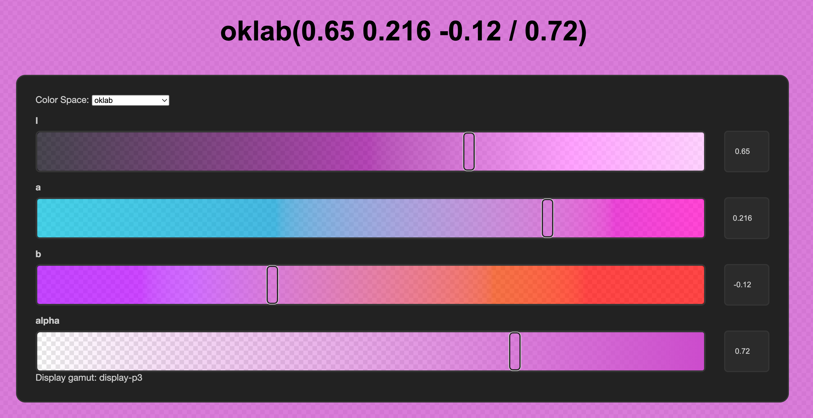
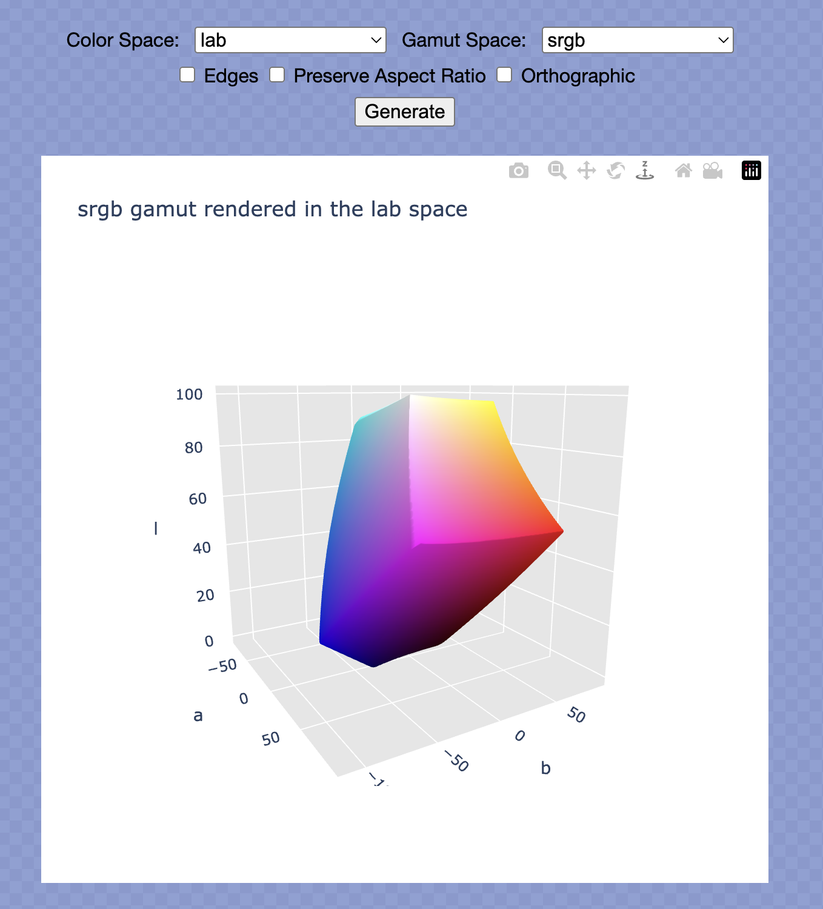

# ColorAide Demos

## Online Color Picker

Use ColorAide to pick a color in any of the color spaces available. ACES color spaces have been arbitrarily limited
has they have ginormous headroom.

[Try it out](./colorpicker.html)

## Interactive 3D Color Space Models

Generate interactive 3D color models in the browser using ColorAide and [Plotly](https://plotly.github.io/)! Most color
spaces are supported, but color spaces with more than 3 color components (not including alpha) are not supported. Colors
can be generated in a number of color gamuts, though a few models are restricted to their own color space for practical
reasons.

[Try it out](./3d_models.html)
