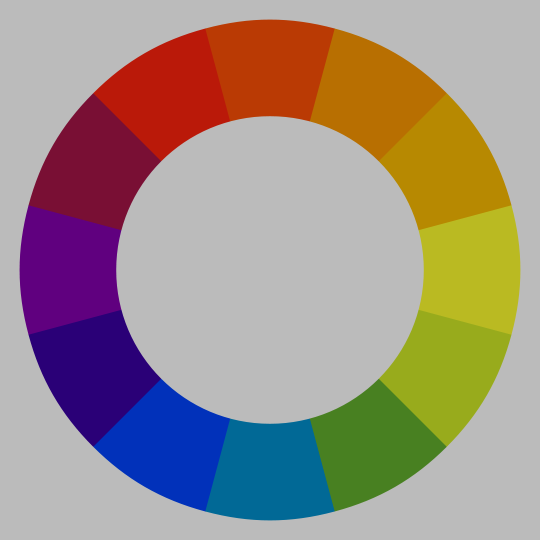
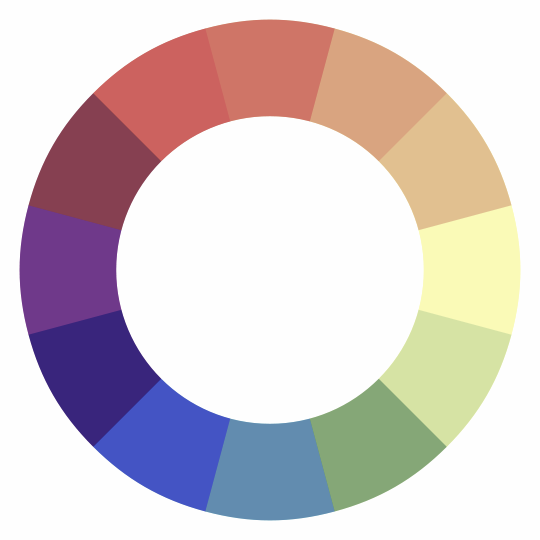
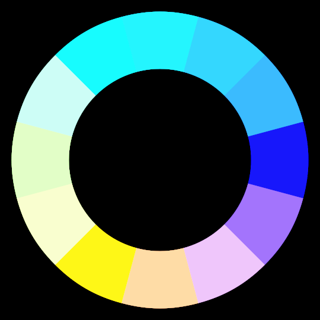
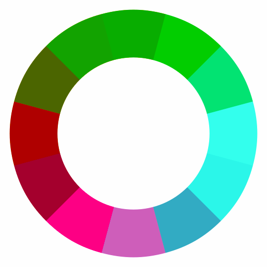

# Filters

ColorAide supports filters as described in the W3C [Filter Effects Module Level 1][filter-effects] specification.
Specifically, all filters that can be directly applied to a color.

## Supported Filters

The following filters are all supported in ColorAide and generally adhere to the specification in regards to behavior.
By default, filters are applied in the Linear sRGB color space, but can be applied in sRGB if requested. All other
color spaces will throw an error.

=== "Normal"

    

=== "Brightness"

    

=== "Saturate"

    

=== "Contrast"

    

=== "Opacity"

    

=== "Invert"

    

=== "Hue Rotate"

    

=== "Sepia"

    

=== "Grayscale"

    

In ColorAide, just call the `filter` method and provide the name of the filter. If not `amount` is provided, the default
according to the W3C spec will be used instead.

```playground
inputs = ['red', 'orange', 'yellow', 'green', 'blue', 'indigo', 'violet']
colors = Color(inputs[0]).steps(inputs[1:], steps=10, space='srgb')
colors
ColorRow()
[c.filter('brightness', 0.5).clip() for c in colors]
ColorRow()
[c.filter('saturate', 0.5).clip() for c in colors]
ColorRow()
[c.filter('contrast', 0.5).clip() for c in colors]
ColorRow()
[c.filter('opacity', 0.5).clip() for c in colors]
ColorRow()
[c.filter('invert', 1).clip() for c in colors]
ColorRow()
[c.filter('hue-rotate', 90).clip() for c in colors]
ColorRow()
[c.filter('sepia', 1).clip() for c in colors]
ColorRow()
[c.filter('grayscale', 1).clip() for c in colors]
```

## Usage

To use filters, a filter name must be given. The an amount to control to what extent the filter is applied can be used,
but if no amount is given, a suitable default will be used.

Filters       | Name         | Default
------------- | ------------ | -------
Brightness    | `brightness` | `#!py3 1`
Saturation    | `saturate`   | `#!py3 1`
Contrast      | `contrast`   | `#!py3 1`
Opacity       | `opacity`    | `#!py3 1`
Invert        | `invert`     | `#!py3 1`
Hue\ rotation | `hue-rotate` | `#!py3 0`
Sepia         | `sepia`      | `#!py3 1`
Grayscale     | `grayscale`  | `#!py3 1`

Generally, it is recommended to use the default sRGB Linear color space to perform filters, but filtering can also be
performed directly in sRGB as well per the W3C specification. In both cases, the color spaces are extended to handle
colors out of the SRGB color gamut. If specifying any color space other than these two, the operation will fail.

```playground
inputs = ['red', 'orange', 'yellow', 'green', 'blue', 'indigo', 'violet']
colors = Color(inputs[0]).steps(inputs[1:], steps=10, space='srgb')
colors
ColorRow()
[c.filter('sepia', 1, space='srgb-linear').clip() for c in colors]
ColorRow()
[c.filter('sepia', 1, space='srgb').clip() for c in colors]
```

!!! tip "Processing Lots of Colors"
    One logical application for filters is to apply them directly to images. If you are performing these operations on
    millions of pixels, you may notice that ColorAide, with all of its convenience, may not always be the fastest. There
    is a cost due to the overhead of convenience and a cost due to the pure Python approach as well. With that said,
    there are tricks that can dramatically make things much faster!

    --8<-- "pixel_cache.md"
