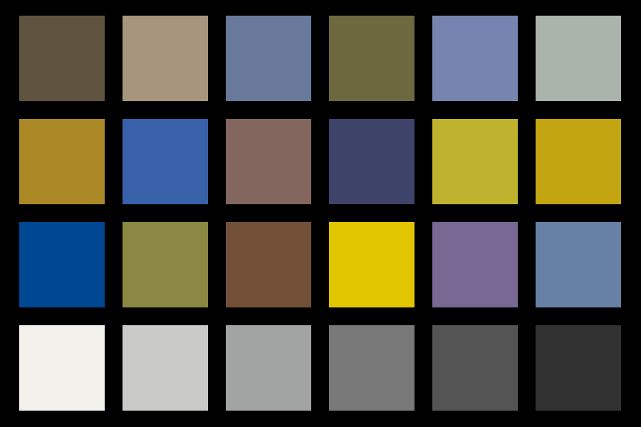

# Filters

ColorAide implements a number of filters with each filter being provided as a plugin. Filters simply apply some logic
to transform a color in some specific way. Filters can be used to lighten colors, adjust saturation, or completely
change the color. Filters can even be used to simulate things like [color vision deficiencies](#color-vision-deficiency-simulation).

## W3C Filter Effects

The W3C [Filter Effects Module Level 1][filter-effects] specification outline a number of filters for use in SVG and
CSS. ColorAide implements all the filters that directly apply to colors. By default, filters are applied in the Linear
sRGB color space, but can be applied in sRGB if requested. All other color spaces will throw an error.

/// tab | Normal

///

/// tab | Brightness

///

/// tab | Saturate

///

/// tab | Contrast

///

/// tab | Opacity
{.trans-bg}
///

/// tab | Invert

///

/// tab | Hue Rotate

///

/// tab | Sepia

///

/// tab | Grayscale

///

To apply a specific filter in ColorAide, just call the `filter()` method with the name of the filter you wish to use. If
an `amount` is not provided, the default according to the W3C spec will be used instead.

```py play
inputs = ['red', 'orange', 'yellow', 'green', 'blue', 'indigo', 'violet']
colors = Color.steps(inputs, steps=10, space='srgb')
Steps(colors)
Steps([c.filter('brightness', 0.5).clip() for c in colors])
Steps([c.filter('saturate', 0.5).clip() for c in colors])
Steps([c.filter('contrast', 0.8).clip() for c in colors])
Steps([c.filter('opacity', 0.5).clip() for c in colors])
Steps([c.filter('invert', 1).clip() for c in colors])
Steps([c.filter('hue-rotate', 90).clip() for c in colors])
Steps([c.filter('sepia', 1).clip() for c in colors])
Steps([c.filter('grayscale', 1).clip() for c in colors])
```

/// tip
`filter()` can output the results in any color space you need by setting `out_space`.

```py play
Color('#07c7ed').filter('grayscale', 1, out_space='hsl')
```
///

## Color Vision Deficiency Simulation

Color blindness or color vision deficiency (CVD) affects approximately 1 in 12 men (8%) and 1 in 200 women. CVD affects
millions of people in the world, and many people have no idea that they are color blind and not seeing the full spectrum
that others see.

CVD simulation allows those who do not suffer with one of the many different variations of color blindness, to simulate
what someone with a CVD would see. Keep in mind that these are just approximations, and that a given type of CVD can be
quite different from person to person in severity.

The human eye has 3 types of cones that are used to perceive colors. Each of these cones can become deficient, either
through genetics, or other means. Each type of cone is responsible for perceiving different wavelengths of light. A CVD
occurs when one or more of these cones are missing or not functioning properly. There are severe cases where one of the
three cones will not perceive color at all, and there are others where the cones may just be less sensitive.

### Dichromacy

Dichromacy is a type of CVD that has the characteristics of essentially causing the person to only have two functioning
cones for perceiving colors. This essentially flattens the color spectrum into a 2D plane. Protanopia describes the CVD
where the cone responsible for long wavelengths does not function, deuteranopia describes the CVD affecting the cone
responsible for processing medium wavelengths, and tritanopia describes deficiencies with the cone responsible for short
wavelengths.

/// tab | Normal

///

/// tab | Protanopia

///

/// tab | Deuteranopia

///

/// tab | Tritanopia

///

One misconception is that people with CVD have a color blindness for just red and green or something similar as that can
often be how it is described, and while the statement is true that certain people with CVD may have trouble with red and
green, they often can have trouble with other colors as well.

The LMS color space was created to mimic the response of the human eye. Each channel represents one of the 3 cones with
each cone responsible for seeing light waves of different frequencies: long (L), medium (M), and short (S). Protanopia
represents deficiencies with the L cone, deuteranopia with the M cone, and tritanopia with the S cone. Any color whose
properties only vary in the properties specific to a person's deficient cone(s) will have the potential to cause
confusion for that person.

Consider the example below. We generate 3 different color series, each specifically targeting a specific deficiency.
This is done by generating a series of colors that have all properties equal except that they have variance in a
different cone response. The first row varies only with the L cone response, the second only with the M cone response,
and the third only with the S cone response. We then apply the filters for protanopia, deuteranopia, and tritanopia. We
can see that while many of the colors are altered, the row that targets the deficient cone specific to the CVD all
appear to be of the same color making it difficult to distinguish between any of them.

/// tab | Normal
```py play

--8<-- "confusion_lines.md"

confusing_colors = confusion_line(Color('orange'), 'l')
Steps([c.clip() for c in confusing_colors])

confusing_colors = confusion_line(Color('hotpink'), 'm')
Steps([c.clip() for c in confusing_colors])

confusing_colors = confusion_line(Color('seagreen'), 's')
Steps([c.clip() for c in confusing_colors])
```
///

/// tab | Protanopia
```py play

---8<-- "confusion_lines.md"

confusing_colors = confusion_line(Color('orange'), 'l')
Steps([c.filter('protan').clip() for c in confusing_colors])

confusing_colors = confusion_line(Color('hotpink'), 'm')
Steps([c.filter('protan').clip() for c in confusing_colors])

confusing_colors = confusion_line(Color('seagreen'), 's')
Steps([c.filter('protan').clip() for c in confusing_colors])
```
///

/// tab | Deuteranopia
```py play

---8<-- "confusion_lines.md"

confusing_colors = confusion_line(Color('orange'), 'l')
Steps([c.filter('deutan').clip() for c in confusing_colors])

confusing_colors = confusion_line(Color('hotpink'), 'm')
Steps([c.filter('deutan').clip() for c in confusing_colors])

confusing_colors = confusion_line(Color('seagreen'), 's')
Steps([c.filter('deutan').clip() for c in confusing_colors])
```
///

/// tab | Tritanopia
```py play

---8<-- "confusion_lines.md"

confusing_colors = confusion_line(Color('orange'), 'l')
Steps([c.filter('tritan').clip() for c in confusing_colors])

confusing_colors = confusion_line(Color('hotpink'), 'm')
Steps([c.filter('tritan').clip() for c in confusing_colors])

confusing_colors = confusion_line(Color('seagreen'), 's')
Steps([c.filter('tritan').clip() for c in confusing_colors])
```
///

By default, ColorAide uses the [Brettel 1997 method][brettel] to simulate tritanopia as it is the only option that has
decent accuracy for tritanopia. [Viénot, Brettel, and Mollon 1999 approach][vienot] is used to simulate protanopia and
deuteranopia as it is not only faster than Brettel, but handles extreme case a little better. [Machado 2009][machado]
has it strengths as well which we will cover in [Anomalous Trichromacy](#anomalous-trichromacy).

```py play
inputs = ['red', 'orange', 'yellow', 'green', 'blue', 'indigo', 'violet']
colors = Color.steps(inputs, steps=10, space='srgb')
Steps(colors)
Steps([c.filter('protan').clip() for c in colors])
Steps([c.filter('deutan').clip() for c in colors])
Steps([c.filter('tritan').clip() for c in colors])
```

If desired, any of the three available methods can be used.

```py play
inputs = ['red', 'orange', 'yellow', 'green', 'blue', 'indigo', 'violet']
colors = Color.steps(inputs, steps=10, space='srgb')
Steps(colors)
Steps([c.filter('tritan', method='brettel').clip() for c in colors])
Steps([c.filter('tritan', method='vienot').clip() for c in colors])
Steps([c.filter('tritan', method='machado').clip() for c in colors])
```

### Anomalous Trichromacy

While Dichromacy is probably the more severe case with only two functional cones, a more common CVD type is anomalous
trichromacy. In this case, a person will have three functioning cones, but not all of the cones function with full
sensitivity. Sometimes, the sensitivity can be so low, that their ability to perceive color may be close to someone with
dichromacy.

While dichromacy may be considered a severity 1, a given case of anomalous trichromacy could be anywhere between 0 and
1, where 0 would be no CVD.

Like dichromacy, the related deficiencies are named in a similar manner: protanomaly (reduced red sensitivity),
deuteranomaly (reduced green sensitivity), and tritanomaly (reduced blue sensitivity).

/// tab | Normal

///

/// tab | Protanomaly Severity 0.5

///

/// tab | Protanomaly Severity 0.7

///

/// tab | Protanomaly Severity 0.9

///

To represent anomalous trichromacy, ColorAide leans on the [Machado 2009 approach][machado] which has a more nuanced
approach to handling severity levels below 1. This research associated with this method did not really focus on
tritanopia though, and Brettel is still a better choice for tritanopia. Instead of relying on the Machado approach for
tritanomaly, we instead just use linear interpolation between the severity 1 results and the severity 0 (no CVD)
results.

```py play
inputs = ['red', 'orange', 'yellow', 'green', 'blue', 'indigo', 'violet']
colors = Color.steps(inputs, steps=10, space='srgb')
Steps(colors)
Steps([c.filter('protan', 0.3).clip() for c in colors])
Steps([c.filter('protan', 0.5).clip() for c in colors])
Steps([c.filter('protan', 0.9).clip() for c in colors])
```

The Brettel and Viénot approach can be used for severities below 1 as well, but, like Brettel with tritanopia, they
will employ simple linear interpolation between a severity 1 case ans the actual color. It is probably debatable as to
whether this approach is sufficient or not.

## Usage Details

To use filters, a filter name must be given, followed by an optional amount. If an amount is omitted, suitable default
will be used. The exact range a given filter accepts varies depending on the filter. If a value exceeds the filter range
, the value will be clamped.

Filters       | Name         | Default
------------- | ------------ | -------
Brightness    | `brightness` | `#!py3 1`
Saturation    | `saturate`   | `#!py3 1`
Contrast      | `contrast`   | `#!py3 1`
Opacity       | `opacity`    | `#!py3 1`
Invert        | `invert`     | `#!py3 1`
Hue\ rotation | `hue-rotate` | `#!py3 0`
Sepia         | `sepia`      | `#!py3 1`
Grayscale     | `grayscale`  | `#!py3 1`
Protan        | `protan`     | `#!py3 1`
Deutan        | `deutan`     | `#!py3 1`
Tritan        | `tritan`     | `#!py3 1`

All of the filters that are supported allow filtering in the Linear sRGB color space and will do so by default.
Additionally, the W3C filter effects also support filtering in the sRGB color space. The CVD filters are specifically
designed to be applied in the Linear sRGB space, and cannot be used in any other color space.

```py play
inputs = ['red', 'orange', 'yellow', 'green', 'blue', 'indigo', 'violet']
colors = Color.steps(inputs, steps=10, space='srgb')
Steps(colors)
Steps([c.filter('sepia', 1, space='srgb-linear').clip() for c in colors])
Steps([c.filter('sepia', 1, space='srgb').clip() for c in colors])
```

/// tip | Processing Lots of Colors
One logical application for filters is to apply them directly to images. If you are performing these operations on
millions of pixels, you may notice that ColorAide, with all of its convenience, may not always be the fastest. There
is a cost due to the overhead of convenience and a cost due to the pure Python approach as well. With that said,
there are tricks that can dramatically make things much faster in most cases!

`functools.lru_cache` is your friend in such cases. We actually process all the images on this page with ColorAide
to demonstrate the filters. The key to making it a quick and painless process was to cache repetitive operations.
When processing images, it is highly likely that you will be performing the same operations on thousands of
identical pixels. Caching the work you've already done can speed this process up exponentially.

There are certainly some images that could be constructed in such a way to elicit a worse case scenario where the
cache would not be able to compensate as well, but for most images, caching dramatically reduces processing time.

We can crawl the pixels in a file, and using a simple function like below, we will only process a pixel once (at
least until our cache fills and we start having to overwrite existing colors).

```py
@lru_cache(maxsize=1024 * 1024)
def apply_filter(name, amount, space, method, p, fit):
    """Apply filter."""

    has_alpha = len(p) > 3
    color = Color('srgb', [x / 255 for x in p[:3]], p[3] / 255 if has_alpha else 1)
    if method is not None:
        # This is a CVD filter that allows specifying the method
        color.filter(name, amount, space=space, in_place=True, method=method)
    else:
        # General filter.
        color.filter(name, amount, space=space, in_place=True)
    # Fit the color back into the color gamut and return the results
    return tuple([int(x * 255) for x in color.fit(method=fit)[:3 if has_alpha else -1]])
```

When processing a 4608x2456 image (15,925,248 pixels) during our testing, it turned a ~7 minute process into a ~25
second process^\*^. Using gamut mapping opposed to simple clipping only increases time by to about ~56 seconds. The
much smaller images shown on this page process much, much faster.

The full script can be viewed [here](https://github.com/facelessuser/coloraide/blob/master/tools/filter_img.py).

\* _Tests were performed using the [Pillow][pillow] library. Results may vary depending on the size of the image,
pixel configuration, number of unique pixels, etc. Cache size can be tweaked to optimize the results._
///

--8<-- "images.md"
