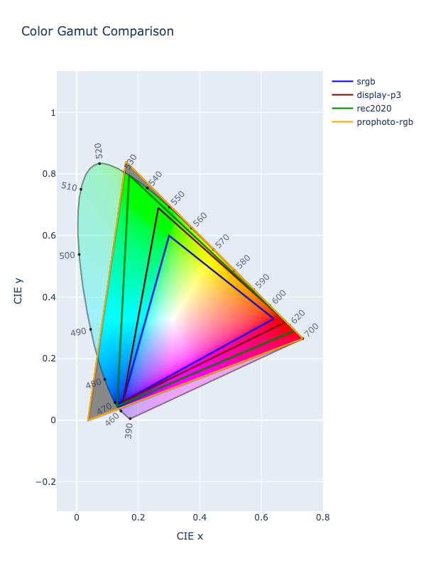
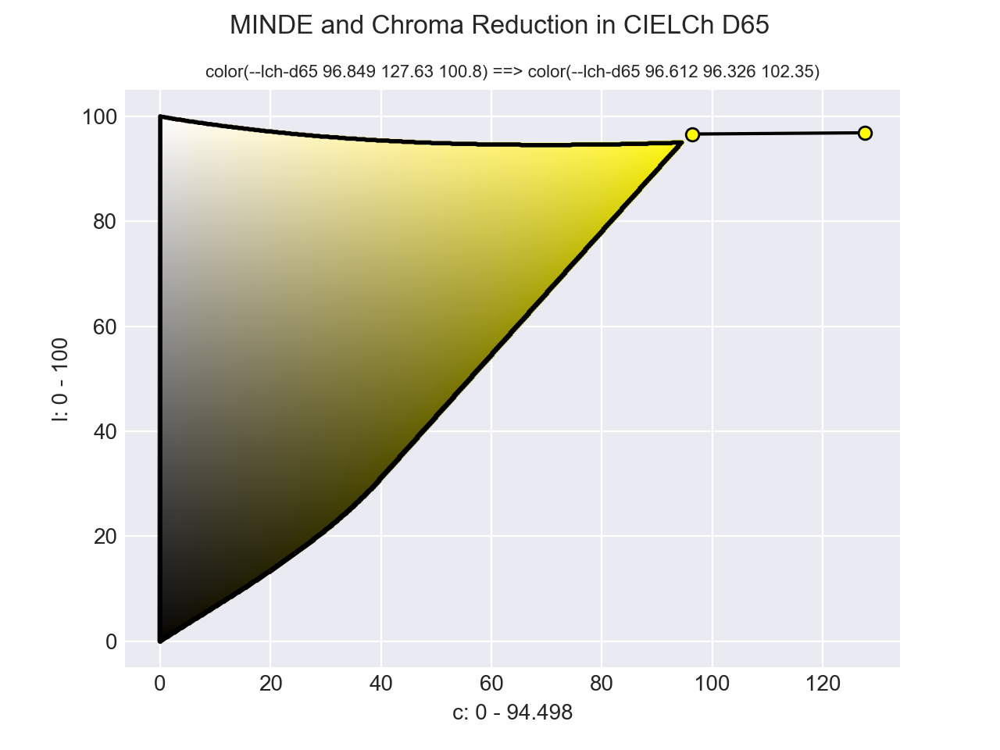

# Gamut Mapping

Many color spaces are designed in such a way that they can only represent colors accurately within a specific range.
This range in which a color can accurately be represented is known as the color gamut. While some color spaces are
theoretically unbounded, there are many that are designed with distinct ranges.

The sRGB and Display P3 color spaces are both RGB color spaces, but they actually can represent a different amount of
colors. Display P3 has a wider gamut and allows for greener greens and redder reds, etc. In the image below, we show
four different RGB color spaces, each with varying different gamut sizes. Display P3 contains all the colors in sRGB
and extends it even further. Rec. 2020, another RGB color space, is even wider. ProPhoto is so wide that it contains
colors that the human eye can't even see.



In order to visually represent a color from a wider gamut color space, such as Display P3, in a more narrow color space,
such as sRGB, a suitable color within the more narrow color space must must be selected and be shown in its place. This
selecting of a suitable replacement is called gamut mapping.

ColorAide defines a couple methods to help identify when a color is outside the gamut bounds of a color space and to
help find a suitable, alternative color that is within the gamut.

## Checking Gamut

When dealing with colors, it can be important to know whether a color is within its own gamut. The `in_gamut` function
allows for comparing the current color's specified values against the color space's gamut.

Let's assume we have a color `#!color rgb(30% 105% 0%)`. The color is out of gamut due to the green channel exceeding
the channel's limit of `#!py3 100%`. When we execute `in_gamut`, we can see that the color is not in its own gamut.

```playground
Color("rgb(30% 105% 0%)").in_gamut()
```

On the other hand, some color spaces do not have a limit. CIELab is one such color space. Sometimes limits will be
placed on the color space channels for practicality, but theoretically, there are no bounds. When we check a CIELab
color, we will find that it is always considered in gamut.

```playground
Color("lab(200% -20 40 / 1)").in_gamut()
```

While checking CIELab's own gamut isn't very useful, we can test it against a different color space's gamut. By simply
passing in the name of a different color space, the current color will be converted to the provided space and then
will run `in_gamut` on the new color. You could do this manually, but using `in_gamut` in this manner can be very
convenient. In the example below, we can see that the CIELab color of `#!color lab(200% -20 40 / 1)` is outside the
narrow gamut of sRGB.

```playground
Color("lab(200% -20 40 / 1)").in_gamut('srgb')
```

### Tolerance

Generally, ColorAide does not round off values in order to guarantee the best possible values for round tripping, but
due to [limitations of floating-point arithmetic][floating-point] and precision of conversion algorithms, there can be
edge cases where colors don't round trip perfectly. By default, `in_gamut` allows for a tolerance of `#!py3 0.000075` to
account for such cases where a color is "close enough". If desired, this "tolerance" can be adjusted.

Let's consider CIELab with a D65 white point. The sRGB round trip through CIELab D65 for `#!color white` does not
perfectly convert back to the original color. This is due to the perils of floating point arithmetic.

```playground
Color('color(srgb 1 1 1)').convert('lab-d65')[:]
Color('color(srgb 1 1 1)').convert('lab-d65').convert('srgb')[:]
```

We can see that when using a tolerance of zero, and gamut checking in sRGB, that the color is considered out of gamut.
This makes sense as the round trip through CIELab D65 and back is so very close, but ever so slightly off. Depending on
what you are doing, this may not be an issue up until you are ready to finalize the color, so sometimes it may be
desirable to have some tolerance, and other times not.

```playground
Color('color(srgb 1 1 1)').convert('lab-d65').convert('srgb')[:]
Color('color(srgb 1 1 1)').convert('lab-d65').convert('srgb').in_gamut()
Color('color(srgb 1 1 1)').convert('lab-d65').convert('srgb').in_gamut(tolerance=0)
```

On the topic of tolerance, lets consider some color models that do not handle out of gamut colors very well. There are
some color models that are alternate representations of an existing color space. For instance, the cylindrical spaces
HSL, HSV, and HWB are just different color models for the sRGB color space. They are are essentially the sRGB color
space, just with cylindrical coordinates that isolate certain attributes of the color space: saturation, whiteness,
blackness, etc. So their gamut is exactly the same as the sRGB space, because they are the sRGB color space. So it
stands to reason that simply using the sRGB gamut check for them should be sufficient, and if we are using strict
tolerance, this would be true.

```playground
Color('rgb(255 255 255)').in_gamut('srgb', tolerance=0)
Color('hsl(0 0% 100%)').in_gamut('srgb', tolerance=0)
Color('color(--hsv 0 0% 100%)').in_gamut('srgb', tolerance=0)
Color('rgb(255.05 255 255)').in_gamut('srgb', tolerance=0)
Color('hsl(0 0% 100.05%)').in_gamut('srgb', tolerance=0)
Color('color(--hsv 0 0% 100.05%)').in_gamut('srgb', tolerance=0)
```

But when we are not using a strict threshold, and we check one of these models **only** using the sRGB gamut, there are
some cases where these cylindrical colors can exhibit coordinates wildly outside of the model's range but still very
close to the sRGB gamut.

In this example, we have an sRGB color that is extremely close to being in gamut, but when we convert it to HSL,
we can see wildly large saturation.

```playground
hsl = Color('color(srgb 1 1.0000002 1)').convert('hsl')
hsl.to_string(fit=False)
hsl.in_gamut('srgb')
```

This happens because these cylindrical color models do not represent colors out of gamut in a very sane way. They are
simply not designed to extend past the color gamut. So even a slightly out of gamut sRGB color can translate to a value
way outside the cylindrical color model's boundaries.

For this reason, gamut checks in the HSL, HSV, or HWB models apply tolerance checks on the color's coordinates in the
sRGB color space **and** the respective cylindrical model ensuring we have coordinates that are close to the color's
actual gamut and reasonably close to the cylindrical model's constraints as well.

So, when using HSL as the gamut check, we can see that it ensures the color is not only very close to the sRGB gamut,
but that it is also very close the color model's constraints.

```playground
hsl = Color('color(srgb 0.9999999999994 1.0000000000002 0.9999999999997)').convert('hsl')
hsl
hsl.in_gamut('hsl')
```

If the Cartesian check is the only desired check, and the strange cylindrical values that are returned are not a
problem, `srgb` can always be specified. `#!py3 tolerance=0` can also be used to constrain the check to values exactly
in the gamut.

HSL has a very tight conversion to and from sRGB, so when an sRGB color is precisely in gamut, it will remain in gamut
throughout the conversion to and from HSL, both forwards and backwards. On the other hand, there may be color models
that have a looser conversion algorithm. There may be cases where it may be beneficial to increase the threshold.

## Gamut Mapping Colors

Gamut mapping is the process of taking a color that is out of gamut and adjusting it such that it fits within the gamut.
There are various ways to map an out of bound color to an in bound color, each with their own pros and cons. ColorAide
offers two methods related to gamut mapping: `#!py3 clip()` and `#!py3 fit()`. `#!py3 clip()` is a dedicated function
that performs the speedy, yet naive, approach of simply truncating a color channel's value to fit within the specified
gamut, and `#!py3 fit()` is a method that allows you to do more advanced gamut mapping approaches that, while slower,
generally yield better results.

While clipping won't always yield the best results, clipping is still very important and can be used to trim channel
noise after certain mathematical operations or even used in other gamut mapping algorithms if used carefully. For this
reason, clip has its own dedicated method for quick access: `#!py3 clip()`.

```playground
Color('rgb(270 30 120)').clip()
```

The `#!py3 fit()` method, is the generic gamut mapping method that exposes access to all the different gamut mapping
methods available. By default, `#!py3 fit()` uses a more advanced method of gamut mapping that tries to preserve hue and
lightness, hue being the attribute the human eye is most sensitive to. If desired, a user can also specify any currently
registered gamut mapping algorithm via the `method` parameter.

```playground
Color('rgb(270 30 120)').fit()
Color('rgb(270 30 120)').fit(method='clip')
```

Gamut mapping can also be used to indirectly fit colors in another gamut. For instance, fitting a Display P3 color into
an sRGB gamut.

```playground
c1 = Color('color(display-p3 1 1 0)')
c1.in_gamut('srgb')
c1.fit('srgb')
c1.in_gamut()
```

This can also be done with `#!py3 clip()`.

```playground
Color('color(display-p3 1 1 0)').clip('srgb')
```

!!! warning "Indirectly Gamut Mapping a Color Space"
    When indirectly gamut mapping in another color space, results may vary depending on what color space you are in and
    what color space you are using to fit the color. The operation may not get the color precisely in gamut. This is
    because we must convert the color to the gamut mapping space, apply the gamut mapping, and then convert it back to
    the original color. The process will be subject to any errors that occur in the [round trip](#notes-on-round-trip-accuracy)
    to and from the targeted space. This is mainly mentioned as fitting in one color space and round tripping back may
    not give exact results and, in some cases, exceed "in gamut" thresholds.

There are actually many different ways to gamut map a color. Some are computationally expensive, some are quite simple,
and many do really good in some cases and not so well in others. There is probably no perfect gamut mapping method, but
some are better than others.

### Clip

!!! success "The `clip` gamut mapping is registered in `Color` by default and cannot be unregistered"

Clipping is a simple and naive approach to gamut mapping. If the color space is bounded by a gamut, clip will compare
each channel's value against the bounds for that channel set the value to the limit it exceeds.

Clip can be performed via `fit` by using the method name `clip` or by using the `clip()` method.

```playground
c = Color('srgb', [2, 1, 1.5])
c.fit(method='clip')
c = Color('srgb', [2, 1, 1.5])
c.clip()
```

Clipping is unique to all other clipping methods in that it has its own dedicated method `clip()` method and that its
method name `clip` is reserved. While not always the best approach for gamut mapping in general, clip is very important
to some other gamut mapping and has specific cases where its speed and simplicity are of great value.

### LCh Chroma

!!! success "The `lch-chroma` gamut mapping is registered in `Color` by default"

LCh Chroma uses a combination of chroma reduction and MINDE in the CIELCh color space to bring a color into gamut. By
reducing chroma in the CIELCh color space, LCh Chroma can hold hue and lightness in the LCh color space relatively
constant. This is currently the default method used.

The algorithm generally works by performing both clipping and chroma reduction. Using bisection, the chroma is reduced
and then the chroma reduced color is clipped. Using ∆E~2000~, the distance between the chroma reduced color and the
clipped chroma reduced color is measured. If the resultant distance falls within the specified threshold, the clipped
color is returned.

Computationally, LCh Chroma is slower to compute than clipping, but generally provides better results. LCh, is not
necessarily the best perceptual color space available, but it is generally well understood color space that has been
available a long time. It does suffer from a purple shift when dealing with blue colors, but generally can generally
colors far out of gamut in a reasonable manner.

While CSS has currently proposed LCh Chroma reduction to be done with OkLCh, and we do offer an [OkLCh variant](#oklch-chroma),
we currently still use CIELCh as the default until OkLCh can be evaluated more fully.

LCh Chroma is the default gamut mapping algorithm by default, unless otherwise changed, and can be performed by simply
calling `fit()` or by calling `fit(method='lch-chroma')`.

```playground
c = Color('srgb', [2, -1, 0])
c.fit(method='clip')
c = Color('srgb', [2, -1, 0])
c.fit(method='clip')
```

### OkLCh Chroma

!!! success "The `lch-chroma` gamut mapping is registered in `Color` by default"

The CSS [CSS Color Level 4 specification](https://drafts.csswg.org/css-color/#binsearch) currently recommends using
OkLCh as the gamut mapping color space. OkLCh Chroma is performed exactly like [LCh Chroma](#lch-chroma) except that it
uses the perceptually uniform OkLCh color space as the LCh color space of choice.

OkLCh has the advantage of doing a better job at holding hues uniform than CIELCh.

```playground
c = Color('srgb', [2, -1, 0])
c.fit(method='oklch-chroma')
```

OkLCh is a very new color space to be used in the field of gamut mapping. While CIELCh is not perfect, its weakness are
known. OkLCh does seem to have certain quirks of its own, and may have more that have yet to be discovered. While we
have not made `oklch-chroma` our default yet, we have exposed the algorithm so users can begin exploring it.

### HCT Chroma

!!! failure "The `hct-chroma` gamut mapping is **not** registered in `Color` by default"

Much like the other LCh chroma reduction algorithms, HCT Chroma performs gamut mapping exactly like
[LCh Chroma](#lch-chroma) with the exception that it uses the HCT color space as the working LCh color space.

Google's Material Design uses a new color space called [HCT](./colors/hct.md). It uses the hue and chroma from
[CAM16 (JMh)](./colors/cam16.md) space and the tone/lightness from the [CIELab](./colors/lab_d65.md) space. HCT takes
advantage of the good hue preservation of CAM16 and has the better lightness predictability of CIELab. Using these
characteristics, the color space is adept at generating tonal palettes with predictable lightness. This makes it easier
to construct UIs with decent contrast. But to do this well, you must work in HCT and gamut map in HCT. For this reason,
the HCT Chroma gamut mapping method was added.

HCT Chroma is computationally the most expensive gamut mapping method that is offered. Since the color space used is
based on the already computationally expensive CAM16 color space, and is made more expensive by blending that color
space with CIELab, it is not the most performant approach, but when used in conjunction with the HCT color space, it
can allow creating good tonal palettes:

```playground
c = Color('hct', [325, 24, 50])
tones = [0, 10, 20, 30, 40, 50, 60, 70, 80, 90, 95, 100]
HtmlSteps([c.clone().set('tone', tone).convert('srgb').to_string(hex=True, fit='hct-chroma') for tone in tones])
```

To HCT Chroma plugin is not registered by default, but can be added by subclassing `Color`. You must register the
[∆E~hct~](./distance.md#delta-e-hct) distancing algorithm and the HCT color space as well.

```py
from coloraide import Color as Base
from coloraide.gamut.fit_hct_chroma import HCTChroma
from coloraide.distance.delta_e_hct import DEHCT
from coloraide.spaces.hct import HCT

class Color(Base): ...

Color.register([HCT(), DEHCT(), HCTChroma()])
```

## Why Not Just Clip?

In the past, clipping has been the default way in which out of gamut colors have been handled in web browsers. It is
fast, and has generally been fine as most browsers have been constrained to using sRGB. But as modern browsers begin to
adopt more wide gamut monitors such as Display P3, and CSS grows to support an assortment of wide and ultra wide color
spaces, representing the best intent of an out of gamut color becomes even more important.

ColorAide currently uses a default gamut mapping algorithm that performs gamut mapping in the CIELCh color space using
chroma reduction coupled with minimum ∆E (MINDE). This approach is meant to preserve enough of the important attributes
of the out of gamut color as is possible, mostly preserving both lightness and hue, hue being the attribute that people
are most sensitive to. MINDE is used to abandon chroma reduction and clip the color when the color is very close to
being in gamut. MINDE also allows us to catch cases where the geometry of the color space's gamut is such that we may
slip by higher chroma options resulting in undesirable, aggressive chroma reduction. While CIELCh is not a perfect
color space, and we may use a different color space in the future, this method is generally more accurate that using
clipping alone.

Below we have an example of using chroma reduction with MINDE. It can be noted that chroma is reduced until we are very
close to being in gamut. The MINDE helps us catch the peak of the yellow shape as, otherwise, we would have continued
reducing chroma until we were at a very chroma reduced, pale yellow.



One might see some cases of clipping and think it does a fine job and question why any of this complexity is necessary.
In order to demonstrate the differences in gamut mapping vs clipping, see the example below. We start with the color
`#!color color(display-p3 1 1 0)` and interpolate with it in the CIELCh color space reducing just the lightness. This
will leave both chroma and hue intact. The Interactive playground below automatically gamut maps the color previews to
sRGB, but we'll control the method being used by providing two different `#!py Color` objects: one that uses
`lch-chroma` (the default) for gamut mapping, and one that uses `clip`. Notice how clipping, the bottom color set, clips
these dark colors and makes them reddish. This is a very undesirable outcome.

```playground
# Gamut mapping in LCh
yellow = Color('color(display-p3 1 1 0)')
lightness_mask = Color('lch(0% none none)')
HtmlRow([c.fit('srgb') for c in Color.steps([yellow, lightness_mask], steps=10, space='lch')])

# Clipping
yellow = Color('color(display-p3 1 1 0)')
lightness_mask = Color('lch(0% none none)')
HtmlRow([c.clip('srgb') for c in Color.steps([yellow, lightness_mask], steps=10, space='lch')])
```

There are times when clipping is simply preferred. It is fast, and if you are just trimming noise off channels, it is
very useful, but if the idea is to present an in gamut color that tries to preserve as much of the intent of the
original color as possible, other methods may be desired. There are no doubt better gamut methods available than what
ColorAide offers currently, and more may be added in the future, but ColorAide can also be extended using 3rd party
plugins as well.
