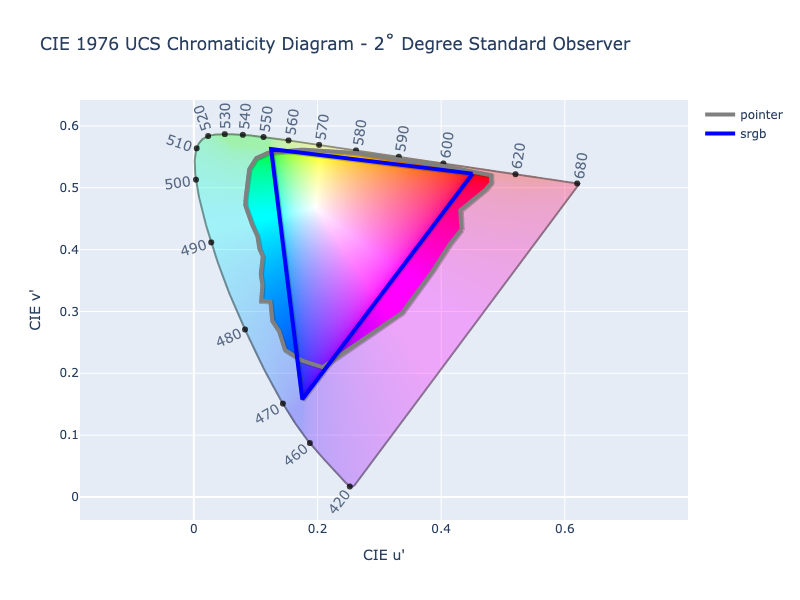

# Gamut Mapping

Many color spaces are designed in such a way that they represent a specific range of colors. This is often done to
target specific display types or mediums. The monitor you are reading this on can likely display millions of colors, but
there are still colors it is not capable of displaying. So color spaces are often designed to represent such mediums, to
make it easy for authors and artists to know exactly where those color boundaries are. This range of colors that a color
space is designed for is called a color gamut.

There are some color spaces that are theoretically unbounded, and even some color spaces that are bounded but can
actually still give meaningful data if extended, but often, when it comes time to display a color, paint a product, or
print a book, the actual colors are limited to what that device or process can handle.

The sRGB and Display P3 color spaces are both RGB color spaces, but they actually can represent a different amount of
colors. Display P3 has a wider gamut and allows for greener greens and redder reds, etc. In the image below, we show
four different RGB color spaces, each with varying different gamut sizes. Display P3 contains all the colors in sRGB
and extends it even further. Rec. 2020, another RGB color space, is even wider. ProPhoto is so wide that it contains
colors that the human eye can't even see.


In order to visually represent a color from a wider gamut color space, such as Display P3, in a more narrow color space,
such as sRGB, a suitable color within the more narrow color space must must be selected and be shown in its place. This
selecting of a suitable replacement is called gamut mapping.

ColorAide defines a couple methods to help identify when a color is outside the gamut bounds of a color space and to
help find a suitable, alternative color that is within the gamut.

## Checking Gamut

When dealing with colors, it can be important to know whether a color is within its own gamut. Let's say we are working
with colors in Display P3, but we want to output to an sRGB display. Let's say the color of interest is
`#!color color(display-p3 1 0 0)`. If we plot the color as shown below, we can see that it is in Display P3, the faint
transparent shell, but it is outside the sRGB gamut, the color solid in the middle. We'd like to detect these cases and
make an adjustment to ensure we don't get unexpected behavior.


The `in_gamut` function allows for comparing the current color's specified values against the target color space's
gamut.

Let's assume we have a color `#!color rgb(30% 105% 0%)`. The color is out of gamut due to the green channel exceeding
the channel's limit of `#!py3 100%`. When we execute `in_gamut`, we can see that the color is not in its own gamut.

```py play
Color("rgb(30% 105% 0%)").in_gamut()
```

On the other hand, some color spaces do not have a limit. CIELab and Oklab are such color spaces and can be represented
in any gamut that'd you'd like.


Sometimes limits will be placed on the color space channels (as done above) for practicality, but theoretically, there
are no bounds.

When we check a CIELab color, we will find that it is always considered in gamut as it has no gamut.

```py play
Color("lab(200% -20 40 / 1)").in_gamut()
```

While checking CIELab's own gamut isn't very useful, we can test it against a different color space's gamut. By simply
passing in the name of a different color space, the current color will be converted to the provided space and then
will run `in_gamut` on the new color. You could do this manually, but using `in_gamut` in this manner can be very
convenient. In the example below, we can see that the CIELab color of `#!color lab(200% -20 40 / 1)` is outside the
narrow gamut of sRGB.

```py play
Color("lab(200% -20 40 / 1)").in_gamut('srgb')
```

### Tolerance

Generally, ColorAide does not round off values in order to guarantee the best possible values for round tripping, but
due to [limitations of floating-point arithmetic][floating-point] and precision of conversion algorithms, there can be
edge cases where colors don't round trip perfectly. By default, `in_gamut` allows for a tolerance of `#!py3 0.000075` to
account for such cases where a color is "close enough". If desired, this "tolerance" can be adjusted.

Let's consider the oRGB color model. When converting from sRGB to oRGB, both of which share the same gamut, we can see
that the conversion back is very, very close to being correct, but still technically out of gamut with one channel value
falling below zero, but only slightly. This is due to the perils of floating point arithmetic.


```py play
Color('red').convert('orgb')[:]
Color('red').convert('orgb').convert('srgb')[:]
```

When testing with a tolerance, the color is considered in gamut, but when testing with a tolerance of zero, the color is
considered out of gamut. Depending on what you are doing, this may not be an issue up until you are ready to finalize
the color as very close to in gamut is usually good enough, so sometimes it may be desirable to have some tolerance, and
other times not.

```py play
Color('red').convert('orgb').convert('srgb')[:]
Color('red').convert('orgb').convert('srgb').in_gamut()
Color('red').convert('orgb').convert('srgb').in_gamut(tolerance=0)
```

Let's consider some color models that handle out of gamut colors in a less subtle way. HSL, HSV, and HWB are color
models designed to represent an RGB color space in a cylindrical format, traditionally sRGB. Each of these spaces
isolate different attributes of a color: saturation, whiteness, lightness, etc. Because these models are just
representing the color space in a different way, they share the same gamut as the reference RGB color space. So it
stands to reason that simply using the sRGB gamut check for them should be sufficient, and if we are using strict
tolerance, this would be true.

```py play
Color('rgb(255 255 255)').in_gamut('srgb', tolerance=0)
Color('hsl(0 0% 100%)').in_gamut('srgb', tolerance=0)
Color('color(--hsv 0 0% 100%)').in_gamut('srgb', tolerance=0)
Color('rgb(255.05 255 255)').in_gamut('srgb', tolerance=0)
Color('hsl(0 0% 100.05%)').in_gamut('srgb', tolerance=0)
Color('color(--hsv 0 0% 100.05%)').in_gamut('srgb', tolerance=0)
```

But when we are using a tolerance, and we check one of these models **only** using the sRGB gamut, there are some cases
where these cylindrical colors can exhibit coordinates wildly outside of the model's range but still very close to the
sRGB gamut. This is isn't an error or a bug, but simply how the color model behaves with out of gamut colors. These
values can still convert right back to the original color, but this might not always be the case with all color models.

In this example, we have an sRGB color that is extremely close to being in gamut, but when we convert it to HSL,
we can see wildly large saturation. But since it round trips back to sRGB just fine, it can exhibit extreme saturation,
but can still be considered in the sRGB gamut.

```py play
hsl = Color('color(srgb 0.999999 1.000002 0.999999)').convert('hsl')
hsl
hsl.in_gamut('srgb')
```

This happens because these cylindrical color models do not represent out of gamut colors in a very sane way. When
lightness exceeds the SDR range of 0 - 1 (or `0 - 100%` as people generally associate HSL), they can return extremely
high saturation. So even a slightly out of gamut sRGB color _could_ translate to a value way outside the cylindrical
color model's boundaries.

For this reason, gamut checks in the HSL, HSV, and HWB models apply tolerance checks on the color's coordinates in the
sRGB color space **and** the respective cylindrical model ensuring we have coordinates that are close to the color's
actual gamut and reasonably close to the cylindrical model's constraints as well. But if we specifically request `srgb`,
we will see that only `srgb` is referenced.

```py play
hsl = Color('color(srgb 0.999999 1.000002 0.999999)').convert('hsl')
hsl
hsl.in_gamut()
hsl.in_gamut('hsl')
hsl.in_gamut('srgb')
```

In short, ColorAide will figure out what best to test unless you explicitly tell it to use something else. If the
Cartesian check is the only desired check, and the strange cylindrical values that are returned are not a problem,
`srgb` can always be specified. `#!py3 tolerance=0` can also be used to constrain the check to values exactly in the
gamut.

HSL has a very tight conversion to and from sRGB, so when an sRGB color is precisely in gamut, it will remain in gamut
throughout the conversion to and from HSL, both forwards and backwards. On the other hand, there may be color models
that have a looser conversion algorithm. There may even be cases where it may be beneficial to increase the threshold.

## Gamut Mapping Colors

Gamut mapping is the process of taking a color that is out of gamut and adjusting it in such a way that it fits within
the gamut. Essentially, gamut mapping takes a color that is out of gamut and maps it to some place on the target gamut
that makes sense.


There are various ways to map or compress values of an out of bound color to an in bound color, each with
their own pros and cons. ColorAide offers a couple of methods related to gamut mapping: `#!py3 clip()` and
`#!py3 fit()`. `#!py3 clip()` is a dedicated function that performs the speedy, yet naive, approach of simply truncating
a color channel's value to fit within the specified gamut, and `#!py3 fit()` is a method that allows you to do more
advanced gamut mapping approaches that, while often not as performant as simple, naive clipping, generally yield much
better results.

While clipping won't always yield the best results, clipping is still very important and can be used to trim channel
noise after certain mathematical operations or even used in other gamut mapping algorithms if used carefully. For this
reason, clip has its own dedicated method for quick access: `#!py3 clip()`.

```py play
Color('rgb(270 30 120)').clip()
```

The `#!py3 fit()` method, is the generic gamut mapping method that exposes access to all the different gamut mapping
methods available. By default, `#!py3 fit()` uses a more advanced method of gamut mapping that tries to preserve hue and
lightness, hue being the attribute the human eye is most sensitive to. If desired, a user can also specify any currently
registered gamut mapping algorithm via the `method` parameter.

```py play
Color('rgb(270 30 120)').fit()
Color('rgb(270 30 120)').fit(method='clip')
```

Gamut mapping can also be used to indirectly fit colors in another gamut. For instance, fitting a Display P3 color into
an sRGB gamut.

```py play
c1 = Color('color(display-p3 1 1 0)')
c1.in_gamut('srgb')
c1.fit('srgb')
c1.in_gamut()
```

This can also be done with `#!py3 clip()`.

```py play
Color('color(display-p3 1 1 0)').clip('srgb')
```

/// warning | Indirectly Gamut Mapping a Color Space
When indirectly gamut mapping in another color space, results may vary depending on what color space you are in and
what color space you are using to fit the color. The operation may not get the color precisely in gamut. This is
because we must convert the color to the gamut mapping space, apply the gamut mapping, and then convert it back to
the original color. The process will be subject to any errors that occur in the [round trip](#notes-on-round-trip-accuracy)
to and from the targeted space. This is mainly mentioned as fitting in one color space and round tripping back may
not give exact results and, in some cases, exceed "in gamut" thresholds.
///

There are actually many different ways to gamut map a color. Some are computationally expensive, some are quite simple,
and many do really good in some cases and not so well in others. There is probably no perfect gamut mapping method, but
some are better than others.

### Clip

/// success | The `clip` gamut mapping is registered in `Color` by default and cannot be unregistered
///

Clipping is a simple and naive approach to gamut mapping. If the color space is bounded by a gamut, clip will compare
each channel's value against the bounds for that channel set the value to the limit it exceeds.

Clip can be performed via `fit` by using the method name `clip` or by using the `clip()` method.

```py play
c = Color('srgb', [2, 1, 1.5])
c.fit(method='clip')
c = Color('srgb', [2, 1, 1.5])
c.clip()
```

Clipping is unique to all other clipping methods in that it has its own dedicated method `clip()` method and that its
method name `clip` is reserved. While not always the best approach for gamut mapping in general, clip is very important
to some other gamut mapping and has specific cases where its speed and simplicity are of great value.

### MINDE Chroma Reduction

MINDE chroma reduction is an approach that reduces the chroma in a perceptual color space until the color is within
gamut of a targeted color space. As the exact point at which the color will be in gamut is unknown, the chroma is
reduced using bisection. The color is compared periodically to the the clipped version of the current iteration to see
if the ∆E distance between them is below the "just noticeable difference" (JND) defined for the color space. If the
color is close enough to the clipped version, the clipped version is returned.

This method is good because it does a fairly accurate job at approach the gamut surface. It is not prone to over
correcting, and clipping before you reach the surface helps soften gamut mapping to reduce hard edges in interpolation.
This approach also keeps lightness and hue fairly constant. If the JND is reduced, the lightness and hue will be held
even more constant and will often approach the gamut surface even closer.

Computationally, MINDE Chroma Reduction is slower to compute than clipping due to how many iterations it must perform
to get close enough to the gamut surface, but it generally provides good results, far surpassing naive clipping.

It should be noted that most color spaces that have a defined gamut are tied to specific RGB gamuts. And when they are
gamut mapped, they are done so in those RGB spaces. For instance HSL, which represents the sRGB gamut in a cylindrical
form will be gamut mapped in sRGB (though simple clipping may be done directly in HSL).

There are a few color spaces/models that do not have a clearly defined gamut. One such case is HPLuv, which is only
defined as a cylindrical color space that represent only a subset of the sRGB color space. Additionally Okhsl and Okhsv
are two cylindrical color spaces based on the perceptual Oklab color space that are meant to target the sRGB gamut, but
are only a loose approximation which actually can slightly clip the sRGB gamut while simultaneously containing a few
colors that exceed the sRGB gamut. ColorAide will not automatically associate these color spaces with an RGB gamut. In
the case of HPLuv, there is no specifically defined RGB gamut, and in the case of Okhsl and Okhsv, sRGB is the closest,
but does not precisely represent the colors in Okhsl and Okhsv.

Gamut mapping in HPLuv usually provides fine results, but you may find that gamut mapping Okhsl may not provide the
intended results. When gamut mapping such spaces, you may want to use the closest RGB gamut.

```py play
Steps([c.fit('okhsl', method='oklch-chroma') for c in Color.steps(['oklch(90% 0.4 0)', 'oklch(90% 0.4 360)'], steps=100, space='oklch', hue='longer')])
Steps([c.fit('srgb', method='oklch-chroma') for c in Color.steps(['oklch(90% 0.4 0)', 'oklch(90% 0.4 360)'], steps=100, space='oklch', hue='longer')])
```

Lastly, all MINDE Chroma Reduction methods allow the setting of the JND. The default is usually specific to the
perceptual space being used, but it should be noted that while a lower JND will give you a theoretically better value,
some color spaces have quirks due to their unique geometric shape. Consider the color `#!color color(display-p3 1 1 0)`.
If we were to gamut map it in LCh with a very low JND, we can see that the odd shape of LCh can cause us to get a very
desaturated color. By using the default JND of 2 for LCh, the fuzziness of the MINDE will catch the more saturated
yellow. This isn't a problem in OkLCh, but it has its own quirks as well.

/// tab | JND 0

///

/// tab | JND 2

///

#### LCh Chroma

/// success | The `lch-chroma` gamut mapping is registered in `Color` by default
///

LCh Chroma applies MINDE Chroma Reduction within the CIELCh color space. This is the default in ColorAide.

/// note
As most colors in ColorAide use a D65 white point by default, LCh D65 is used as the gamut mapping color space.
///

CIELCh, is not necessarily the best perceptual color space available, but it is a generally well understood color space
that has been available a long time. It does suffer from a purple shift when dealing with blue colors, but can generally
handle colors in very wide gamuts reasonably due to its fairly consistent shape well past the spectral locus.

CSS originally proposed MINDE Chroma Reduction with CIELCh, but has later changed to OkLCh. It is possible that the
entire choice in algorithms could change as well in the future. We do offer an [OkLCh variant](#oklch-chroma), but we
currently still use CIELCh due to its consistency even with colors far outside the gamut. If you are working within
reasonable gamuts, OkLCh may be a better choice.

LCh Chroma is the default gamut mapping algorithm unless otherwise changed, and can be performed by simply calling
`fit()` or by calling `fit(method='lch-chroma')`.

```py play
c = Color('srgb', [2, -1, 0])
c.fit(method='lch-chroma')
```

Additionally, the JND target can be controlled for tighter or looser gamut mapping via the `jnd` option. The default is
`2`.

```py play
c = Color('srgb', [2, -1, 0])
c.fit(method='lch-chroma', jnd=0.2)
```

#### OkLCh Chroma

/// success | The `lch-chroma` gamut mapping is registered in `Color` by default
///

The [CSS Color Level 4 specification](https://drafts.csswg.org/css-color/#binsearch) currently recommends using the
perceptually uniform OkLCh color space with the MINDE Chroma Reduction approach.

OkLCh does a much better job holding hues constant. When combined with gamut mapping, it generally does a better job
than CIELCh, but it does have limitations. When colors get near the edge of the visible spectrum, the shape of the
color space distorts, and gamut mapping will not be as good. But if you are working within reasonable gamuts, it may
be an excellent option.

```py play
c = Color('srgb', [2, -1, 0])
c.fit(method='oklch-chroma')
```

Additionally, the JND target can be controlled for tighter or looser gamut mapping via the `jnd` option. The default is
`0.02`.

```py play
c = Color('srgb', [2, -1, 0])
c.fit(method='oklch-chroma', jnd=0.002)
```

#### HCT Chroma

/// failure | The `hct-chroma` gamut mapping is **not** registered in `Color` by default
///

Much like the other LCh chroma reduction algorithms, HCT Chroma performs gamut mapping exactly like
[LCh Chroma](#lch-chroma) with the exception that it uses the HCT color space as the working LCh color space.

Google's Material Design uses a new color space called [HCT](./colors/hct.md). It uses the hue and chroma from
[CAM16](./colors/cam16_jmh.md) space and the tone/lightness from the [CIELab](./colors/lab_d65.md) space. HCT takes
advantage of the good hue preservation of CAM16 and has the better lightness predictability of CIELab. Using these
characteristics, the color space is adept at generating tonal palettes with predictable lightness. This makes it easier
to construct UIs with decent contrast. But to do this well, you must work in HCT and gamut map in HCT. For this reason,
the HCT Chroma gamut mapping method was added.

HCT Chroma is computationally the most expensive gamut mapping method that is offered. Since the color space used is
based on the already computationally expensive CAM16 color space, and is made more expensive by blending that color
space with CIELab, it is not the most performant approach, but when used in conjunction with the HCT color space, it
can allow creating good tonal palettes:

```py play
c = Color('hct', [325, 24, 50])
tones = [0, 10, 20, 30, 40, 50, 60, 70, 80, 90, 95, 100]
Steps([c.clone().set('tone', tone).convert('srgb').to_string(hex=True, fit={'method': 'hct-chroma', 'jnd': 0.0}) for tone in tones])
```

As shown above, the JND target can be controlled for tighter or looser gamut mapping via the `jnd` option. The default
is `2`, but to get tonal palette results comparable to Google Material, we are using `0.0`.

To HCT Chroma plugin is not registered by default, but can be added by subclassing `Color`. You must register the
[∆E~hct~](./distance.md#delta-e-hct) distancing algorithm and the HCT color space as well.

```py
from coloraide import Color as Base
from coloraide.gamut.fit_hct_chroma import HCTChroma
from coloraide.distance.delta_e_hct import DEHCT
from coloraide.spaces.hct import HCT

class Color(Base): ...

Color.register([HCT(), DEHCT(), HCTChroma()])
```

### Ray Tracing Chroma Reduction

/// warning | Experimental Gamut Mapping
///

ColorAide has developed an experimental chroma reduction technique that employs ray tracing. This approach specifically
targets RGB gamuts, or spaces that can be represented with RGB gamuts. Additionally, if ColorAide can detect a linear
version of the targeted RGB gamut, that version will be used automatically for best results. Currently ColorAide can
gamut map all officially supported color spaces as they either have an RGB gamut or can be coerced into one.

The way this approach works is it takes a given color and converts it to a perceptual LCh like color space. Then the
achromatic version of the color (chroma set to zero) is calculated. Both of these colors are converted to the targeted
RGB color space. Then a ray is traced from the out of gamut RGB color to the achromatic color within the RGB cube
find the intersection of the cube and the ray.


The intersection of the line and the cube is returned as the most saturated color, but because the RGB space is not
perceptual, the color is then corrected in the perceptual color space by setting the lightness and hue back to the
original color's. This correction in an LCh space will place the color even closer to the target, but may place the
color once again out of the gamut or in gamut potentially undersaturated. These issues can be corrected by projecting
the line from the achromatic color, through the new corrected point, and back out the RGB cube, ignoring the original
color. Then we can trace the line back to the surface again. About two iterations of this and we have a color with
chroma reduced very close to the sRGB gamut's surface. Then we can clip off any noise.

The results are comparable to MINDE using a low JND, but resolves much faster.

```py play
Color('oklch(90% 0.8 270)').fit('srgb', method='lch-raytrace')
```

As noted earlier, this method specifically targets RGB gamuts. This is because the ray tracing is performed on a simple
RGB cube which is easy to calculate. ColorAide maps almost all colors to an RGB gamut, if they have one. And those
gamuts are often associated with a linear RGB counterpart which is preferred when gamut mapping, but there are a few
color spaces/models that do not map to an obvious RGB gamut.

HPLuv, which is only defined as a cylindrical color space that represent only a subset of the sRGB color space, has no
defined RGB gamut on which to operate on. Additionally Okhsl and Okhsv are two cylindrical color spaces, based on the
perceptual Oklab color space, that are meant to target the sRGB gamut, but are only a loose approximation which actually
can slightly clip the sRGB gamut while simultaneously containing a few colors that exceed the sRGB gamut. ColorAide will
not automatically associate these color spaces with an RGB gamut as their is not one that precisely represent the colors
in Okhsl and Okhsv.

With that said, ColorAide will translate these spaces into a cube shape to apply gamut mapping on them if they are
specifically used. In the case of HPLuv, results are usually fine, but you may find that gamut mapping Okhsl
may not provide the intended results. For Okhsl and Okhsv, it is better to use the closest RGB gamut.

```py play
Steps([c.fit('okhsl', method='oklch-raytrace') for c in Color.steps(['oklch(90% 0.4 0)', 'oklch(90% 0.4 360)'], steps=100, space='oklch', hue='longer')])
Steps([c.fit('srgb', method='oklch-raytrace') for c in Color.steps(['oklch(90% 0.4 0)', 'oklch(90% 0.4 360)'], steps=100, space='oklch', hue='longer')])
```

#### LCh Ray Tracing Chroma Reduction

/// success | The `lch-raytrace` gamut mapping is registered in `Color` by default.
///

This is a ray tracing approach to chroma reduction using CIELCh D65. This can be a faster approach to gamut mapping.

```py play
Color('oklch(90% 0.8 270)').fit('srgb', method='lch-raytrace')
Color('oklch(90% 0.8 270)').fit('hsl', method='lch-raytrace')
```

#### OkLCh Ray Tracing Chroma Reduction

/// success | The `oklch-raytrace` gamut mapping is registered in `Color` by default.
///

This is a ray tracing approach to chroma reduction using OkLCh. This can be a faster approach to gamut mapping.

```py play
Color('oklch(90% 0.8 270)').fit('srgb', method='oklch-raytrace')
Color('oklch(90% 0.8 270)').fit('hsl', method='oklch-raytrace')
```

#### Ray Tracing Chroma Reduction in Any LCh space

/// success | The `raytrace` gamut mapping is registered in `Color` by default.
///

This is a generic ray tracing approach that allows a user to specify any perceptual LCh-ish color space for use in
gamut mapping with ray tracing.

```py play
Color('oklch(50% 0.4 270)').fit('srgb', method='raytrace', lch='cam16-jmh')
Color('oklch(50% 0.4 270)').fit('srgb', method='raytrace', lch='lchuv')
```

It should be noted that mapping will be limited by the capabilities of the perceptual space being used. Some color
spaces can swing to varying degrees outside the visible spectrum. Some color spaces can tolerate this more than others,
and this can affect gamut mapping results, this does not mean the gamut mapping approach does not work.

Consider the example below. We take a very saturated yellow in Display P3 (`#!color color(display-p3 1 1 0)`) and then
we interpolate it's whiteness between 0, masking off chroma so that we are only interpolating lightness. This means
lower lightness colors will retain a very high chroma that needs to be gamut mapped. What we can observe is some spaces
will struggle to map these colors as the hue naturally shifts with these imaginary colors that are super low light but
super high chroma. Some spaces handle this fine, and others do not.

```py play
yellow = Color('color(display-p3 1 1 0)')
lightness_mask = Color('lch(0% none none)')
Steps([c.fit('srgb', method='raytrace', lch='oklch') for c in Color.steps([yellow, lightness_mask], steps=20, space='lch')])
Steps([c.fit('srgb', method='raytrace', lch='lch99o') for c in Color.steps([yellow, lightness_mask], steps=20, space='lch')])
Steps([c.fit('srgb', method='raytrace', lch='hct') for c in Color.steps([yellow, lightness_mask], steps=20, space='lch')])
Steps([c.fit('srgb', method='raytrace', lch='jzczhz') for c in Color.steps([yellow, lightness_mask], steps=20, space='lch')])
Steps([c.fit('srgb', method='raytrace', lch='lchuv') for c in Color.steps([yellow, lightness_mask], steps=20, space='lch')])
```

While in these extreme cases, the space can fail, but that doesn't mean they can't be used in environments when where
we know the values are not not beyond their capabilities, for instance, let's try the same thing, but now we use JzCzhz
as the interpolating space. JzCzhz will not produce such extreme chroma values when working directly within it.

```py play
yellow = Color('color(display-p3 1 1 0)')
lightness_mask = Color('color(jzczhz 0% none none)')
Steps([c.fit('srgb', method='raytrace', lch='jzczhz') for c in Color.steps([yellow, lightness_mask], steps=20, space='jzczhz')])
Steps([c.fit('srgb', method='raytrace', lch='lchuv') for c in Color.steps([yellow, lightness_mask], steps=20, space='jzczhz')])
```

Every color space has limitations, some spaces just have more agreeable ones.

## Why Not Just Clip?

In the past, clipping has been the default way in which out of gamut colors have been handled in web browsers. It is
fast, and has generally been fine as most browsers have been constrained to using sRGB. But as modern browsers begin to
adopt more wide gamut monitors such as Display P3, and CSS grows to support an assortment of wide and ultra wide color
spaces, representing the best intent of an out of gamut color becomes even more important.

One might see some cases of clipping and think it does a fine job and question why any of this complexity is necessary.
In order to demonstrate the differences in gamut mapping vs clipping, see the example below. We start with the color
`#!color color(display-p3 1 1 0)` and interpolate with in the LCh color space reducing just the lightness. This
will leave both chroma and hue intact. The high chroma in lower and brighter lightness will be too much to display on
the screen, so we will employ various gamut mapping approaches: `oklch-chroma`, `oklch-raytrace`, and `clip`. Notice how
clipping, the bottom color set, clips these dark colors and makes them reddish. This is a very undesirable outcome.

```py play
# Gamut mapping in OkLCh with Ray Tracing
yellow = Color('color(display-p3 1 1 0)')
lightness_mask = Color('lch(0% none none)')
Steps([c.fit('srgb', method='oklch-chroma') for c in Color.steps([yellow, lightness_mask], steps=20, space='lch')])
# Gamut mapping in OkLCh
yellow = Color('color(display-p3 1 1 0)')
lightness_mask = Color('lch(0% none none)')
Steps([c.fit('srgb', method='oklch-raytrace') for c in Color.steps([yellow, lightness_mask], steps=20, space='lch')])
# Clipping
yellow = Color('color(display-p3 1 1 0)')
lightness_mask = Color('lch(0% none none)')
Steps([c.clip('srgb') for c in Color.steps([yellow, lightness_mask], steps=20, space='lch')])
```

There are times when clipping is simply preferred. It is fast, and if you are just trimming noise off channels, it is
very useful, but if the idea is to present an in gamut color that tries to preserve as much of the intent of the
original color as possible, other methods may be desired. There are no doubt better gamut methods available than what
ColorAide offers currently, and more may be added in the future, but ColorAide can also be extended using 3rd party
plugins as well.

## Pointer's Gamut

/// new | New 2.4
///

The Pointer’s gamut is (an approximation of) the gamut of real surface colors as can be seen by the human eye, based on
the research by Michael R. Pointer (1980). What this means is that every color that can be reflected by the surface of
an object of any material should be is inside the Pointer’s gamut. This does not include, however, those that do not
occur naturally, such as neon lights, etc.



While in the above image, it may appear that most of sRGB is in the gamut, it is important to note that the image is
showing the maximum range of the gamut. The actual boundary will be different at different luminance levels.


The gamuts previously discussed are bound by a color space's limits, but the Pointer's gamut applies to colors more
generally and was created from observed data via research. Because it doesn't quite fit with the color space gamut API,
ColorAide exposes two special functions to test if a color is in the Pointer's gamut and to fit a color to the gamut.

To test if a color is within the gamut, simply call `in_pointer_gamut()`:

```py play
Color('red').in_pointer_gamut()
Color('orange').in_pointer_gamut()
```

ColorAide also provides a way to fit a color to the Pointer's gamut. The original gamut's data is described in LCh using
illuminant C. Using this color space, we can estimate the chroma limit for any color based on it's lightness and hue.
We can then reduce the chroma, preserving the lightness and hue. The image below shows the out of Pointer's gamut color
`#!color red` (indicated by the `x`) which is clamped to the Pointer's gamut by reducing the chroma (indicated by the
dot).


ColorAide provides the `fit_pointer_gamut()` method to perform this "fitting" of the color.

```py play
color = Color('red')
color
color.in_pointer_gamut()
color.fit_pointer_gamut()
color.in_pointer_gamut()
```

/// tip
Much like `in_gamut()`, `in_pointer_gamut()` allows adjusting tolerance as well via the `tolerance` parameter.
///
