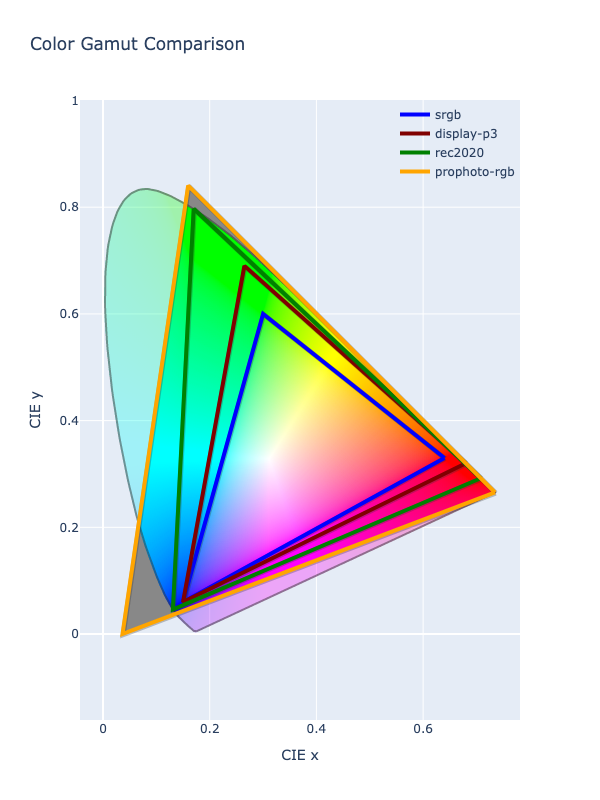
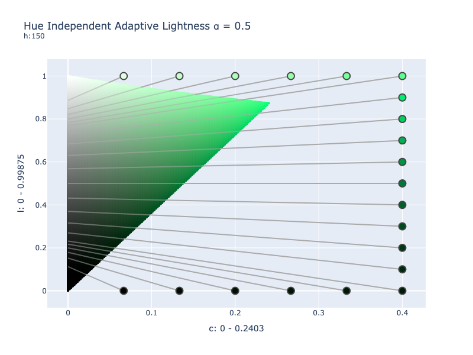
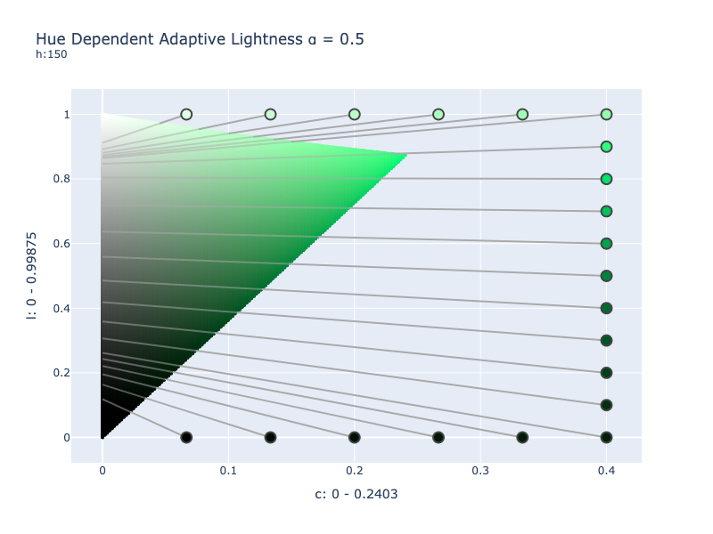
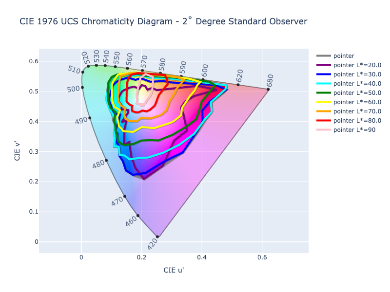

# Gamut Mapping

Many color spaces are designed to represent a specific range of colors. This is often done to target specific display
types or mediums. The monitor this is being displayed on can likely display millions of colors, but there are still 
colors it is not capable of displaying. So color spaces are often designed to represent such mediums to make it easy for
authors and artists to know exactly where those color boundaries are. This range of colors that a color space is limited
to and designed for is called a color gamut.

There are some color spaces that are theoretically unbounded, and even some color spaces that are bounded but can
actually still give meaningful data if extended, but often, when it comes time to display a color, paint a product, or
print a book, the actual colors are limited to what that device or process can handle.

The sRGB and Display P3 color spaces are both RGB color spaces, but they actually can represent a different amount of
colors. Display P3 has a wider gamut and allows for greener greens and redder reds, etc. In the image below, we show
four different RGB color spaces, each with varying different gamut sizes. Display P3 contains all the colors in sRGB
and extends it even further. Rec. 2020, another RGB color space, is even wider. ProPhoto is so wide that it contains
colors that the human eye can't even see.



In order to visually represent a color from a wider gamut color space, such as Display P3, in a more narrow color space,
such as sRGB, a suitable color within the more narrow color space must be selected and be shown in its place. This
selecting of a suitable replacement is called gamut mapping.

ColorAide defines a couple methods to help identify when a color is outside the gamut bounds of a color space and to
help find a suitable, alternative color that is within the gamut.

## Checking Gamut

When dealing with colors, it can be important to know whether a color is within its own gamut. Let's say we are working
with colors in Display P3, but we want to output to an sRGB display. Let's say the color of interest is
`#!color color(display-p3 1 0 0)`. If we plot the color as shown below, we can see that it is in Display P3, the faint
transparent shell, but it is outside the sRGB gamut, the color solid in the middle. We'd like to detect these cases and
make an adjustment to ensure we don't get unexpected behavior.


The `in_gamut` function allows for comparing the current color's specified values against the target color space's
gamut.

Let's assume we have a color `#!color rgb(30% 105% 0%)`. The color is out of gamut due to the green channel exceeding
the channel's limit of `#!py3 100%`. When we execute `in_gamut`, we can see that the color is not in its own gamut.

```py play
Color("rgb(30% 105% 0%)").in_gamut()
```

On the other hand, some color spaces do not have a limit. CIELab and Oklab are such color spaces and can be represented
in any gamut that'd you'd like.


Sometimes limits will be placed on the color space's channels (as done above) for practicality, but theoretically, there
are no exact bounds.

When we check a CIELab color, we will find that it is always considered in gamut as it has no gamut itself.

```py play
Color("lab(200% -20 40 / 1)").in_gamut()
```

While checking CIELab's own gamut isn't very useful, we can test it against a different color space's gamut. By simply
passing in the name of a different color space, the current color will be converted to the provided space and then
will run `in_gamut` on the new color. You could do this manually, but using `in_gamut` in this manner can be very
convenient. In the example below, we can see that the CIELab color of `#!color lab(200% -20 40 / 1)` is outside the
narrow gamut of sRGB.

```py play
Color("lab(200% -20 40 / 1)").in_gamut('srgb')
```

### Tolerance

Generally, ColorAide does not round off values in order to guarantee the best possible values for round tripping, but
due to [limitations of floating-point arithmetic][floating-point] and precision of conversion algorithms, there can be
edge cases where colors don't round trip perfectly. By default, `in_gamut` allows for a tolerance of `#!py3 0.000075` to
account for such cases where a color is "close enough". If desired, this "tolerance" can be adjusted.

Let's consider the oRGB color model. When converting from sRGB to oRGB, both of which share the same gamut, we can see
that the conversion back is very, very close to being correct, but still technically out of gamut with one channel value
falling below zero, but only slightly. This is due to the perils of floating point arithmetic.


```py play
Color('red').convert('orgb')[:]
Color('red').convert('orgb').convert('srgb')[:]
```

When testing with a tolerance, the color is considered in gamut, but when testing with no tolerance (a tolerance of
zero), the color is considered out of gamut. Depending on what you are doing, this may not be an issue up until you are
ready to finalize the color as very close to in gamut is usually good enough, so sometimes it may be desirable to have
some tolerance, and other times not.

```py play
Color('red').convert('orgb').convert('srgb')[:]
Color('red').convert('orgb').convert('srgb').in_gamut()
Color('red').convert('orgb').convert('srgb').in_gamut(tolerance=0)
```

Let's consider some color models that handle out of gamut colors in a less subtle way. HSL, HSV, and HWB are color
models designed to represent an RGB color space in a cylindrical format, traditionally sRGB. Each of these spaces
isolate different attributes of a color: saturation, whiteness, lightness, etc. Because these models are just
representing the color space in a different way, they share the same gamut as the reference RGB color space. So it
stands to reason that simply using the sRGB gamut check for them should be sufficient, and if we are using strict
tolerance, this would be true.

```py play
Color('rgb(255 255 255)').in_gamut('srgb', tolerance=0)
Color('hsl(0 0% 100%)').in_gamut('srgb', tolerance=0)
Color('color(--hsv 0 0% 100%)').in_gamut('srgb', tolerance=0)
Color('rgb(255.05 255 255)').in_gamut('srgb', tolerance=0)
Color('hsl(0 0% 100.05%)').in_gamut('srgb', tolerance=0)
Color('color(--hsv 0 0% 100.05%)').in_gamut('srgb', tolerance=0)
```

But when we are using a tolerance, and we check one of these models **only** using the sRGB gamut, there are some cases
where these cylindrical colors can exhibit coordinates wildly outside of the model's range but still very close to the
sRGB gamut. This isn't an error or a bug, but simply how the color model behaves with out of gamut colors. These values
can still convert right back to the original color, but this might not always be the case with all color models.

In this example, we have an sRGB color that is extremely close to being in gamut, but when we convert it to HSL,
we can see wildly large saturation. But since it round trips back to sRGB just fine, it can exhibit extreme saturation,
but can still be considered in the sRGB gamut.

```py play
hsl = Color('color(srgb 0.999999 1.000002 0.999999)').convert('hsl')
hsl
hsl.in_gamut('srgb')
```

This happens because these cylindrical color models do not represent out of gamut colors in a very sane way. When
lightness exceeds the SDR range of 0 - 1 (or `0 - 100%` as people generally associate HSL), they can return extremely
high saturation. So even a slightly out of gamut sRGB color _could_ translate to a value way outside the cylindrical
color model's boundaries.

For this reason, gamut checks in the HSL, HSV, and HWB models apply tolerance checks on the color's coordinates in the
sRGB color space **and** the respective cylindrical model ensuring we have coordinates that are close to the color's
actual gamut and reasonably close to the cylindrical model's constraints as well. But if we specifically request `srgb`,
we will see that only `srgb` is referenced.

```py play
hsl = Color('color(srgb 0.999999 1.000002 0.999999)').convert('hsl')
hsl
hsl.in_gamut()
hsl.in_gamut('hsl')
hsl.in_gamut('srgb')
```

In short, ColorAide will figure out what best to test unless you explicitly tell it to use something else. If the
Cartesian check is the only desired check, and the strange cylindrical values that are returned are not a problem,
`srgb` can always be specified. `#!py3 tolerance=0` can also be used to constrain the check to values exactly in the
gamut.

HSL has a very tight conversion to and from sRGB, so when an sRGB color is precisely in gamut, it will remain in gamut
throughout the conversion to and from HSL, both forwards and backwards. On the other hand, there may be color models
that have a looser conversion algorithm. There may even be cases where it may be beneficial to increase the threshold.

## Gamut Mapping Colors

Gamut mapping is the process of taking a color that is out of gamut and adjusting it in such a way that it fits within
the gamut. Essentially, gamut mapping takes a color that is out of gamut and maps it to some place on the target gamut
that makes sense.


There are various ways to map or compress values of an out of bound color to an in bound color, each with their own pros
and cons. ColorAide offers a couple of methods related to gamut mapping: `#!py3 clip()` and `#!py3 fit()`.
`#!py3 clip()` is a dedicated function that performs the speedy, yet naive, approach of simply truncating a color
channel's value to fit within the specified gamut, and `#!py3 fit()` is a method that allows using more advanced gamut
mapping approaches that, while often not as performant and simple as naive clipping, generally yield much better
results in certain contexts.

While clipping won't always yield the most perceptually correct results, it can be a useful way get a color back into
gamut. There may be better approaches, but clipping is still very important and can be used to trim channel noise after
certain mathematical operations or even used in other gamut mapping algorithms if used carefully. For this reason, clip
has its own dedicated method for quick access: `#!py3 clip()`.

```py play
Color('rgb(270 30 120)').clip()
```

The `#!py3 fit()` method, is the generic gamut mapping method that exposes access to all the different gamut mapping
methods available. By default, `#!py3 fit()` uses a more advanced method of gamut mapping that tries to preserve hue and
lightness, hue being the attribute the human eye is most sensitive to. If desired, a user can also specify any currently
registered gamut mapping algorithm via the `method` parameter.

```py play
Color('rgb(270 30 120)').fit()
Color('rgb(270 30 120)').fit(method='clip')
```

Gamut mapping can also be used to indirectly fit colors in another gamut. For instance, fitting a Display P3 color into
an sRGB gamut.

```py play
c1 = Color('color(display-p3 1 1 0)')
c1.in_gamut('srgb')
c1.fit('srgb')
c1.in_gamut()
```

This can also be done with `#!py3 clip()`.

```py play
Color('color(display-p3 1 1 0)').clip('srgb')
```

/// warning | Indirectly Gamut Mapping a Color Space
When indirectly gamut mapping in another color space, results may vary depending on what color space you are in and
what color space you are using to fit the color. The operation may not get the color precisely in gamut. This is
because we must convert the color to the gamut mapping space, apply the gamut mapping, and then convert it back to
the original color. The process will be subject to any errors that occur in the [round trip](./advanced.md#round-trip-accuracy)
to and from the targeted space. This is mainly mentioned as fitting in one color space and round tripping back may
not give exact results and, in some cases, exceed "in gamut" thresholds.
///

There are actually many different ways to gamut map a color. Some are computationally expensive, some are quite simple,
and many do really good in some cases and not so well in others. There is probably no perfect gamut mapping method, but
some are better than others.

### Clip

/// success | The `clip` gamut mapping is registered in `Color` by default and cannot be unregistered
///

Clipping is a simple and naive approach to gamut mapping. If the color space is bounded by a gamut, clip will compare
each channel's value against the bounds for that channel and set the value to the limit it exceeds.

Clip can be performed via `fit` by using the method name `clip` or by using the `clip()` method.

```py play
c = Color('srgb', [2, 1, 1.5])
c.fit(method='clip')
c = Color('srgb', [2, 1, 1.5])
c.clip()
```

Clipping is unique to all other clipping methods in that it has its own dedicated method `clip()` method and that its
method name `clip` is reserved. While not always the best approach for all gamut mapping needs in general, clip is very
important and its speed and simplicity are of great value.

### MINDE Chroma Reduction

Chroma reduction is an approach that reduces the chroma in a polar color space until the color is within the gamut of a
targeted color space. Pure chroma reduction has the advantage of preserving as much lightness and hue as possible, and
when performed within a perceptual space, it can preserve perceptual hue and lightness, but it comes at the cost of
colorfulness/chroma. Pure chroma reduction may not always be desirable when gamut mapping images as some colorfulness
will be lost.

MINDE is an approach that tries to find the in gamut color with the shortest distance to out of gamut color. This can
be better at finding an in gamut color with closer colorfulness but often comes at the cost of larger hue shifts and
variances in lightness.

Combining both chroma reduction and something similar to MINDE can allow you to reduce the chroma of a color, but along
the way, if there is a color near the chroma reduction path below the "just noticeable difference" (JND) in color
distance, it can be returned early.

The way this works is as follows. A given out of gamut color will have its chroma reduced via bisection to bring the
color into gamut. In addition, local clipping will be applied at each step and the distance between that clipped color
and the chroma reduced color will be compared. If the distance between the clipped and chroma reduced color is close
enough to the JND, the clipped color will be returned.

Visually, MINDE chroma reduction will allow a color that has decent constant lightness and will allow some hue shift
as long as it is under what is noticeable by the eye. This doesn't mean no hue shift, and in certain regions, such as
very dark colors or very light colors, hue shift can be greater because it is more difficult to notice in such lightness
ranges. Every perceptual space is different and some do better than others and may allow for a larger or smaller JND
limits, so the JND is relative to the color space and the ∆E color distancing algorithm used.

Preserving lightness in this way is useful when creating tones or mixing and interpolating colors. A constant lightness
can also be useful when trying to control contrast.

Computationally, chroma reduction is slower to compute than clipping. Chroma reduction by bisecting can have varying
performance as it is unknown how many iterations will be required to reduce the color into the gamut. Additionally, by
combining the reduction with MINDE, the algorithm takes additional performance hits has it must now perform costly
color distancing checks. Using a perceptual space with more uniform color distancing can reducing the complexity
required to determine the color distance and, in turn, can speed up the process.

Lastly, all provided MINDE chroma reduction methods allow the controlling of the JND. This is useful if you want to
adjust how close to the gamut boundary you approach before clipping. A larger JND may provide even more colorful colors
while a lower JND will provide more accurate colors (relative to the perceptual space). If desired, setting the JND to 0
can improve performance by bypassing the MINDE logic altogether, but keep in mind that some perceptual spaces can have
a geometry that can cause overly under-saturated colors just due to how the colors are distributed in the color space.

Consider the color `#!color color(display-p3 1 1 0)`. If we were to gamut map it in CIELCh with a very low JND, we can
see that the odd shape of CIELCh in the yellow region can cause us to get a very desaturated color. By using the default
JND of 2 for CIELCh, the MINDE logic will catch a more saturated yellow before it reduces chroma all the way to the
gamut surface. Such geometric quirks aren't present in all color spaces, so in a space like OkLCh, it will have a less
noticeable difference.

/// tab | JND 0

///

/// tab | JND 2

///

As a final note, it should be noted that most color spaces that have a defined gamut are tied to specific RGB gamuts.
And when they are gamut mapped, they are done so in those RGB spaces. For instance, HSL which represents the sRGB gamut
in a cylindrical form will be gamut mapped in sRGB (though simple clipping may be done directly in HSL).

There are a few color spaces/models that do not have a clearly defined gamuts. One such case is HPLuv, which is only
defined as a cylindrical color space that represent only a subset of the sRGB color space. Additionally Okhsl and Okhsv
are two cylindrical color spaces based on the perceptual Oklab color space that are meant to target the sRGB gamut, but
are only a loose approximation which can actually slightly clip the sRGB gamut while simultaneously containing a few
colors that exceed the sRGB gamut. ColorAide will not automatically associate these color spaces with an RGB gamut. In
the case of HPLuv, there is no specifically defined RGB gamut, and in the case of Okhsl and Okhsv, sRGB is the closest,
but does not precisely represent the colors in Okhsl and Okhsv.

Gamut mapping in HPLuv usually provides fine results, but you may find that gamut mapping Okhsl may not provide the
intended results. When gamut mapping such spaces, you may want to use the closest RGB gamut.

```py play
Steps([c.fit('okhsl', method='oklch-chroma') for c in Color.steps(['oklch(90% 0.4 0)', 'oklch(90% 0.4 360)'], steps=100, space='oklch', hue='longer')])
Steps([c.fit('srgb', method='oklch-chroma') for c in Color.steps(['oklch(90% 0.4 0)', 'oklch(90% 0.4 360)'], steps=100, space='oklch', hue='longer')])
```

#### LCh Chroma

/// success | The `lch-chroma` gamut mapping is registered in `Color` by default
///

LCh Chroma applies MINDE Chroma Reduction within the CIELCh color space and is currently the default approach in
ColorAide.

/// note
As most colors in ColorAide use a D65 white point by default, LCh D65 is used as the gamut mapping color space.
///

CIELCh, is not necessarily the best perceptual color space available, but it is a generally well understood color space
that has been available a long time. It does suffer from a purple shift when dealing with blue colors, but can generally
handle colors in very wide gamuts reasonably due to its fairly consistent shape well past the spectral locus.

CSS originally proposed MINDE Chroma Reduction with CIELCh, but has later changed to OkLCh. It is possible that the
entire choice in algorithms could change as well in the future. We do offer an [OkLCh variant](#oklch-chroma), but we
currently still use CIELCh due to its consistency even with colors far outside the gamut. If you are working within
reasonable gamuts, OkLCh may be a better choice.

LCh Chroma is the default gamut mapping algorithm unless otherwise changed, and can be performed by simply calling
`fit()` or by calling `fit(method='lch-chroma')`.

```py play
c = Color('srgb', [2, -1, 0])
c.fit(method='lch-chroma')
```

Additionally, the JND target can be controlled for tighter or looser gamut mapping via the `jnd` option. The default is
`2`.

```py play
c = Color('srgb', [2, -1, 0])
c.fit(method='lch-chroma', jnd=0.2)
```

#### OkLCh Chroma

/// success | The `lch-chroma` gamut mapping is registered in `Color` by default
///

The [CSS Color Level 4 specification](https://drafts.csswg.org/css-color/#binsearch) currently recommends using the
perceptually uniform OkLCh color space with the MINDE Chroma Reduction approach.

OkLCh does a much better job holding hues constant. When combined with gamut mapping, it generally does a better job
than CIELCh, but it does have limitations. When colors get near the edge of the visible spectrum, the shape of the
color space distorts, and gamut mapping will not be as good. But if you are working within reasonable gamuts, it may
be an excellent option.

```py play
c = Color('srgb', [2, -1, 0])
c.fit(method='oklch-chroma')
```

Additionally, the JND target can be controlled for tighter or looser gamut mapping via the `jnd` option. The default is
`0.02`.

```py play
c = Color('srgb', [2, -1, 0])
c.fit(method='oklch-chroma', jnd=0.002)
```

#### HCT Chroma

/// failure | The `hct-chroma` gamut mapping is **not** registered in `Color` by default
///

/// warning
This approach was specifically added to help produce tonal palettes, but with the recent addition of the [ray trace
approach to chroma reduction in any perceptual space](#gamut-mapping-in-any-perceptual-space), it is
recommended that users apply that approach as it performs a tight chroma reduction much quicker, and it doesn't require
a special ∆E method.

On occasions, MINDE approach can be slightly more accurate very close to white due to the way ray trace handles HCT's
atypical achromatic response, but differences should be imperceptible to the eye at such lightness levels making the
improved performance of the ray trace approach much more desirable.

```py play
c = Color('hct', [325, 24, 50])
tones = [0, 10, 20, 30, 40, 50, 60, 70, 80, 90, 95, 100]
Steps([c.clone().set('tone', tone).convert('srgb').to_string(hex=True, fit={'method': 'raytrace', 'pspace': 'hct'}) for tone in tones])
```

If more accuracy in HCT's atypical achromatic region is desired, the MINDE approach is available.
///

Much like the other LCh chroma reduction algorithms, HCT Chroma performs gamut mapping exactly like
[LCh Chroma](#lch-chroma) with the exception that it uses the HCT color space as the working LCh color space.

Google's Material Design uses a new color space called [HCT](./colors/hct.md). It uses the hue and chroma from
[CAM16](./colors/cam16.md) space and the tone/lightness from the [CIELab](./colors/lab_d65.md) space. HCT takes
advantage of the good hue preservation of CAM16 and has the better lightness predictability of CIELab. Using these
characteristics, the color space is adept at generating tonal palettes with predictable lightness. This makes it easier
to construct UIs with decent contrast. But to do this well, you must work in HCT and gamut map in HCT. For this reason,
the HCT Chroma gamut mapping method was added.

HCT Chroma is computationally the most expensive gamut mapping method that is offered. Since the color space used is
based on the already computationally expensive CAM16 color space, and is made more expensive by blending that color
space with CIELab, it is not the most performant approach, but when used in conjunction with the HCT color space, it
can allow creating good tonal palettes:

```py play
c = Color('hct', [325, 24, 50])
tones = [0, 10, 20, 30, 40, 50, 60, 70, 80, 90, 95, 100]
Steps([c.clone().set('tone', tone).convert('srgb').to_string(hex=True, fit={'method': 'hct-chroma', 'jnd': 0.0}) for tone in tones])
```

As shown above, the JND target can be controlled for tighter or looser gamut mapping via the `jnd` option. The default
is `2`, but to get tonal palette results comparable to Google Material, we are using `0.0`.

To HCT Chroma plugin is not registered by default, but can be added by subclassing `Color`. You must register the
[∆E~hct~](./distance.md#delta-e-hct) distancing algorithm and the HCT color space as well.

```py
from coloraide import Color as Base
from coloraide.gamut.fit_hct_chroma import HCTChroma
from coloraide.distance.delta_e_hct import DEHCT
from coloraide.spaces.hct import HCT

class Color(Base): ...

Color.register([HCT(), DEHCT(), HCTChroma()])
```

### Ray Tracing Chroma Reduction

/// warning | Experimental Gamut Mapping
///

/// New | New in 4.8
The default perceptual space is now Oklab.

Please see [Gamut Mapping in Any Perceptual Space](#gamut-mapping-in-any-perceptual-space) to learn how to use different
perceptual spaces and how to set your own default.
///

ColorAide has developed a chroma reduction technique that employs ray tracing. Its aim is to provide faster chroma
reduction for gamut mapping using constant lightness. This approach specifically targets RGB gamuts, or spaces that can
be represented with RGB gamuts. Additionally, if ColorAide can detect a linear version of the targeted RGB gamut, that
version will be used automatically for best results. Currently, ColorAide can gamut map all officially supported color
spaces as they either have an RGB gamut or can be coerced into one.

The ray trace approach works by taking a given color and converting it to a perceptual Lab-ish or LCh-ish color space
(the default being Oklab) and then calculates the achromatic version of the color which will be our anchor point.
Assuming our anchor point is within bounds, a ray is cast from the inside of the cube, from the anchor point to the
current color. The intersection along this path with the RGB gamut surface is then found.  If the achromatic color
exceeds the maximum or minimum lightness of the gamut, the respective maximum or minimum achromatic color is returned.

/// note | Ray Trace Algorithm
The ray trace algorithm is based on the [slab method](https://en.wikipedia.org/wiki/Slab_method). The intersection that
is selected is the first one encountered when following the ray from the origin point in the direction of the specified
end point.
///

The intersection of the line and the gamut surface represents an approximation of the most saturated color for that
lightness and hue, but because the RGB space is not perceptual, the initial approximation is likely to be off because
decreasing chroma and holding lightness and hue constant in a perceptual space will create a curved path through the
RGB space. In order to converge on a point as close as possible to the actual, most saturated color with the given hue
and lightness, we must refine our result with a few additional iterations.

In order to converge on the actual chroma reduced color we seek, we can take the first intersection we find and correct
the color in the perceptual color space by projecting the point back onto the chroma reduction path, correcting the
color's hue and lightness. The corrected color becomes our new current color and should be a much closer color on the
reduced chroma line. We can repeat this process a few more times, each time finding a better, closer color on the path.
After about three _additional_ iterations (a combined total of four for the entire process), we will be close enough
where we can stop. Finally, we can then clip off floating point math errors. With this, we will now have a more accurate
approximation of the color we seek.


One final improvement is that during the correction step, where we adjust the surface point back onto the chroma
reduction path, if we find a point below the gamut surface, we can adjust our anchor to be this new point, closer to the
gamut surface, which in some spaces will help to converge closer to our ideal color than they would without the
adjustment.


The results are comparable to MINDE using a low JND, but resolves much faster and within more predictable, consistent
time.

```py play
Color('oklch(90% 0.8 270)').fit('srgb', method='raytrace', pspace='lch-d65')
Color('oklch(90% 0.8 270)').fit('srgb', method='lch-chroma', jnd=0)
```

As noted earlier, this method specifically targets RGB gamuts. This is because the ray tracing is performed on a simple
RGB cube which is easy to calculate. ColorAide maps almost all colors to an RGB gamut, if they have one. And those
gamuts are often associated with a linear RGB counterpart which is preferred when gamut mapping, but there are a few
color spaces/models that do not map to an obvious RGB gamut.

HPLuv, which is only defined as a cylindrical color space that represent only a subset of the sRGB color space, has no
defined RGB gamut on which to operate on. Additionally Okhsl and Okhsv are two cylindrical color spaces, based on the
perceptual Oklab color space, that are meant to target the sRGB gamut, but are only a loose approximation which actually
can slightly clip the sRGB gamut while simultaneously containing a few colors that exceed the sRGB gamut. ColorAide will
not automatically associate these color spaces with an RGB gamut as their is not one that precisely represent the colors
in Okhsl and Okhsv.

With that said, ColorAide will translate these spaces into a cube shape to apply gamut mapping on them if they are
specifically used. In the case of HPLuv, results are usually fine, but you may find that gamut mapping Okhsl
may not provide the intended results. It should be noted that the currently suggested CSS gamut mapping algorithm
(`oklch-chroma`) does not do much better, so, for Okhsl and Okhsv, it is better to use the closest RGB gamut.

```py play
Steps([c.fit('okhsl', method='raytrace') for c in Color.steps(['oklch(90% 0.4 0)', 'oklch(90% 0.4 360)'], steps=100, space='oklch', hue='longer')])
Steps([c.fit('okhsl', method='oklch-chroma') for c in Color.steps(['oklch(90% 0.4 0)', 'oklch(90% 0.4 360)'], steps=100, space='oklch', hue='longer')])
Steps([c.fit('srgb', method='raytrace') for c in Color.steps(['oklch(90% 0.4 0)', 'oklch(90% 0.4 360)'], steps=100, space='oklch', hue='longer')])
```

### Gamut Mapping in Any Perceptual Space

ColorAide provides a couple gamut mapping approaches and a few using different perceptual spaces to perform the
operation, but th `minde-chroma` and the `raytrace` gamut mapping allow for using any perceptual space to perform the
gamut mapping operation in. Any perceptual space in the LCh-ish or Lab-ish form can be specified via the `pspace`
parameter.

```py play
Color('oklch(50% 0.4 270)').fit('srgb', method='raytrace', pspace='cam16-jmh')
Color('oklch(50% 0.4 270)').fit('srgb', method='raytrace', pspace='luv')
```

For the MINDE chroma approach, you would need to specify and configure an appropriate ∆E distancing approach and
determine an appropriate JND limit for said distancing approach. Ideally, a ∆E algorithm specific to the perceptual
space is preferred to help prevent costly conversions to other color spaces. Performance of algorithm in different
perceptual spaces is dependent on the ∆E algorithm used, the JND selected, and how uniformly perceptual the color space
is.

As an example, `minde-chroma` method uses OkLCh and uses the ∆E~ok~ distancing algorithm with a JND of 0.02. The LCh
variant uses CIELCh D65 and uses ∆E~2000~ with a JND of 2. We can manually perform both of these by setting the
perceptual space with `psapce`, the ∆E configuration via `de_options`, and the JND with `jnd`.

``` py play
gma_lch = {'pspace': 'lch-d65', 'de_options': {'method': '2000'}, 'jnd': 2}
gma_oklch = {'pspace': 'oklch', 'de_options': {'method': 'ok'}, 'jnd': 0.02}

Steps([c.fit('srgb', **gma_lch) for c in Color.steps(['oklch(90% 0.4 0)', 'oklch(90% 0.4 360)'], steps=100, space='oklch', hue='longer')])
Steps([c.fit('srgb', **gma_oklch) for c in Color.steps(['oklch(90% 0.4 0)', 'oklch(90% 0.4 360)'], steps=100, space='oklch', hue='longer')])
```

It should be noted that gamut mapping will be limited by the capabilities of the perceptual space being used. Some color
spaces can swing to varying degrees outside the visible spectrum and some perceptual models can tolerate this more than
others. While the characteristics of the color space can affect gamut mapping results, this does not mean the gamut
mapping approach does not work, only that some color models may work best under more constraints.

Consider the example below. We take a very saturated yellow in Display P3 (`#!color color(display-p3 1 1 0)`) and then
we interpolate it's lightness between 0, masking off chroma so that we are only interpolating lightness. We do this
interpolation in CIELCh, whose chroma can swing very far outside the visible spectrum when interpolating hues at more
extreme lightness. Finally, we gamut map in various LCh models. What we can observe is some models will struggle to map
some of these colors as the hue preservation can break down at extreme limits. In the cases below, this specifically
happens due to negative XYZ values that are produced due to high chroma in lower lightness. Some models can tolerate
this more than others.

```py play
yellow = Color('color(display-p3 1 1 0)')
lightness_mask = Color('lch(0% none none)')
Steps([c.fit('srgb', method='raytrace', pspace='oklch') for c in Color.steps([yellow, lightness_mask], steps=20, space='lch')])
Steps([c.fit('srgb', method='raytrace', pspace='lch99o') for c in Color.steps([yellow, lightness_mask], steps=20, space='lch')])
Steps([c.fit('srgb', method='raytrace', pspace='hct') for c in Color.steps([yellow, lightness_mask], steps=20, space='lch')])
Steps([c.fit('srgb', method='raytrace', pspace='jzczhz') for c in Color.steps([yellow, lightness_mask], steps=20, space='lch')])
Steps([c.fit('srgb', method='raytrace', pspace='lchuv') for c in Color.steps([yellow, lightness_mask], steps=20, space='lch')])
```

Almost any perceptual model, if pushed far enough, can start to break down. Converting to and from these spaces _before_
reducing chroma can introduce such disparities. Every color space has limitations, some spaces just have more agreeable
ones.

If you are working within reasonable gamuts, most will work fine. And if you want to do something like above, holding
chroma really high for all lightness values, you will often find that it works best when you do it directly in the color
space that is doing the gamut mapping as you will have to "fit" the color before converting to another color
space.


```py play
yellow = Color('color(display-p3 1 1 0)')
lightness_mask = Color('oklch(0% none none)')
Steps([c.fit('srgb', method='raytrace', pspace='oklch') for c in Color.steps([yellow, lightness_mask], steps=20, space='oklch')])
yellow = Color('color(display-p3 1 1 0)')
lightness_mask = Color('color(--lch99o 0% none none)')
Steps([c.fit('srgb', method='raytrace', pspace='lch99o') for c in Color.steps([yellow, lightness_mask], steps=20, space='lch99o')])
yellow = Color('color(display-p3 1 1 0)')
lightness_mask = Color('color(--hct none none 0%)')
Steps([c.fit('srgb', method='raytrace', pspace='hct') for c in Color.steps([yellow, lightness_mask], steps=20, space='hct')])
yellow = Color('color(display-p3 1 1 0)')
lightness_mask = Color('jzczhz(0% none none)')
Steps([c.fit('srgb', method='raytrace', pspace='jzczhz') for c in Color.steps([yellow, lightness_mask], steps=20, space='jzczhz')])
yellow = Color('color(display-p3 1 1 0)')
lightness_mask = Color('color(--lchuv 0% none none)')
Steps([c.fit('srgb', method='raytrace', pspace='lchuv') for c in Color.steps([yellow, lightness_mask], steps=20, space='lchuv')])
```

Lastly, if we have a particular color space that we'd like to have as the default, we can derive a variant for our particular
color space using our preferred method of gamut mapping. Generally it is recommended to use the base plugins
`minde-chroma` or `raytrace` as the base.

/// tab | Ray Trace

```py play
from coloraide.gamut.fit_raytrace import RayTrace
from coloraide.spaces.hct import HCT
from coloraide import Color as Base

class HCTRayTrace(RayTrace):
    """Apply gamut mapping using ray tracing."""

    NAME = 'hct-raytrace'
    PSPACE = "hct"

class Color(Base): ...

Color.register([HCT(), HCTRayTrace()])

c = Color('hct', [325, 24, 50])
tones = [0, 10, 20, 30, 40, 50, 60, 70, 80, 90, 95, 100]
Steps([c.clone().set('tone', tone).convert('srgb').to_string(hex=True, fit='hct-raytrace') for tone in tones])
```

If we want to make ray tracing the default algorithm for all gamut mapping, we can simply set `FIT` to our method.

```py
class Color(Base):
    FIT = 'hct-raytrace'

Color.register(HCTRayTrace(), overwrite=True)
```

///

/// tab | MINDE Chroma
```py play
from coloraide import Color as Base
from coloraide.spaces.hct import HCT
from coloraide.distance.delta_e_hct import DEHCT
from coloraide.gamut.fit_minde_chroma import MINDEChroma

class HCTChroma(MINDEChroma):
    """HCT chroma gamut mapping class."""

    NAME = "hct-chroma"
    JND = 2.0
    DE_OPTIONS = {"method": "hct"}
    PSPACE = "hct"

class Color(Base): ...

Color.register([HCT(), DEHCT(), HCTChroma()])

c = Color('hct', [325, 24, 50])
tones = [0, 10, 20, 30, 40, 50, 60, 70, 80, 90, 95, 100]
Steps([c.clone().set('tone', tone).convert('srgb').to_string(hex=True, fit='hct-chroma') for tone in tones])
```

If we want to make ray tracing the default algorithm for all gamut mapping, we can simply set `FIT` to our method.

```py
class Color(Base):
    FIT = 'hct-chroma'

Color.register(HCTChroma(), overwrite=True)
```
///

### Adaptive Lightness

Both MINDE chroma reduction and ray trace chroma reduction support adaptive lightness. This is an option to allow for
a non-constant lightness chroma reduction. Adaptive lightness allows us to essentially choose a dynamic anchor point
different than our constant lightness anchor. Choosing a different anchor point can allow us to preserve more
chroma/colorfulness by sacrificing some lightness.

Essentially, a lightness focal point is selected by which the chroma reduction will be biased towards by some factor
**ɑ**. This is done by taking this focal lightness and using it as a reference by which a new, non-constant lightness
anchor point is calculated relative to this focal point. The anchor point is biased more or less towards this focal
lightness depending on how large or small the **ɑ** value is respectively.

Below shows examples of chroma reduction with a focal lightness of 50% and an **ɑ** value of 0, 0.5, and 5 respectively.

/// tab | Constant Lightness (ɑ = 0)

///

/// tab | Adaptive Lightness (ɑ = 0.5)

///

/// tab | Adaptive Lightness (ɑ = 5)

///

There are various ways in which adaptive lightness could be implemented, but we will talk about two basic approaches:
hue independent and hue dependent.

A hue independent approach will select some lightness focal point. This focal point can be anywhere, but it will be the
same regardless of the hue. This focal point will be used to calculate new anchor points relative to the focal point
based on the given **ɑ** that will guide the chroma reduction.

A hue dependent approach will select a lightness focal point for each hue. In such approaches, the lightness selected
is often a lightness value that corresponds with the maximum chroma for the current hue in the target gamut, this
lightness and chroma point being called the cusp. By biasing chroma reduction towards the lightness of the cusp, it
better accounts for the geometry of the perceptual color space and ensures that the process is providing colors with
more, not less, chroma in all situations.

/// tab | Hue Independent (ɑ = 0.5)

///

/// tab | Hue Dependent (ɑ = 0.5)

///

/// note
The current algorithms we use to determine anchor points relative to a lightness focal point as described in the
following article by the author of Oklab:

- [Hue independent](https://bottosson.github.io/posts/gamutclipping/#adaptive-%2C-hue-independent).
- [Hue dependent](https://bottosson.github.io/posts/gamutclipping/#adaptive-%2C-hue-dependent).

These algorithms are not specific to Oklab and are general functions that can be applied to any similar color space.
///

Generally, the hue dependent approach is the more preferable approach, but it is more complex to calculate the cusp in
every supported gamut for a every perceptual space in a performant, generic way. Conversely, the hue independent
approach requires no specialized calculation as the lightness focal point is a single, arbitrary point with no relation
to the perceptual hue or the gamut making it fast and easy to calculate the required anchor points, but its practical
range will be more limited. If only a smaller factor is needed, the hue dependent approach could be a faster, and a more
desirable approach.

Currently, ColorAide only implements a hue independent approach as a generalized approach for _any_ perceptual space
and _any_ target gamut is difficult, that's not to say that a more specialized, limited hue dependent approach can't be
offered in the future, but none are currently offered at this time.

To enable hue independent adaptive lightness, simply set the `adaptive` option in any MINDE chroma or ray trace
gamut mapping method. A factor of 0 is equivalent to constant lightness and will disables adaptive lightness. Any other
positive value will create a bias towards the focal point of 50% lightness. The biasing of the chroma reduction towards
the focal point will increase as the provided factor increases. A practical range might be more in the ballpark of
0 - 0.5, maybe even lower, but higher values can be used if desired.

/// tab | Ray Trace
```py play
Steps(
    [
        c.fit('srgb', method='raytrace', pspace='oklch', adaptive=0.0)
        for c in Color.steps(['oklch(80% 0.4 0)', 'oklch(80% 0.4 360)'], space='oklch', steps=100, hue='longer')
    ]
)
Steps(
    [
        c.fit('srgb', method='raytrace', pspace='oklch', adaptive=0.5)
        for c in Color.steps(['oklch(80% 0.4 0)', 'oklch(80% 0.4 360)'], space='oklch', steps=100, hue='longer')
    ]
)
```
///

/// tab | MINDE Chroma
```py play
Steps(
    [
        c.fit('srgb', method='minde-chroma', pspace='oklch', adaptive=0.0, jnd=0)
        for c in Color.steps(['oklch(80% 0.4 0)', 'oklch(80% 0.4 360)'], space='oklch', steps=100, hue='longer')
    ]
)
Steps(
    [
        c.fit('srgb', method='minde-chroma', pspace='oklch', adaptive=0.5, jnd=0)
        for c in Color.steps(['oklch(80% 0.4 0)', 'oklch(80% 0.4 360)'], space='oklch', steps=100, hue='longer')
    ]
)
```
///

//// note
Generally, adaptive lightness can be used within any perceptual space against any target gamut using the ray trace
or MINDE chroma reduction approach. With that said, it should be noted that some spaces will not perform as well at
high **ɑ** values due to their geometry regardless of whether the ray trace or MINDE chroma reduction approach is used.

The one exception to the above statement is the Luv/LCH~uv~ color space which exhibited less accurate results in our
testing when using the ray trace approach and high **ɑ** values that strayed too far from constant lightness. The dark
blue region of Luv/LCH~uv~ created chroma reduction curves that pushed the ray trace algorithm too hard with adaptive
lightness.

While Luv/LCH~uv~ is currently the only space provided by ColorAide that had trouble with high **ɑ** values when using
the ray trace algorithm, there may be others that have yet to be implemented. In these rare cases, it may be better to
use MINDE chroma reduction which, while slower, has a straightforward algorithm that is less likely to have issues. For
all others, ray trace will give the best performance with comparable results.

/// tab | Ray Trace
```py play
Steps(
    [
        c.fit('srgb', method='raytrace', pspace='lchuv', adaptive=0.0)
        for c in Color.steps(['color(--lchuv 10% 100 270)', 'color(--lchuv 90% 100 270)'], space='luv', steps=100)
    ]
)
Steps(
    [
        c.fit('srgb', method='raytrace', pspace='lchuv', adaptive=0.5)
        for c in Color.steps(['color(--lchuv 10% 100 270)', 'color(--lchuv 90% 100 270)'], space='luv', steps=100)
    ]
)
```
///

/// tab | MINDE Chroma
```py play
Steps(
    [
        c.fit('srgb', method='minde-chroma', pspace='lchuv', adaptive=0.0, jnd=0)
        for c in Color.steps(['color(--lchuv 10% 100 270)', 'color(--lchuv 90% 100 270)'], space='luv', steps=100)
    ]
)
Steps(
    [
        c.fit('srgb', method='minde-chroma', pspace='lchuv', adaptive=0.5, jnd=0)
        for c in Color.steps(['color(--lchuv 10% 100 270)', 'color(--lchuv 90% 100 270)'], space='luv', steps=100)
    ]
)
```
///
////

## Pointer's Gamut

/// new | New 2.4
///

The Pointer’s gamut is (an approximation of) the gamut of real surface colors as can be seen by the human eye, based on
the research by Michael R. Pointer (1980). What this means is that every color that can be reflected by the surface of
an object of any material should be is inside the Pointer’s gamut. This does not include, however, those that do not
occur naturally, such as neon lights, etc.


While in the above image, it may appear that most of sRGB is in the gamut, it is important to note that the image is
showing the maximum range of the gamut. The actual boundary will be different at different luminance levels.



The gamuts previously discussed are bound by a color space's limits, but the Pointer's gamut applies to colors more
generally and was created from observed data via research. Because it doesn't quite fit with the color space gamut API,
ColorAide exposes two special functions to test if a color is in the Pointer's gamut and to fit a color to the gamut.

To test if a color is within the gamut, simply call `in_pointer_gamut()`:

```py play
Color('red').in_pointer_gamut()
Color('orange').in_pointer_gamut()
```

ColorAide also provides a way to fit a color to the Pointer's gamut. The original gamut's data is described in LCh using
illuminant C. Using this color space, we can estimate the chroma limit for any color based on it's lightness and hue.
We can then reduce the chroma, preserving the lightness and hue. The image below shows the out of Pointer's gamut color
`#!color red` (indicated by the `x`) which is clamped to the Pointer's gamut by reducing the chroma (indicated by the
dot).


ColorAide provides the `fit_pointer_gamut()` method to perform this "fitting" of the color.

```py play
color = Color('red')
color
color.in_pointer_gamut()
color.fit_pointer_gamut()
color.in_pointer_gamut()
```

/// tip
Much like `in_gamut()`, `in_pointer_gamut()` allows adjusting tolerance as well via the `tolerance` parameter.
///
