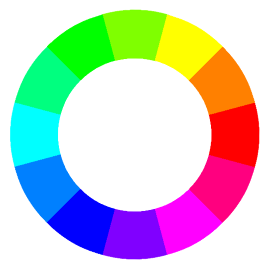
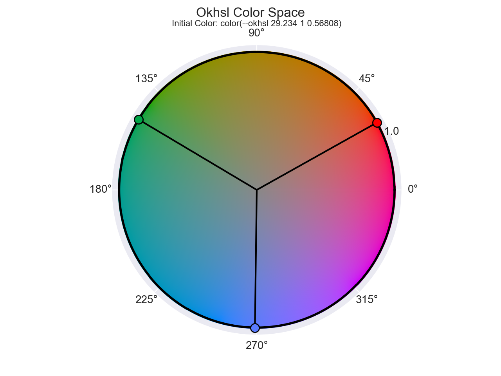
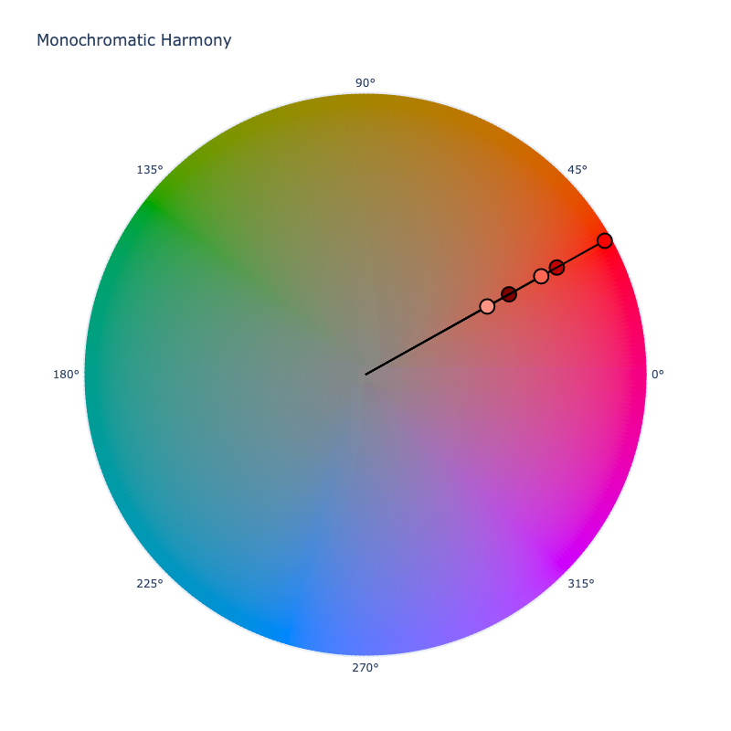
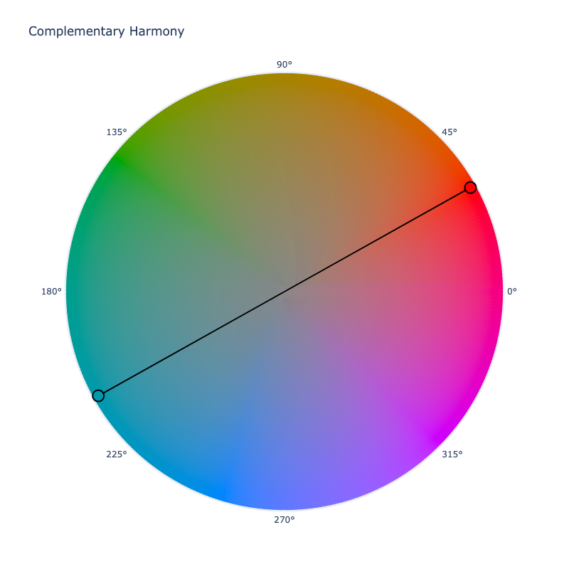
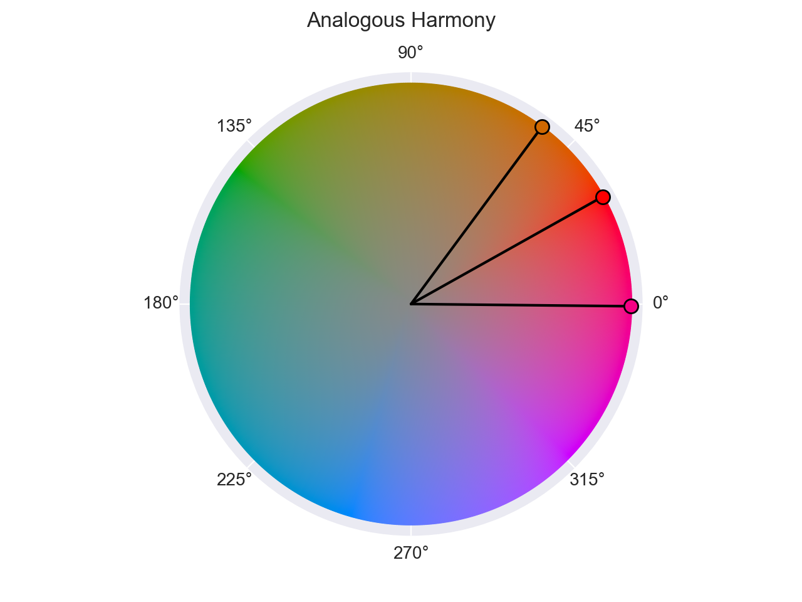
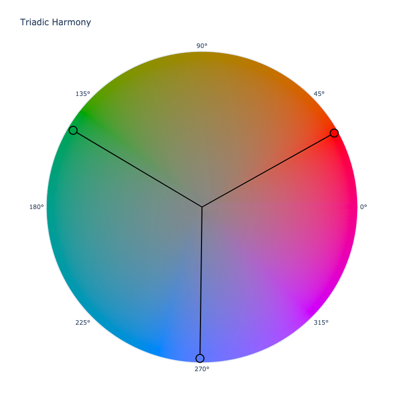
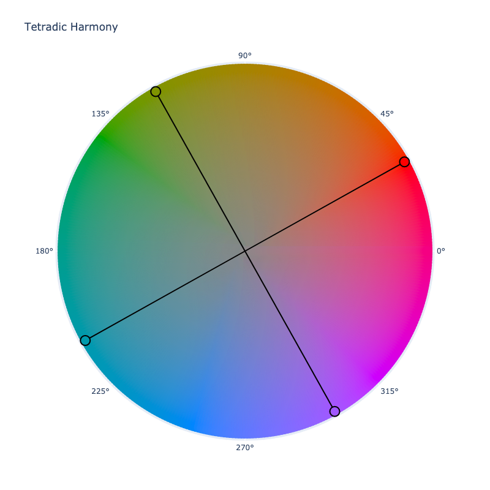
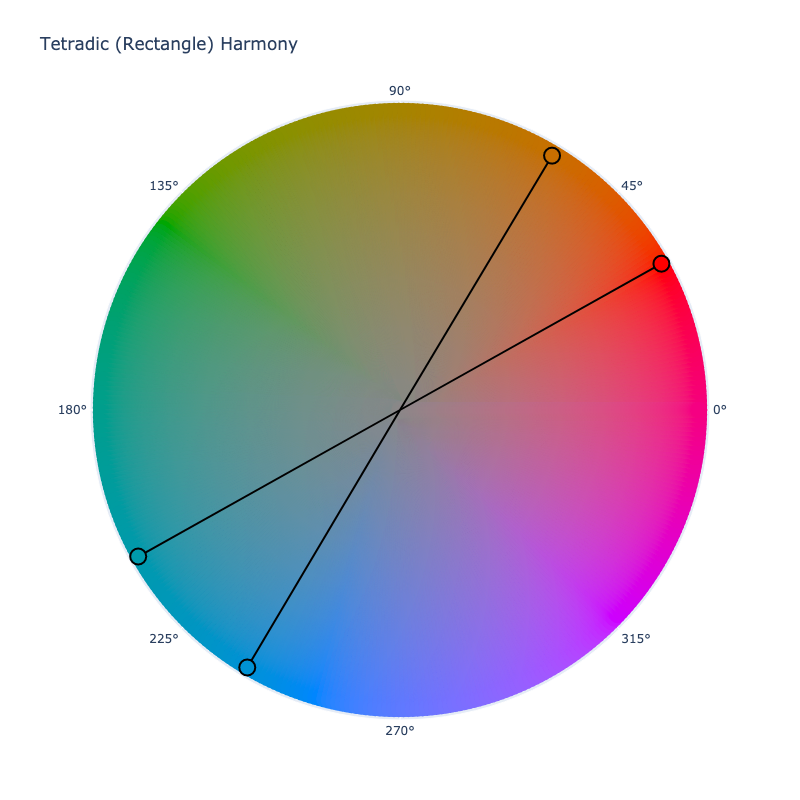

# Color Harmonies

In color theory, color harmony refers to the property that certain aesthetically pleasing color combinations have.
Modern day color theory probably starts with the first color wheel created by Isaac Newton. Based on his observations of
light with prisms, he formed probably the first color wheel. From there, many others built upon this work, sometimes
with opposing ideas.

The original color wheel, while inspired by what was observed by light, was created based on experiments with pigments
as well. As most know, in paint, red, yellow, and blue are considered primary colors. Newton thought this translated to
light as well and stated they were also the primary colors of light. While this isn't actually true, his work was very
important in reshaping how people viewed color.

Over time, the color wheel was refined. The traditional model, which we will call an RYB color model, defined 12 colors
that made up the wheel: the primary colors, the secondary colors, and the tertiary colors. The secondary colors are
created by evenly mixing the primary colors, and the tertiary colors are created by evenly mixing those primary colors
with the secondary colors.


The idea of color harmonies originates from the idea that colors, based on their relative position on the wheel, can
form more pleasing color combinations.

## Which Color Space is Best for Color Harmonies?

As we know, these days, there are many color spaces out there: subtractive models, additive models, perceptually
uniform models, high dynamic range models, etc. Many color spaces trying to solve specific issues based on the knowledge
at the time.

The early work that created the first color wheel was based on an RYB color model. In modern TVs and monitors, the RYB
color model is not used. Electronic screens create all their colors with light based methods that mix red, green, and
blue lights. In addition, the human eye perceives colors using red, green, and blue as well.

In reality, we could create a color wheel from any of the various color spaces out there and end up with slightly
different results. If we were to compose a color wheel based on the common sRGB color space, we could base it off the 3
primary colors of light. Starting with red (0˚), we could extract the colors at evenly spaced degrees, 30˚ to be exact.
This would give us our 12 colors for the sRGB color space.

```playground
HtmlSteps([Color('hsl', [x, 1, 0.5]) for x in range(0, 360, 30)])
```

From this we can construct an sRGB color wheel.



This is different from the RYB color wheel, and more accurate in relation to how light works, but does it yield better
harmonies for colors?

If we were to select the perceptually uniform OkLCh color space, and seed it with red's lightness and chroma, we'd get:

```playground
c = Color('red').convert('oklch', in_place=True)
HtmlSteps([Color('oklch', [*c[0:2], x]) for x in range(0, 360, 30)])
```

This produces colors with visually more uniform lightness, does that mean these are better?

The truth is, what is better or even harmonious can be largely subjective, and everyone has reasons for selecting
certain color spaces for a specific task.

Many artists swear by the classical color wheel, others are fine with using the sRGB color wheel as it is easy to work
with in CSS via the HSL color space, and there are still others that are more interested in perceptually uniform color
spaces that aim for more consistent hues and predictable lightness.

As far as ColorAide is concerned, we've chosen to use OkLCh as the color space in which we work in. This is based
mainly on the fact it keeps hue more consistent than some other options, and it allows us to support a wider gamut than
options like HSL.

```playground
HtmlSteps(Color.steps(['black', 'blue', 'white'], steps=11, space='oklch'))
HtmlSteps(Color.steps(['black', 'blue', 'white'], steps=11, space='hsl'))
HtmlSteps(Color.steps(['black', 'blue', 'white'], steps=11, space='lch'))
```

While OkLCh is the default, we understand that there are many reasons to use other spaces, so use what you like, we
won't judge :smile:.

```playground
HtmlSteps(Color('red').harmony('complement'))
HtmlSteps(Color('red').harmony('complement', space='hsl'))
```

## Supported Harmonies

ColorAide currently supports 7 theorized color harmonies: [monochromatic](#monochromatic),
[complementary](#complementary), [split complementary](#split-complementary), [analogous](#analogous),
[triadic](#triadic), [square](#tetradic-square), and [rectangular](#tetradic-rectangular). By default, all color
harmonies are calculated with the perceptually uniform OkLCh color space, but other color spaces can be used if desired.

While we use OkLCh, we will actually visualize the examples in Okhsl. Okhsl is a derivative of OkLCh with the lightness
adjusted to match CIELCh and reshaped in a cylindrical form. It is limited to the sRGB gamut only, but it can help
visualize better what is happening in a familiar color wheel format. You can see the difference below:

=== "OkLCh Color Slice"

    

=== "Okhsl Color Slice"

    


### Monochromatic

The monochromatic harmony pairs various tints and shades of a color together to create pleasing color schemes.



```playground
HtmlSteps(Color('red').harmony('mono'))
```

!!! note "Achromatic Colors"
    Pure `#!color white` and `#!color black` will not be included in a monochromatic color harmony unless the color is
    achromatic.

### Complementary

Complementary harmonies use a dyad of colors at opposite ends of the color wheel.



```playground
HtmlSteps(Color('red').harmony('complement'))
```

### Split Complementary

Split Complementary is similar to complementary, but actually uses a triad of colors. Instead of just choosing one
complement, it splits and chooses two colors on the opposite side that are close, but not adjacent.


```playground
HtmlSteps(Color('red').harmony('split'))
```

### Analogous

Analogous harmonies consists of 3 adjacent colors.



```playground
HtmlSteps(Color('red').harmony('analogous'))
```

### Triadic

Triadic draws an equilateral triangle between 3 colors on the color wheel. For instance, the primary colors have triadic
harmony.



```playground
HtmlSteps(Color('red').harmony('triad'))
```

### Tetradic Square

Tetradic color harmonies refer to a group of four colors. One tetradic color harmony can be found by drawing a square
between four colors on the color wheel.



```playground
HtmlSteps(Color('red').harmony('square'))
```

### Tetradic Rectangular

The rectangular tetradic harmony is very similar to the square tetradic harmony except that it draws a rectangle between
four colors instead of a square.



```playground
HtmlSteps(Color('red').harmony('rectangle'))
```

## Changing the Default Harmony Color Space

If you'd like to change the `#!py3 Color()` class's default harmony color space, it can be done with
[class override](./color.md#override-default-settings). Simply derive a new `#!py3 Color()` class from the original and
override the `HARMONY` property with the name of a suitable cylindrical color space. Afterwards, all color color
harmony calculations will use the specified color space unless overridden via the method's `space` parameter.

```playground
class Custom(Color):
    HARMONY = 'hsl'

HtmlSteps(Custom('red').harmony('split'))
```
