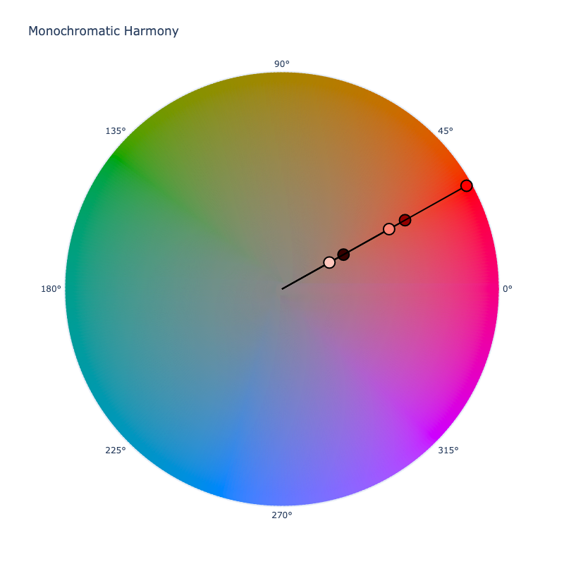

# Color Harmonies

Isaac Newton, based on his observations of light interacting with prisms, constructed the first known color wheel. From
there, many others built upon this work, sometimes with opposing ideas, but his original work is where color harmony got
its start.

The original color wheel, while inspired by what was observed by light, was created based on experiments with pigments
as well. In paints, red, yellow, and blue are often taught to be primary colors. This idea originates from Newton's
work as through his experiments, he came to the conclusions that all colors could be made from red, yellow, and blue,
and assumed this was true for light as well. While this isn't exactly true, his work was very important in reshaping how
people viewed color.

Over time, the color wheel was refined. The traditional model, which we will call an RYB color model, defined 12 colors
that made up the wheel: the primary colors, the secondary colors, and the tertiary colors. The secondary colors are
created by evenly mixing the primary colors, and the tertiary colors are created by evenly mixing those primary colors
with the secondary colors.

```py play
Wheel(Color('ryb', [1, 0, 0]).harmony('wheel', space='ryb'))
```

The concept of color harmonies was formulated on the idea that colors, based on specific, relative position on the
wheel, can form more pleasing color combinations.

## Which Color Space is Best for Color Harmonies?

These days, there are many color spaces and models out there: subtractive models, additive models, perceptually
uniform models, high dynamic range models, etc. But which space/model is the best for color harmonies?

The concept of primary colors stems from the idea that there are a set of pure colors from which all colors can be made
from. The primary colors of electronic screens use red, green, and blue light to display its full gamut of color.
Interestingly, electronic screens were modeled after the human eye that have three cones, each sensitive to wavelengths
close to red, green, and blue. From what the three cones in the eye detect, our brain perceive all the various colors.

Paints and inks on the other hand can alter the light that comes back to our eye depending on the medium's light
absorption and scattering properties. These physical properties of the medium can alter what light is reflected back to
our eyes causing how our eyes perceive the mixing of colors in paint. This mixing behavior in pigments can seem different
when compared to how pure light mixes.

The work that helped create the first color wheel was done with the limited paints that were available at the time, and
influenced by the light scattering and absorption properties of those paints. Because of this, the original color wheel
is built on the RYB color model which uses red, yellow, and blue as the primary colors. The question though, is would
our theories on color harmony be different today if early theorists had a better understanding of light and color?

In reality, we can create a color wheel from any of the various color spaces out there and end up with different
results based on how color is spaced and oriented within those spaces. As an example, we could create one directly from
the sRGB color space. The sRGB space is an additive color space that was modeled on light behavior, so its primary
colors are red, green, and blue. We can simply select the most red, green, and blue colors in its gamut, and transform
them into a polar space such as HSL. Here, these colors are evenly spaced and if we mixed these colors evenly, and those
colors evenly, we will get 12 colors whose hues are evenly spaced at 30˚.

```py play
Steps([Color('hsl', [x, 1, 0.5]) for x in range(0, 360, 30)])
```

From this we can construct an sRGB color wheel.

```py play
Wheel(Color('red').harmony('wheel', space='srgb'))
```

These results are different from the RYB color wheel we showed earlier, but are used to display all the colors you see
on your screen right now. This is how light works when not scattered and absorbed by pigments, but does that mean that
this color wheel yields better color harmonies?

We can transform the RGB color model into a subtractive color space, something similar to what printers use when
applying ink to paper. Printers use something closer to an RYB model and use magenta, yellow, and cyan.

```py play
Wheel(Color('magenta').harmony('wheel', space='cmy'))
```

If we were to select the perceptually uniform OkLCh color space, and seed it with red's lightness and chroma, we'd once
again get very different results in the color wheel. The results are more similar to when we used sRGB, but the exact
hues may be different and lightness is kept more uniform when we construct the wheel. But does that mean this model is
better?

```py play
Wheel(Color('red').harmony('wheel', space='oklch'))
```

The truth is that what is better or even harmonious can be largely subjective.

Many artists swear by the limited, classical RYB color wheel, and others are fine with using the sRGB color wheel as it
is easy to work with in CSS via the HSL color space, and models closer to how the eye works. Additionally, there may be
some that prefer a perceptually uniform approach that aims for more consistent hues and predictable lightness.

As far as ColorAide is concerned, we've chosen to use OkLCh as the color space in which we work in. This is based
mainly on the fact that it keeps hue more consistent than some other options, and it allows us to support a wider gamut
than options like HSL.

```py play
Steps(Color.steps(['black', 'blue', 'white'], steps=11, space='oklch'))
Steps(Color.steps(['black', 'blue', 'white'], steps=11, space='hsl'))
Steps(Color.steps(['black', 'blue', 'white'], steps=11, space='lch'))
```

While OkLCh is the default, we make no assertions that this is better than using any other color space. If you are from
the world of paint, you may strongly dislike this default and prefer a classical RYB approach, or maybe you just want to
use the familiar sRGB approach. We understand that there are many reasons to use other spaces, so use what you like, we
won't judge :smile:. If you are a color theory purist, you can use the classical RYB model.

```py play
Steps(Color('red').harmony('complement'))
Steps(Color('ryb', [1, 0, 0]).harmony('complement', space='ryb'))
```

/// tip | RYB Model
The RYB model has a more limited color gamut than sRGB as the red, yellow and blue primaries cannot make all colors.
Additionally, the red, yellow, and blue primaries are not the same as the ones in sRGB, so when using RYB to generate
harmonies, make sure you are working directly within RYB to ensure you are not out of gamut.
///

/// tip
Regardless of what color space `harmony()` operates in, it can output the results in any color space you need by setting
`out_space`.

```py play
Steps(Color('red').harmony('complement', out_space='srgb'))
```
///

## Supported Harmonies

ColorAide currently supports 7 theorized color harmonies: [monochromatic](#monochromatic),
[complementary](#complementary), [split complementary](#split-complementary), [analogous](#analogous),
[triadic](#triadic), [square](#tetradic-square), and [rectangular](#tetradic-rectangular). By default, all color
harmonies are calculated with the perceptually uniform OkLCh color space, but other color spaces can be used if desired.


### Monochromatic

The monochromatic harmony pairs various tints and shades by mixing white and black respectively with the target color to
create pleasing color schemes. The number of tints and shades that are created is determined by color distance between
white and black via ∆E~2000~.

Then number of colors returned by the monochromatic harmony can be controlled via the `count` parameter, 5 being the
default.



```py play
Steps(Color('red').harmony('mono'))
Steps(Color('red').harmony('mono', count=8))
```

/// note | Achromatic Colors
Pure `#!color white` and `#!color black` will not be included in a monochromatic color harmony unless the color is
achromatic.
///

/// new | New 3.3
The `count` parameter is new in 3.3.
///

### Complementary

Complementary harmonies use a dyad of colors at opposite ends of the color wheel.


```py play
Steps(Color('red').harmony('complement'))
```

### Split Complementary

Split Complementary is similar to complementary, but actually uses a triad of colors. Instead of just choosing one
complement, it splits and chooses two colors on the opposite side that are close, but not adjacent.


```py play
Steps(Color('red').harmony('split'))
```

### Analogous

Analogous harmonies consists of 3 adjacent colors.


```py play
Steps(Color('red').harmony('analogous'))
```

### Triadic

Triadic draws an equilateral triangle between 3 colors on the color wheel. For instance, the primary colors have triadic
harmony.


```py play
Steps(Color('red').harmony('triad'))
```

### Tetradic Square

Tetradic color harmonies refer to a group of four colors. One tetradic color harmony can be found by drawing a square
between four colors on the color wheel.


```py play
Steps(Color('red').harmony('square'))
```

### Tetradic Rectangular

The rectangular tetradic harmony is very similar to the square tetradic harmony except that it draws a rectangle between
four colors instead of a square.


```py play
Steps(Color('red').harmony('rectangle'))
```

### Others

If you have a particular configuration that you are after that is not covered with the default harmonies, you can use
`harmony` to calculate your own via `wheel`. The `wheel` harmony that can generate a wheel of evenly spaced colors of
any size. From this, additional harmonies could be calculated. Simply use a color to seed the wheel, specify the space
in which to generate the wheel, and optionally, provide the desired number of colors in the color wheel via the `count`
argument. With this, we can generate a wheel of any size for any color.

```py play
Wheel(Color('ryb', [1, 0, 0]).harmony('wheel', space='ryb', count=48))
Steps(Color('ryb', [1, 0, 0]).harmony('wheel', space='ryb', count=48))
```

## Changing the Default Harmony Color Space

/// new | New 2.7
Non-cylindrical space support was added in 2.7.
///

If you'd like to change the `#!py3 Color()` class's default harmony color space, it can be done with
[class override](./color.md#override-default-settings). Simply derive a new `#!py3 Color()` class from the original and
override the `HARMONY` property with the name of a suitable color space. Color spaces must be a registered color space
of either a cylindrical space, a Lab-like color space, or what we will call a regular, rectangular space. By "regular"
we mean a normal 3 channel color space _usually_ with a range of [0, 1] (think RGB). Afterwards, all color harmony
calculations will use the specified color space unless overridden via the method's `space` parameter.

```py play
class Custom(Color):
    HARMONY = 'ryb'

Steps(Custom('red').harmony('split'))
```

/// warning
Remember that every color space is different. Some may rotate hues in a different direction and some may just not be
very compatible for extracting harmonies from.

Additionally, a color space may not handle colors beyond its gamut well, for such color spaces, it is important to work
within that spaces gamut opposed to picking colors outside of the gamut and relying on gamut mapping.
///
