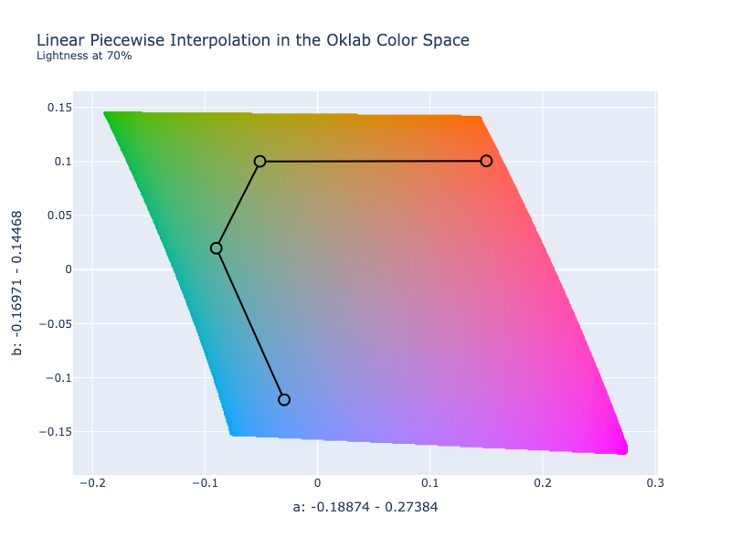
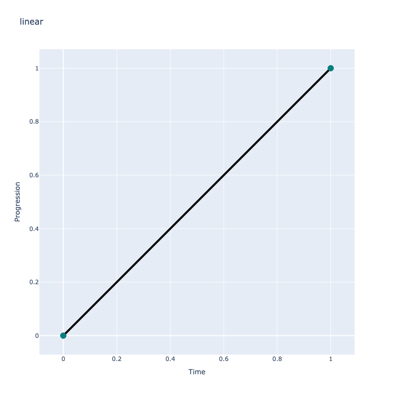
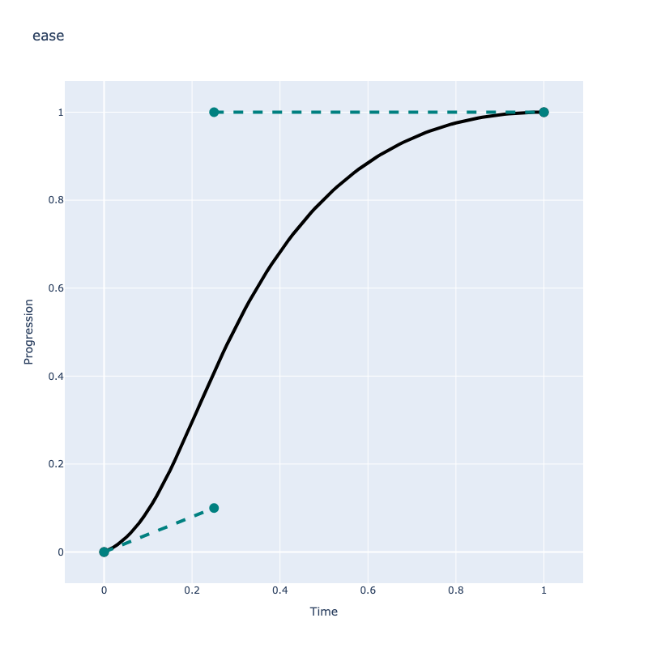
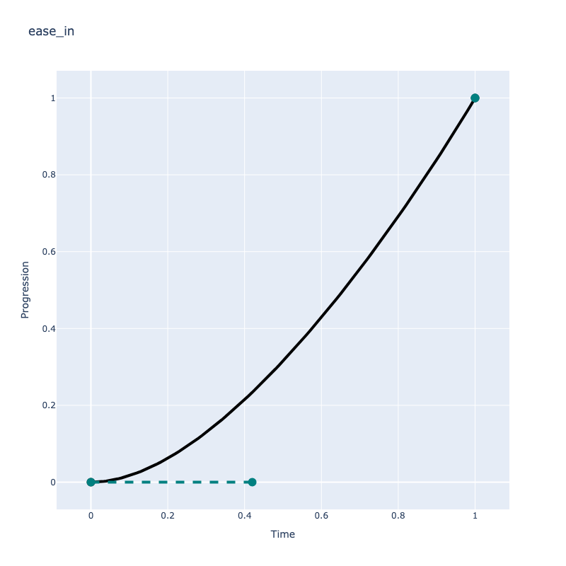
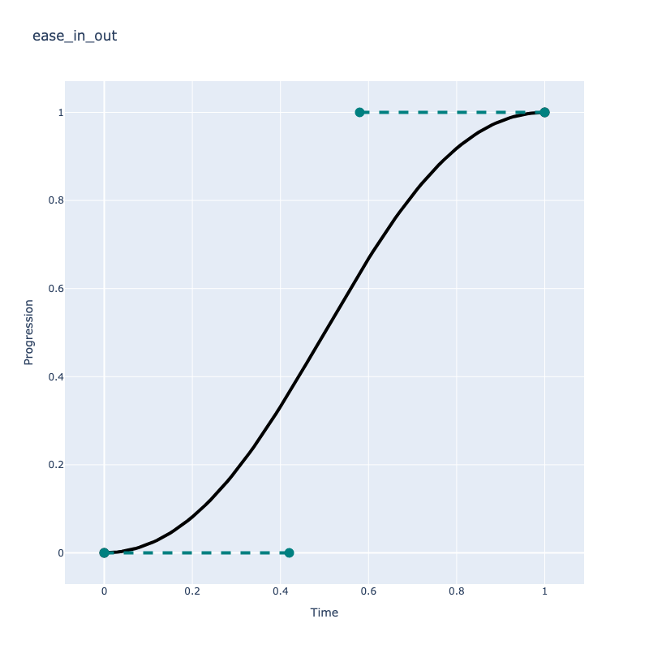
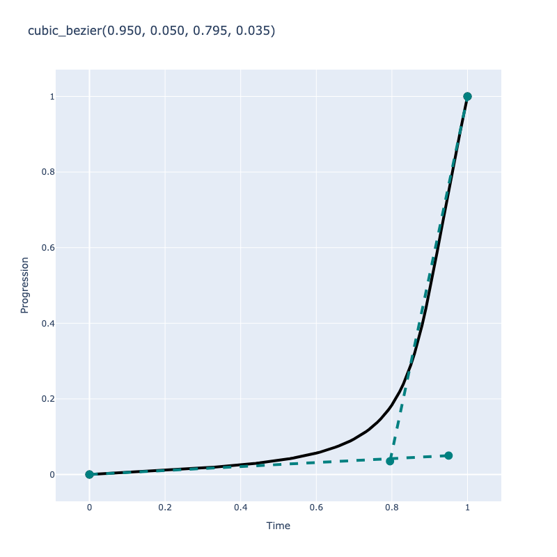

# Color Interpolation

Interpolation is a type of estimation that finds new data points based on the range of a discrete set of known data
points. When used in the context of color, it is finding one or more colors that reside between any two given colors.
This is often used to simulate mixing colors, creating gradients, or even create color palettes.

ColorAide provides a number of useful utilities based on interpolation.

## Linear Interpolation

/// success | Linear interpolation is registered in `Color` by Default
///

One of the most common, and easiest ways to interpolate data between two points is to use linear interpolation. An easy
way of thinking about this concept is to imagine drawing a straight line that connects two colors within a color space.
We could then navigate along that line and return colors at different points to simulate mixing colors at various
percentages or return the whole range and create a continuous, smooth gradient.

To further illustrate this point, the example below shows a slice of the Oklab color space at a lightness of 70%. On
this 2D plane, we select two colors: `#!color oklab(0.7 0.15 0.1)` and `#!color oklab(0.7 -0.03 -0.12)`. We then connect
these two colors with a line. We can then select any point on the line to simulate the mixing of these colors. 0% would
yield the first color, 100% would yield the second color, and 50% would yield a new color:
`#!color Color.interpolate(['oklab(0.7 0.15 0.1)', 'oklab(0.7 -0.03 -0.12)'])(0.5)`.

/// html | figure


//// html | figcaption
Interpolation performed at 50%
////
///

The `interpolate` method allows a user to create a linear interpolation function using two or more colors. By default, a
returned interpolation function accepts numerical input in the [domain](#domains) of [0, 1] and will cause a new color
between the specified colors to be returned.

By default, colors are interpolated in the perceptually uniform Oklab color space, though any supported color space can
be used instead. This also applies to all methods that use interpolation, such as [`discrete`](#discrete),
[`steps`](#steps), [`mix`](#mixing), etc.

As an example, below we create an interpolation between `#!color rebeccapurple` and `#!color lch(85% 100 85)`. We then
step through values of `0.0`, `0.1`, `0.2`, etc. This returns colors at various positions on the line that connects
the two colors, `0` returning `#!color rebeccapurple` and `1` returning `#!color lch(85% 100 85)`.

```py play
i = Color.interpolate(["rebeccapurple", "lch(85% 100 85)"], space='lch')
[i(x / 10).to_string() for x in range(10 + 1)]
```

If we create enough steps, we can create a gradient.

```py play
i = Color.interpolate(
    ["rebeccapurple", "lch(85% 100 85)"],
    space='lch'
)
```

## Piecewise Interpolation

Piecewise interpolation takes the idea of linear interpolation and then applies it to multiple colors. As drawing a
straight line through a series of points greater than two can be difficult to achieve, piecewise interpolation creates
straight lines between each color in a chain of colors.



When the `interpolate` method receives more that two colors, the interpolation will utilize piecewise interpolation
and interpolation will be broken up between each pair of colors. The function, just like when interpolating between two
colors, still operates by default in the domain of [0, 1], only it will now apply to the entire range of colors.

Piecewise interpolation simply breaks up a series of data points into segments in order to apply interpolation
individually on each segment.

```py play
Color.interpolate(['black', 'red', 'white'])
```

This approach generally works well, but since the placement of colors may not be in a straight line, you will often
have pivot points and the transition may not be quite as smooth at these locations.

## Continuous Interpolation

/// success | Continuous interpolation is registered in `Color` by Default
///

In this document, we use the term "continuous" in two ways when talking about interpolation: continuous vs
[discrete ](#discrete-interpolation) and the interpolation method whose literal name is `continuous`.

The `interpolate` method only creates continuous interpolations, meaning that for any point along the interpolation
line, you will get a unique color. Continuous interpolation in this sense directly contrasts with with
[discrete interpolation](#discrete-interpolation) which provides quantized color results where multiple inputs are
associated with a limited set of colors along the interpolation line.

The `continuous` interpolation method is simply a piecewise, linear interpolation method that interpolates defined
channels continuously across one more undefined channels.

Normal, piecewise interpolation only considers a single segments under interpolation at a time. When channels are
undefined, the undefined channel on one end of a segment will adopt the value of the other defined channel on the other
side of the segment, and if that other channel is also undefined, then any color interpolated between the two will also
have no defined value for the channel. This approach to interpolation never considers any context beyond the segment it
is looking at.

The `continuous` interpolation method is a linear piecewise approach created for ColorAide that will actually
interpolate through undefined channels, using context from all the colors to be interpolated. What this means is that if
you have multiple colors, and one or more of the colors have the same channel undefined, the colors with that channel
defined will have those values interpolated across the undefined gaps across all the segments. This is probably better
illustrated with an example.

In this example, we have 3 colors. The end colors both define lightness, but the middle color is undefined. We can see
when we use normal, linear piecewise interpolation that we get a discontinuity. But with continuous linear
interpolation, we get a smooth interpolation of the lightness through the undefined channel.

```py play
colors = [
    Color('oklab', [0, 0, 0]),
    Color('oklab', [NaN, -0.03246, -0.31153]),
    Color('oklab', [1, 0, 0])
]
Color.interpolate(colors, space='oklab', method='linear')
Color.interpolate(colors, space='oklab', method='continuous')
```

Now, if have colors on the side that are not between two defined colors, all those colors will adopt the defined value
of the one that is defined. This time we have a single color with all components defined, but all the colors to the
left are missing the lightness. All colors with the undefined lightness will assume the lightness of the defined color.

```py play
colors = [
    Color('oklab', [NaN, 0.22486, 0.12585]),
    Color('oklab', [NaN, -0.1403, 0.10768]),
    Color('oklab', [0.45201, -0.03246, -0.31153])
]
Color.interpolate(colors, space='oklab', method='linear')
Color.interpolate(colors, space='oklab', method='continuous')
```

## Cubic Spline Interpolation

Linear interpolation is nice because it is easy to implement, and due to its straight forward nature, pretty fast. With
that said, it doesn't always have the smoothest transitions. It turns out that there are other piecewise ways to
interpolate that can yield smoother results.

Inspired by some efforts seen on the [web](catmull-observe) and in the great JavaScript library
[Culori](https://culorjs.org), ColorAide implements a number of spline based interpolation methods.

Because splines require taking into account more than two colors at a time, all spline based interpolation methods are
built off of the [`continuous` interpolation](#continuous-interpolation) approach of handling undefined values.

### B-Spline

/// success | B-Spline interpolation is registered in `Color` by Default
///


B-spline is a piecewise spline similar to Bezier curves. It utilizes "control points" that help shape the interpolation
path through a series of colors. Like Bezier Curves, the path does not pass through the control points, but it is
clamped at the start and end. Essentially, the interpolation path passes through both end colors and bends that path
along the way towards the other colors being used as control points.

It can be used by specifying `bspline` as the interpolation method.

```py play
Color.interpolate(['red', 'green', 'blue', 'orange'], method='bspline')
```

### Natural

/// success | Natural interpolation is registered in `Color` by Default
///


The "natural" spline is the same as the B-spline approach except an algorithm is applied that uses the colors as data
points and calculates new control points such that the interpolation passes through all the data points. This means
that the path will pass through all the colors. The resultant spline has the continuity and properties of a natural
spline, hence the name.

One down side is that it can overshoot or undershoot a bit, and can occasionally cause the interpolation path to pass
out of gamut if interpolating on an edge.

It can be used by specifying `natural` as the interpolation method.

```py play
Color.interpolate(['red', 'green', 'blue', 'orange'], method='natural')
```

### Monotone

/// success | Monotone interpolation is registered in `Color` by Default
///


The "monotone" spline is a piecewise interpolation spline that passes through all its data points and helps to preserve
monotonicity. As far as we are concerned, the important thing to note is that it greatly reduces any overshoot or
undershoot in the interpolation.

```py play
Color.interpolate(['red', 'green', 'blue', 'orange'], method='monotone')
```

### Catmull-Rom

/// failure | Catmull-Rom interpolation is not registered in `Color` by Default
///


Lastly, the Catmull-Rom spline is another "interpolating" spline that passes through all of its data points, similar to
the "natural" spline, but it but does not share the same continuity and properties of a "natural" spline.

Much like the "natural" spline, it can overshoot or undershoot.

Catmull-Rom is not registered by default, but can be registered as shown below and then used by specifying `catrom`
as the interpolation method.

```py play
from coloraide import Color
from coloraide.interpolate.catmull_rom import CatmullRom

class Custom(Color): ...

Custom.register(CatmullRom())

Custom.interpolate(['red', 'green', 'blue', 'orange'], method='catrom')
```

## Discrete Interpolation

/// new | New 2.5
///

So far, we've only shown examples of continuous interpolation methods. To clarify, we are using "continuous" in a
slightly different way than we discussed [earlier](#continuous-interpolation). When we say "continuous" here, we simply
mean that the colors in the interpolation smoothly transition from one color to the other. But when creating charts or
graphs, some times you'd like to categorize data such that a range of values correspond to a specific color. For this,
we can use `discrete`, which like `intrpolate`, returns an interpolation object, but the the ranges will be discrete.

By default, ranges are calculated directly form the input colors. So if you had three colors, the interpolation would be
broken up into 3 ranges. Compare this with the the "continuous" interpolation we methods we showed earlier.

```py play
Color.discrete(['red', 'green', 'blue'])
Color.interpolate(['red', 'green', 'blue'])
```

If we specify `step`, we can create a larger or smaller color scale using the input colors to interpolate the new color
scale. And we can use any of the aforementioned interpolation methods to help generate this new discrete scale.

```py play
Color.discrete(['red', 'green', 'blue'], steps=5, method='catrom')
```

What makes this really useful is if you combine it with custom domains to process data. By default, the domain is
`[0, 1]`, but we can change this to directly correlate the data with our quantized color samples. For instance, let's
use a series of discrete colors to represent temperature. Additionally, let's use [`domain`](#domains) to associate a
temperature ranges with the given colors. Now when we input a temperature value, it will align with our discrete color
scale.

```py play
i = Color.discrete(['blue', 'green', 'yellow', 'orange', 'red'], domain=[-32, 32, 60, 85, 95])
i(-32)
i(40)
i(87)
i(100)
i
```

As `discrete()` is built on [`steps()`](#steps), it can take all the same arguments. Check out [`steps()`](#steps) to
learn more.

## Hue Interpolation

In interpolation, hues are handled special allowing us to control the way in which hues are evaluated. By default, the
shortest angle between two hues is targeted for interpolation, but the `hue` option allows us to redefine this behavior
in a number of interesting ways: `shorter`, `longer`, `increasing`, `decreasing`, and `specified`. Below, we can see how
the interpolation varies using `shorter` vs `longer` (interpolate between the longest angle).

```py play
i = Color.interpolate(
    ["lch(52% 58.1 22.7)", Color("lch(56% 49.1 257.1)").mask("hue", invert=True)],
    space="lch"
)
i(0.2477).to_string()
i = Color.interpolate(
    ["lch(52% 58.1 22.7)", Color("lch(56% 49.1 257.1)").mask("hue", invert=True)],
    space="lch",
    hue="longer"
)
i(0.2477).to_string()
```

To help visualize the different hue methods, consider the following evaluation between `#!color rebeccapurple` and
`#!color lch(85% 85 805)`. Below we will demonstrate each of the different hue evaluations. To learn more, check out the
[CSS level 4 specification](https://drafts.csswg.org/css-color-4/#hue-interpolation) which describes each one.

/// note | Hue Specified
The `specified` fix-up was at one time specified in the CSS Color Level 4 specification, but is no longer mentioned
there. While CSS no longer supports this hue fix-up, we still do. `specified` simply does not apply any hue fix-up and
will use hues as _specified_, hence the name.
///

/// tip | Interpolating Multiple Colors
The algorithm has been tweaked in order to calculate fix-ups of multiple hues such that they are all relative to
each other. This is a requirement for interpolation methods that use cubic splines that evaluate many hues at the
same time as opposed to linear, piecewise interpolation that only evaluates two hues at any given time.
///

/// tab | shorter
```py play
Color.interpolate(
    ["rebeccapurple", "lch(85% 100 805)"],
    space='lch',
    hue="shorter"
)
```
///

/// tab | longer
```py play
Color.interpolate(
    ["rebeccapurple", "lch(85% 100 805)"],
    space='lch',
    hue="longer"
)
```
///

/// tab | increasing
```py play
Color.interpolate(
    ["rebeccapurple", "lch(85% 100 805)"],
    space='lch',
    hue="increasing"
)
```
///

/// tab | decreasing
```py play
Color.interpolate(
    ["rebeccapurple", "lch(85% 100 805)"],
    space='lch',
    hue="decreasing"
)
```
///

/// tab | specified
```py play
Color.interpolate(
    ["rebeccapurple", "lch(85% 100 805)"],
    space='lch',
    hue="specified"
)
```
///

## Interpolating with Alpha

Interpolating color channels is pretty straight forward and uses traditional linear interpolation logic, but when
introducing transparency to a color, interpolation uses a concept known as premultiplication which alters the normal
interpolation process.

Premultiplication is a technique that tends to produce better results when two colors have differing transparency. It
essentially accounts for the transparency and uses it to _weight_ how may a given color channel will contribute to the
interpolation. A more transparent color's channels will naturally contribute less.

Consider the following example. Normally, when transitioning to a "transparent" color, the colors will be more gray
during the transition. This is because `#!color transparent` is actually black. But when using premultiplication, the
transition looks just as one would expect as the transparent color's channels are weighted less due to the high
transparency.

```py play
Color.interpolate(['white', 'transparent'], space='srgb', premultiplied=False)
Color.interpolate(['white', 'transparent'], space='srgb')
```

As a final example, below we have an opaque orange and a blue that is quite transparent. Logically, the blue shouldn't
have as big an affect on the overall color as it is so faint, and yet, in the un-premultiplied example, when mixing the
colors equally, we see that the resultant color is also equally influenced by the hue of both colors. In the
premultiplied example, we see that orange is still quite dominant at 50% as it is fully opaque.


```py play
Color('orange').mix(Color('blue').set('alpha', 0.25), space='srgb', premultiplied=False)
Color('orange').mix(Color('blue').set('alpha', 0.25), space='srgb')
```

If we interpolate it, we can see the difference in transition.

```py play
Color.interpolate(['orange', Color('blue').set('alpha', 0.25)], space='srgb', premultiplied=False)
Color.interpolate(['orange', Color('blue').set('alpha', 0.25)], space='srgb')
```

There may be some cases where it is desired to use no premultiplication in alpha blending. One could simply be that you
need to mimic the same behavior of a system that does not use premultiplied interpolation. If so, simply set
`premultiplied` to `#!py3 False` as shown above.

## Masking

If desired, we can mask off specific channels that we do not wish to interpolate. Masking works by cloning the color
and setting the specified channels as undefined (internally set to `NaN`). When interpolating, if one color's channel
has a `NaN`, the other color's channel will be used as the result, keeping that channel at a constant value. If both
colors have a `NaN` for the same channel, then `NaN` will be returned.

/// tip | Magic Behind NaN
There are times when `NaN` values can happen naturally, such as with achromatic colors with hues. To learn more,
check out [Undefined Handling/NaN Handling](#null-handling).
///

In the following example, we have a base color of `#!color lch(52% 58.1 22.7)` which we then interpolate with
`#!color lch(56% 49.1 257.1)`. We then mask off the second color's channels except for `hue`. Applying this logic, we
will end up with a range of colors that maintains the same lightness and chroma as the first color, but with different
hues. We can see as we step through the colors that only the hue is interpolated.

```py play
i = Color.interpolate(
    ["lch(52% 58.1 22.7)", Color("lch(56% 49.1 257.1)").mask(['lightness', 'chroma', 'alpha'])],
    space="lch"
)
[i(x/10).to_string() for x in range(10)]
```

You can also create inverted masks. An inverted mask will mask all *except* the specified channel.

```py play
i = Color.interpolate(
    ["lch(52% 58.1 22.7)", Color("lch(56% 49.1 257.1)").mask('hue', invert=True)],
    space="lch"
)
[i(x/10).to_string() for x in range(10)]
```

## Easing Functions

When interpolating, whether using linear interpolation or something like B-Spline interpolation, the transitioning
between colors is always linear in time, even if the path to those colors is not. For example, if you are interpolating
between 2 colors and you request a `#!py3 0.5` point on that line, it will always be in the middle. This is because, no
matter how crooked the path, the rate of change on that path is always linear.

By default, ColorAide uses linear transitions when interpolating, but there are times that a different, more dynamic
transition may be desired. This can be achieved by using the `progress` parameter on any of the interpolation related
functions provided by ColorAide.

`progress` accepts an easing function that takes a single `time` input and returns a new `time` input. This allows for a
user to augment the rate of change when transitioning from one color to another. Inputs are almost always between 0 - 1
unless [`extrapolate`](#extrapolation) is enabled and the user has manually input a range beyond 0 - 1. Even a change in
[domain](#domains) will not affect the range as once the domain is accounted for, internally the domain [0, 1] is used.

ColorAide provides 5 basic easing functions out of the box along with `cubic_bezier` which is used to create all of the
aforementioned easing function except `linear`, which simply returns what is given as an input.

/// tip | Create Your Own Cubic Bezier Easings Online: https://cubic-bezier.com
///

/// details | More Common Cubic Bezier Easings
    type: tip

The following were all acquired from from https://matthewlein.com/tools/ceaser.js.

```py
ease_in_quad = cubic_bezier(0.550, 0.085, 0.680, 0.530)
ease_in_cubic = cubic_bezier(0.550, 0.055, 0.675, 0.190)
ease_in_quart = cubic_bezier(0.895, 0.030, 0.685, 0.220)
ease_in_quint = cubic_bezier(0.755, 0.050, 0.855, 0.060)
ease_in_sine = cubic_bezier(0.470, 0.000, 0.745, 0.715)
ease_in_expo = cubic_bezier(0.950, 0.050, 0.795, 0.035)
ease_in_circ = cubic_bezier(0.600, 0.040, 0.980, 0.335)
ease_in_back = cubic_bezier(0.600, -0.280, 0.735, 0.045)

ease_out_quad = cubic_bezier(0.250, 0.460, 0.450, 0.940)
ease_out_cubic = cubic_bezier(0.215, 0.610, 0.355, 1.000)
ease_out_quart = cubic_bezier(0.165, 0.840, 0.440, 1.000)
ease_out_quint = cubic_bezier(0.230, 1.000, 0.320, 1.000)
ease_out_sine = cubic_bezier(0.390, 0.575, 0.565, 1.000)
ease_out_expo = cubic_bezier(0.190, 1.000, 0.220, 1.000)
ease_out_circ = cubic_bezier(0.075, 0.820, 0.165, 1.000)
ease_out_back = cubic_bezier(0.175, 0.885, 0.320, 1.275)

ease_in_out_quad = cubic_bezier(0.455, 0.030, 0.515, 0.955)
ease_in_out_cubic = cubic_bezier(0.645, 0.045, 0.355, 1.000)
ease_in_out_quart = cubic_bezier(0.770, 0.000, 0.175, 1.000)
ease_in_out_quint = cubic_bezier(0.860, 0.000, 0.070, 1.000)
ease_in_out_sine = cubic_bezier(0.445, 0.050, 0.550, 0.950)
ease_in_out_expo = cubic_bezier(1.000, 0.000, 0.000, 1.000)
ease_in_out_circ = cubic_bezier(0.785, 0.135, 0.150, 0.860)
ease_in_out_back = cubic_bezier(0.680, -0.550, 0.265, 1.550)
```
///

/// tab | Linear

///

/// tab | Ease

///

/// tab | Ease In

///

/// tab | Ease Out

///

/// tab | Ease In/Out

///

/// tab | Cubic Bezier

///

Here, we are using the default "ease in" and "ease out" easing functions provided by ColorAide.

```py play
from coloraide import ease_in, ease_out

Color.interpolate(
    ["green", "blue"],
    progress=ease_in
)
Color.interpolate(
    ["green", "blue"]
)
Color.interpolate(
    ["green", "blue"],
    progress=ease_out
)
```

Additionally, easing functions can be injected inline which allows a user to control how easing is performed between
specific sub-interpolations within piecewise interpolation.

```py play
Color.interpolate(["red", "green", ease_out, "blue"])
```

ColorAide even lets you apply easing functions to specific channels, though they can only be done this way for the
entire operation. This can be done to one or more channels at a time. Below, we apply an exponential "ease in" to
`alpha` while allowing all other channels to interpolate normally.

```py play
ease_in_expo = cubic_bezier(0.950, 0.050, 0.795, 0.035)
Color.interpolate(
    ["lch(50% 50 0)", "lch(90% 50 260 / 0.5)"],
    progress={
        'alpha': ease_in_expo
    }
)
```

We can also set all the channels to an easing function via `all` and then override specific channels. In this case,
we exponentially "ease out" on all channels except the red channel, which we then force to be linear.

```py play
ease_out_expo = cubic_bezier(0.190, 1.000, 0.220, 1.000)
Color.interpolate(
    ["color(srgb 0 1 1)", "color(srgb 1 0 0)"],
    progress={
        'all': ease_out_expo,
        'r': linear
    },
    space='srgb'
)
```

## Color Stops and Hints

Color stops are the position where the transition to and from a color starts and ends. By default, color stops are
evenly distributed within the domain of [0, 1], but if desired, these color stops can be shifted.

To specify color stops, simply wrap a color in a `coloraide.stop` object and specify the stop position. Stop positions
will then cause the transition of the targeted color to be moved.

```py play
from coloraide import stop
Color.interpolate(['orange', 'purple', 'green'])
Color.interpolate(['orange', stop('purple', 0.25), 'green'])
```

Color stops follow the rules as laid out in the [CSS spec](https://drafts.csswg.org/css-images-4/#color-stop-fixup).

CSS gradients also have a concept of "hints". Hints essentially define the midpoint between two colors. Instead of
reinventing the wheel, and further complicating the interface, we've decided to just demonstrate color hints with
easing functions. The logic comes directly from the [CSS spec](https://drafts.csswg.org/css-images-4/#coloring-gradient-line).

Using the `hint` function, we can generate a midpoint easing method that moves the middle of the interpolation
transition to the specified point which is relative to the two color stops it is between.

```py play
from coloraide import hint

Color.interpolate(['orange', 'purple', 'green'])
Color.interpolate(['orange', hint(0.75), 'purple', 'green'])
```

## Mixing

/// tip | Interpolation Options
Any options not consumed by `mix` will be passed to the underlying `interpolation` function. This includes options
like `hue`, `progress`, etc.
///

The `mix` function is built on top of the [`interpolate`](#linear-interpolation) function and provides a simple, quick, and
intuitive simple mixing of two colors. Just pass in a color to mix with the base color, and you'll get an equal mix of
the two.

```py play
Color("red").mix(Color("blue"))
```

By default, colors are mixed at 50%, but the percentage can be controlled. Here we mix the color `#!color blue` into
the color `#!color red` at 20%. With `#!color blue` at 20% and `#!color red` at 80%, this gives us a more reddish color.

```py play
Color("red").mix(Color("blue"), 0.2)
```

As with all interpolation based functions, if needed, a different color space can be specified with the `space`
parameter or even a different interpolation method via `method`. `mix` accepts all the same parameters used in
`interpolate`, though concepts like [stops and hints](#color-stops-and-hints) are not allowed with mixing.

```py play
Color("red").mix(Color("blue"), space="hsl", method='bspline')
```

Mix can also accept a string and will create the color for us which is great if we don't need to work with the second
color afterwards.

```py play
Color("red").mix("blue", 0.2)
```

Mixing will always return a new color unless `in_place` is set `#!py3 True`.

## Steps

/// tip | Interpolation Options
Any options not consumed by `mix` will be passed to the underlying `interpolation` function. This includes options
like `hue`, `progress`, etc.
///

The `steps` method provides an intuitive interface to create lists of discrete colors. Like mixing, it is also built on
[`interpolate`](#linear-interpolation). Just provide two colors, and specify how many `steps` are wanted.

```py play
Color.steps(["red", "blue"], steps=10)
```

If desired, multiple colors can be provided, and steps will be returned for all the interpolated segments. When
interpolating multiple colors, [piecewise interpolation](#piecewise-interpolation) is used (which is covered in more
detail later).

```py play
Color.steps(["red", "orange", "yellow", "green"], steps=10)
```

Steps can also be configured to return colors based on a maximum Delta E distance. This means you can ensure the
distance between all colors is no greater than a certain value.

In this example, we specify the color `#!color color(display-p3 0 1 0)` and interpolate steps between `#!color red`.
The result gives us an array of colors, where the distance between any two colors should be no greater than the Delta E
result of 10.

```py play
Color.steps(
    [Color("display-p3", [0, 1, 0]), "red"],
    space="lch",
    out_space="srgb",
    max_delta_e=10
)
```

`max_steps` can be used to limit the results of `max_delta_e` in case result balloons to an unexpected size. Obviously,
this affects the Delta E between the colors inversely. It should be noted that steps are injected equally between every
color when satisfying a max Delta E limit in order to avoid shifting the midpoint. In some cases, in order to satisfy
both the `max_delta_e` and the `max_steps` requirement, the number of steps may even be clipped such that they are less
than the `max_steps` limit. `max_steps` is set to `#!py3 1000` by default, but can be set to `#!py3 None` if no limit is
desired.

```py play
Color.steps(
    [Color("display-p3", [0, 1, 0]), "red"],
    space="lch",
    out_space="srgb",
    max_delta_e=10,
    max_steps=10
)
```

When specifying a `max_delta_e`, `steps` will function as a minimum required steps and will push the delta even smaller
if the required steps is greater than the calculated steps via the maximum Delta E limit.

```py play
Color.steps(
    [Color("display-p3", [0, 1, 0]), "red"],
    space="lch",
    out_space="srgb",
    max_delta_e=10,
    steps=50
)
```

`steps` uses the color class's default ∆E method to calculate max ∆E, the current default ∆E being ∆E^\*^~ab~. While
using something like ∆E^\*^~00~ is far more accurate, it is a much more expensive operation. If desired, the class's
default ∆E can be changed via subclassing the color object and and changing `DELTA_E` class variable or by manually
specifying the method via the `delta_e` parameter.


/// tab | ∆E^\*^~ab~.
```py play
Color.steps(
    [Color("display-p3", [0, 1, 0]), "red"],
    space="lch",
    out_space="srgb",
    max_delta_e=10,
    delta_e="76"
)
```
///

/// tab | ∆E^\*^~00~
```py play
Color.steps(
    [Color("display-p3", [0, 1, 0]), "red"],
    space="lch",
    out_space="srgb",
    max_delta_e=10,
    delta_e="2000"
)
```
///

And much like [`interpolate`](#linear-interpolation), we can use [`stops` and `hints`](#color-stops-and-hints) and any
of the other supported `interpolate` features as well.

```py play
Color.steps(['orange', stop('purple', 0.25), 'green'], method='bspline', steps=10)
```

## Domains

By default, interpolation has an input domain of [0, 1]. This domain applies to an entire interpolation, even ones that
span multiple colors. Generally, this is sufficient and can be used to generate color scales, mixes, and steps in any
way that a user needs. When generating colors that should align with data, custom domains can be quite helpful.

For instance, associating colors with temperature.

```py play
i = Color.interpolate(
    ['blue', 'green', 'yellow', 'orange', 'red'],
    domain=[-32, 32, 60, 85, 95]
)
i(-32)
i(47)
i(89)
i
```

It should be noted that you are not constrained to provide the exact same amount of domain values as you have colors and
can have differing amounts, but if you want to align specific colors to certain data points, then it helps.

```py play
Color.interpolate(
    ['blue', 'green', 'yellow', 'orange', 'red'],
    domain=[-32, 32, 60, 85, 95]
)
Color.interpolate(
    ['blue', 'green', 'yellow', 'orange', 'red'],
    domain=[-32, 95]
)
```

Lastly, domains must be specified in ascending order of values. If a value decreases in magnitude, it will assume the
value that comes right before it. This means you cannot put a domain in reverse. If you need to reverse the order, just
flip the color order and setup the domain accordingly.

```py play
i = Color.interpolate(
    ['blue', 'green', 'yellow', 'orange', 'red'],
    domain=[-32, 32, 60, 20, 95]
)
i.domain
i
```

Custom domains are most useful when working with [`discrete`](#discrete-interpolation) or
[`interpolate`](#linear-interpolation) directly, but you can use it in other methods like [`steps`](#steps) as well. As
`steps` does not take data point inputs like `interpolate`, we do not need to use the temperature data as an input
except to set the domain, but the steps will be generated with the same alignment relative to the domain range.

```py play
Color.interpolate(
    ['blue', 'green', 'yellow', 'orange', 'red'],
    domain=[-32, 32, 60, 85, 95]
)
Color.discrete(
    ['blue', 'green', 'yellow', 'orange', 'red'],
    domain=[-32, 32, 60, 85, 95]
)
Color.steps(
    ['blue', 'green', 'yellow', 'orange', 'red'],
    steps=11,
    domain=[-32, 32, 60, 85, 95]
)
```

Wile you can technically feed `domain` into [`mix`](#mix), it is probably not as useful. It will respect the domain
alignment, but mix always accepts a percentage of [0, 1], regardless of the underlying domain.

## Extrapolation

By default, ColorAide clamps the entire progress of an interpolation to always be within the domain ([0, 1] by default).
In most cases, this is more what most user expects and why this is the default. It should be noted that this does not
affect easing functions, as the clamping is done prior to any easing function calls.

If it is desired to extrapolate past 0 and 1, `extrapolate` can set to `#!py3 True` on all interpolation methods.

```py play
Color('red').mix('blue', 0.5)
Color('red').mix('blue', -0.5, extrapolate=True)
```

As a larger example, we can purposely interpolate over a range with values beyond 0 and 1. Here we extended the range
to -0.5 and 1.5.

```py play
offset, factor = 0.25, 1.5
i = Color.interpolate(['red', 'blue'])
Ramp([i((r * factor / 100) - offset) for r in range(101)])
i = Color.interpolate(['red', 'blue'], extrapolate=True)
Ramp([i((r * factor / 100) - offset) for r in range(101)])
```

Lastly, it is important to note that this affects stops as well, mainly stops applied to interpolation endpoints. When
an endpoint is moved inwards via a color stop, the end range of the interpolation is clamped, extending the star and
end color. But when extrapolation is enabled, a color stop on an endpoint essentially moves the start and end
interpolation. And since there are no other colors on either end to interpolate with, extrapolation occurs.

```py play
Color.interpolate([stop('red', 0.25), stop('blue', 0.75)])
Color.interpolate([stop('red', 0.25), stop('blue', 0.75)], extrapolate=True)
```

## Undefined/NaN Handling {#null-handling}

Color spaces that have hue coordinates often have rules about when the hue is considered relevant. For instance, in the
HSL color space, if saturation is zero, the hue is essentially powerless. This is because the color is "without color"
or achromatic; therefore, the hue can have no affect on the actual color.

ColorAide will generally respect the values a user provides, so if an achromatic HSL color is given a hue of 270
degrees, ColorAide will accept it, but the hue will not affect the color in any meaningful way.

During conversions, such context is lost, and if an achromatic color is converted to the color space like HSL, the
resultant color will have a hue that is noted as undefined. This is simply because there is no good hue for achromatic
colors as they play no part in the color. Any hue is actually incorrect as achromatic colors have no real hue. Instead,
colors will be returned with a value that represents that the hue is missing or undefined, or maybe better worded, could
not be defined.

Many libraries, like [d3-color](https://github.com/d3/d3-color), [chroma.js](https://gka.github.io/chroma.js/), and
[color.js](https://github.com/LeaVerou/color.js), represent null hues with `NaN` (not a number). This is usually done
to make color interpolation easier. Some, like d3-color, are a bit more liberal with `NaN` and will target special cases
that are above and beyond the normal rules to help ensure good interpolation. For instance, they not only mark hue
undefined on HSL colors when saturation is zero, but they'll mark saturation as `NaN` when lightness indicates "black"
or "white".

ColorAide also uses `NaN`, or in Python `#!py3 float('nan')`, to represent undefined channels. In certain situations,
when a hue is deemed undefined, the hue value will be set to `coloraide.NaN`, which is just a constant containing
`#!py3 float('nan')`.

When performing linear interpolation, where only two color's channels are ever being evaluated together at a given time,
if one color's channel has a `NaN`, the other color's channel will be used as the result. If both colors have a `NaN`
for the same channel, then `NaN` will be returned.

/// tip | Continuous NaN Handling
`NaN` handling is a bit different for the [Continuous](#continuous-interpolation) and
[Cubic Spline](#cubic-spline-interpolaton) interpolation approaches. Linear only evaluates colors at a given time, while
the others will take into consideration more than two colors. Because the context is much wider and more complicated,
`NaN` values will often get context from both sides.
///

Notice that in this example, because white's saturation is zero, the hue is undefined. Because the hue is undefined,
when the color is mixed with a second color (`#!color green`), the hue of the second color is used.

```py play
color = Color('white').convert('hsl')
color[:-1]
color2 = Color('green').convert('hsl')
color2[:-1]
color.mix(color2, space="hsl")
```

But if we manually set the hue to `#!py 0` instead of `NaN`, we can see that the mixing goes quite differently.

```py play
color = Color('white').convert('hsl').set('hue', 0)
color[:-1]
color2 = Color('green').convert('hsl')
color2[:-1]
color.mix(color2, space="hsl")
```

Technically, any channel can be set to `NaN`. And there are various ways to do this. The
[Color Manipulation documentation](./manipulation.md#undefined-values) goes into the details of how these `Nan` values
naturally occur and the various ways a user and manipulate them.
