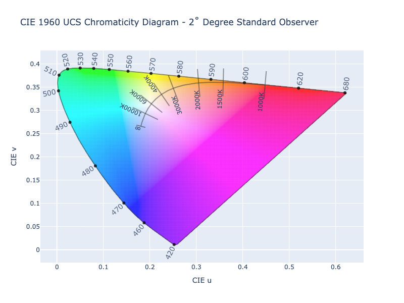

# Correlated Color Temperature

/// new | New 2.4
///

Correlated color temperature (CCT) is a measurement of the average hue of light as it appears to the eye. It is
expressed as the temperature (in Kelvins) something would need to be heated to glow at approximately the same color.

This response can be modeled with a Planckian or black body locus/curve and is often shown in chromaticity diagrams.

//// html | figure


///// html | figcaption
1960 Chromaticity Diagram with black body curve in the range of 1,000K - 100,000K
/////
////

In order to calculate the Planckian locus, color matching functions (CMFs) are needed. The CMFs are obtained from a
series of experiments in which subjects set the intensities of three colors required to match a series of monochromatic
(single wavelength) lights of equal energy that traverse the visible spectrum. CMFs contain the required data from such
experiments and can be used to calculate a number of things, including the Planckian locus.

/// tip | CMFs
It should be noted that there isn't one set set of CMFs. Over the years there have been multiple attempts to come up
with the best CMFs and often done at both 2˚ and 10˚ viewing angles. ColorAide only provides CMFS provided by the CIE
via `coloraide.cmfs`, the CIE 1931 2 Degree Standard Observer being the default as it is still the common approach even
though better CMFs have been provided.

CMFS                            |
------------------------------- |
`coloraide.cmfs.CIE_1931_2DEG`  |
`coloraide.cmfs.CIE_1964_10DEG` |
`coloraide.cmfs.CIE_2015_2DEG`  |
`coloraide.cmfs.CIE_2015_10DEG` |

External CMFs could be used as long as they are in the appropriate format and not at increments less than 1nm.
///

## CCT

When anything gets warm enough it will start to give off light, and the hotter it gets, the more energetic the light
is. As an object increases in temperature, it will shift from the red end of the spectrum to the blue end.

ColorAide provides the `blackbody()` method to generate colors along the black body curve. Simply give it a color space
in which the color should be generated and a temperature in Kelvin and ColorAide will return an approximate color along
the black body locus.

```py play
Steps([Color.blackbody('srgb', t) for t in range(1000, 15000, 50)])
```

ColorAide also provides a method `cct()` which allows you to get an associated temperature and [∆~uv~](#duv) from a
given color. [∆~uv~](#duv) will be discussed later.

```py play
color = Color.blackbody('srgb', 2000)
color
color.cct()
```

## D~uv~

In addition to CCT, there is also the concept of D~uv~ or ∆~uv~. In the following image, we've now drawn perpendicular
lines that intersect the black body curve. These lines are called isotherms. An isotherm is simply a line connecting
points having the same temperature at a given time or on average over a given period. In the case of colors, they
connect a number of colors that are close to the locus with the same temperature. ∆~uv~ describes the distance a given
uv point is away from the associated uv point on the black body curve, positive being above the curve and negative
being below the curve

//// html | figure


///// html | figcaption
1960 Chromaticity Diagram with black body curve and isotherms indicating +/- 0.03 ∆~uv~.
/////
////

We can calculate a color's associated temperature and its ∆~uv~ along the associated isotherm.

```py play
'CCT: {}K Duv: {}'.format(*Color('yellow').cct())
```

CCT and ∆~uv~ can also be used together to get a specific color that satisfies those requirements.

```py play
Color.blackbody('srgb-linear', *Color('yellow').cct())
```

## Limitations

All algorithms to calculate to and from CCT have some limitations and are only approximations, some being more accurate
than others. Many algorithms are only accurate up to a certain temperature range. Additionally, it is recommend that
colors that exhibit a ∆~uv~ larger than |5e-2| should be considered inaccurate, and some algorithm's may not do as well
out to even this limit.

## Out of Gamut Temperatures

It should be noted that `blackbody()` normalizes/scales the returned colors by default as the colors are often much too
bright initially, all having a max luminance. This scaling is usually done under a linear RGB color space, Linear
Rec2020 being the default as it encompasses the entire curve.

Keep in mind that if the color is not in the display gamut it will need to be gamut mapped, and the gamut mapped value
will not exhibit the same temperature. How far off it is will be depends on the disparity of the gamut sizes and how the
color was gamut mapped.

//// html | figure


///// html | figcaption
CCT of 1200K in relation to the sRGB gamut.
/////
////

Colors that are outside the traditional RGB gamut (0 - 1) will be scaled to be within that range. If the color is beyond
the gamut of the scaling color space, it will not convert back to the same temperature.

```py play
c = Color.blackbody('srgb', 1200)
c
c.cct()
```

Using a larger gamut, such as Linear Rec. 2020 that encompasses the entire black body curve, can allow for more accurate
results throughout the entire range, but this may be impractical if you need to work in a smaller gamut.

The desired RGB color space to scale within can be specified via `scale_space`. And if no scaling is desired, it can be
turned off by setting `scale` to `#!py False`.

```py play
c1 = Color.blackbody('display-p3', 1200, scale_space='display-p3-linear')
c1
c1.cct()
c2 = Color.blackbody('display-p3', 1200, scale=False)
c2
c2.cct()
```

## Algorithms

There are quite a few approaches to calculating to and from CCT, each with their strengths and weaknesses. ColorAide
currently only supports a few approaches, specifically those that support the concept of CCT and ∆~uv~. Each approach
is implemented as a CCT plugin.

Algorithm       | Key              | Description
--------------- | ---------------- | -----------
Robertson\ 1968 | `robertson-1968` | Uses the CIE 2˚ Standard Observer and can handle a range of 1000K - ∞.
Ohno\ 2013      | `ohno-2013`      | Utilizes a combined approach of a triangular and parabolic solver. Current implementation allows for a range of 1000K - 100000K.

[Robertson 1968](#robertson-1968) is the current default CCT approach, but any approach can be selected via the `method` parameter
in `blackbody()` or `cct()`.

```py play
Color.blackbody('srgb-linear', 2500, method='ohno-2013').cct(method='ohno-2013')
Color.blackbody('srgb-linear', 2500, method='robertson-1968').cct(method='robertson-1968')
```

### Robertson 1968

/// success | The Robertson 1968 CCT algorithm is registered in `Color` by default
///

The "Robertson 1968" approach was created by A. R. Robertson and is based on the CIE 2˚ Standard Observer with a range
of 1667K - ∞. This approach uses a look up table containing 31 precalculated points along the black body curve and is
used to approximate temperatures in between.

Robertson's approach is a reasonably fast approximation, but can exhibit moderate errors at times. The margin of error
gets increasingly larger at very high temperatures approaching infinity.

ColorAide implements the Robertson 1968 approach by faithfully calculating the original 31 points (with later
corrections), but it also uses the same approach to extend the lower range from 1667K to 1000K by calculating 16
additional points.  There is no change in behavior from 1667K to ∞, but it will now properly resolve values as
low as 1000K as well.

/// tip | Practical Range
While Robertson's technically supports a range out to infinity, it becomes increasingly less practical after 100000K due
to increasingly less accurate results. Even some results below 100000K may already have fairly sizeable errors.
///

```py play
color = Color.blackbody('srgb-linear', 5000, duv=0.02)
color
color.cct()
```

Because the calculation logic is built into the plugin, you can actually use the plugin to generate a higher resolution
table or even generate one using a different set of CMFs. When registering the plugin, you can configure the CMFs and a
few other options to customize the look up table.

Parameters        | Description
----------------- | ------------
`cmfs`            | Valid CMFs at a resolution greater than or equal to 1nm.
`white`           | A white point as xy chromaticity coordinates.
`mired`           | The mired value points to generate in the table (1e6 / T~kelvin~ = mired). Values should not be at a resolution lower than 1 mired as it can give the algorithm issues. 0 is acceptable though.
`sigfig`          | Significant figures to round to. This is required to faithfully generate the values as documented in the papers and is set to `#!py 5` by default. If set to `#!py 0`, no rounding will be done.
`planck_step`     | This controls the resolution at which the wavelengths in the CMFs are used to calculate the points along the Planckian locus. The original values are calculated with a 1nm resolution, so the default is set to `#!py 1`. If a given table has a lower resolution, such as 5nm, this value can be adjusted to properly work with that table.

To use a different set of CMFS, such as the CIE 1964 10˚ Standard Observer, we could override the default plugin.

```py play
from coloraide.temperature import robertson_1968
from coloraide import cmfs
from coloraide import cat

mired_points = tuple(range(0, 100, 10)) + tuple(range(100, 601, 25)) + tuple(range(625, 1001, 25))

class Custom(Color):
    ...

Custom.register(
    robertson_1968.Robertson1968(cmfs.CIE_1964_10DEG, cat.WHITES['10deg']['D65'], mired_points, 0),
    overwrite=True
)

Steps([Color.blackbody('srgb', t) for t in range(1000, 15000, 50)])
```

### Ohno 2013

/// success | The Ohno 2013 CCT algorithm is registered in `Color` by default
///

This is an approach researched by Yoshi Ohno and aims to provide better accuracy. It uses a look up table similar to
the Roberson method and employs a combined approach of a triangular solver and a parabolic solver. This can lead to
high accuracy if the table is large enough.

Additionally, an "automatic expansion" technique can be used that starts with a small table and expands the table on
smaller intervals based on the first solution. This can allow for a high accuracy without having to keep a large table
in memory.

For good accuracy throughout the range of 1000K - 100000K, as ColorAide supports, a very large table would be needed. If
the "automatic expansion" technique was used, without caching the data which would cause the table to balloon in
memory, the process is much slower.

To mitigate the downside of storing a massive table in memory and to reduce the performance issues when using "automatic
expansion", ColorAide uses a moderately sized table and creates a spline to interpolate points in between. The expansion
technique is then used to get close to the target using the spline as the data table. Once points sufficiently close
are found via the automatic expansion, more accurate values are calculated at those locations and are used in the
triangular and parabolic solver. This allows us to use a smaller table while mitigating the performance issues
associated with the expansion technique, all while maintaining good accuracy. The technique is still slower than the
[Roberson](#robertson-1968) approach, but it is a more accurate approach.

```py play
color = Color.blackbody('srgb-linear', 5000, duv=0.02, method='ohno-2013')
color
color.cct()
```

ColorAide exposes some of the knobs to control the automatic expansion.

Parameter    | Description
------------ | -----------
`start`      | Used to control the starting range for the search. Default is `#!py 1000`. For accuracy, the start should not be set lower than `#!py 1000`.
`end`        | Used to control the ending range for the search. Default is `#!py 100000`. For accuracy, the end should not be set higher than `#!py 100000`.
`samples`    | Number of sample points to use on each iteration of "automatic expansion". The default is `#!py 10`.
`iterations` | Number of iterations to perform when converging close to the temperature. The default is `#!py 6` as experimentation seemed indicate it yields the best results with a sample size of `#!py 10` and a range of 1000K - 100000K.
`exact`      | Controls whether the spline approximation is used. When set to `#!py True`, all values are directly calculated, bypassing the spline. Calculations will be slower when enabled. The default is `#!py False` and will utilize the spline providing a performance boost.

By default, the entire range of 1000K to 100000K is explored when resolving CCT, but a smaller range can be used. This
can be useful if you have an idea of the range, but not the specific value. Using a smaller range may allow for less
iterations to achieve the same or better accuracy.

```py play
Color('orange').cct(method='ohno-2013')
Color('orange').cct(start=2000, end=3000, iterations=3, method='ohno-2013')
```

If a more _pure_ approach is desired, `exact` can be used to directly use the "automatic expansion" without using the
spline. The values for the table will be explicitly calculated on the fly. Performance will be affected with minimal
to no increase in accuracy.

```py play
Color.blackbody('srgb-linear', 5000, duv=0.02).cct(method='ohno-2013')
Color.blackbody('srgb-linear', 5000, duv=0.02).cct(method='ohno-2013', exact=True)
```

Lastly, the Ohno 2013 method can be used with other CMFs if desired. To do this, the plugin must be instantiated with
different CMFs. The plugin supports a few initialization parameters to controls this.

Parameters        | Description
----------------- | ------------
`cmfs`            | Valid CMFs at a resolution greater than or equal to 1nm.
`white`           | A white point as xy chromaticity coordinates.
`planck_step`     | This controls the resolution at which the wavelengths in the CMFs are used to calculate the points along the Planckian locus. `#!py 5` (5nm) is used as the default as it provides decent performance vs accuracy.


To use an different CMFs, such as the CIE 10˚ Standard Observer, we can add the plugin with our desired configuration, overwriting the defaults.

```py play
from coloraide import cmfs
from coloraide import cat
from coloraide.temperature.ohno_2013 import Ohno2013


class Custom(Color):
    ...


Custom.register(
    Ohno2013(cmfs.CIE_1964_10DEG, cat.WHITES['10deg']['D65']),
    overwrite=True
)

Steps([Custom.blackbody('srgb-linear', t, method='ohno-2013') for t in range(1000, 15000, 50)])
```
