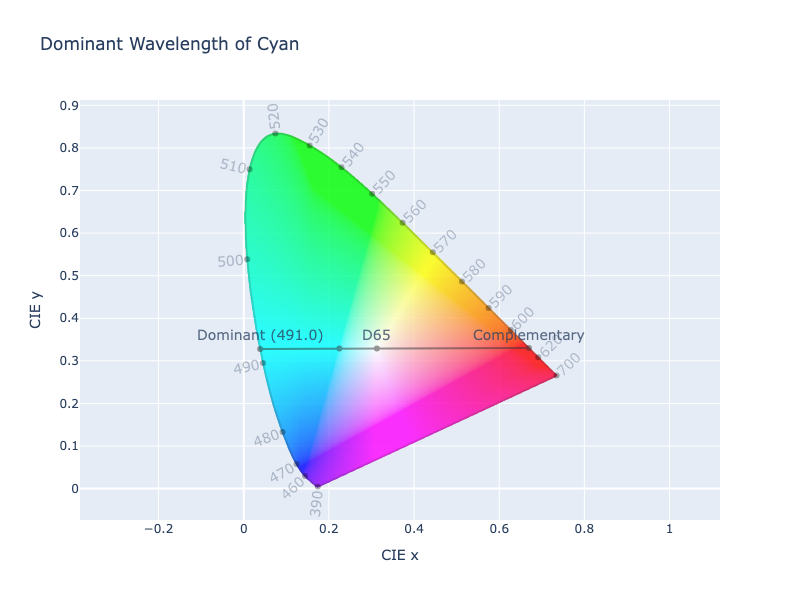
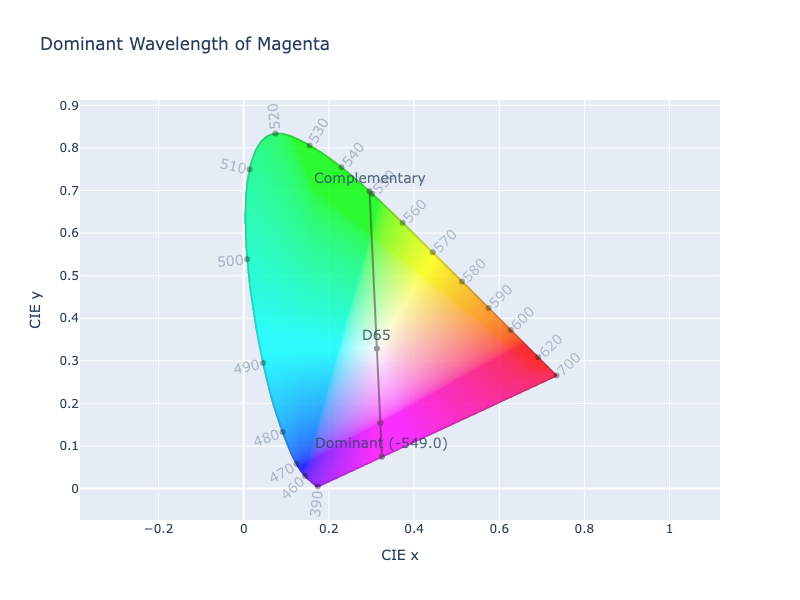

 Wavelengths

Visible light is the portion of the electromagnetic spectrum detectable by the human eye, with wavelengths ranging from
approximately 380 nm to 750 nm.

Violet light has the shortest (highest energy) visible wavelengths, around 380–450 nm.  Red light has the longest
(lowest energy) visible wavelengths, around 620–750 nm. 

Light  | Wavelength
------ | ----------
Violet | 380–450 nm
Blue   | 450–495 nm
Green  | 495–570 nm
Yellow | 570–590 nm
Orange | 590–620 nm
Red    | 620–750 nm

/// table-caption
Approximate wavelengths of light.
///

## Estimate Dominant Wavelength of Color

Colors are made up of certain frequencies of light, sometimes multiple if they are not a pure frequency. In color
science, colors can be classified by their dominant wavelength.

Dominant wavelengths are acquired by drawing a line from the white point through the color to the edge of the horseshoe
shape of the spectrum. The intersection on that line would be the dominant wavelength. If the line was extended in the
opposite direction, the intersection on the other side of the spectral locus would be complementary wavelength.



It is common to see these wavelengths depicted relative to the illuminant E, but often they are calculated relative to
the current working illuminant. It should be noted that since these wavelengths are calculated relative to a specific
white point, the values can vary depending on what white point is chosen.

Colors in the direction of the bottom line, often referred to as the "line of purples", don't really have a dominant
wavelength because purples cannot be defined by a pure wavelength because they do not represent monochromatic light. In
these cases, the complementary wavelength is used. They are denoted with a negative sign.



In ColorAide, we can call the `wavelength()` function to acquire the closest, dominant wavelength (between 360 - 780 nm).
This will return the dominant wavelength and two intersection points, usually these intersection points will be the same.

```py play
Color('cyan').wavelength()
```

If a color is in the direction of the "line of purples", the complementary wavelength is returned with a negative sign,
but the coordinates will be returned with the first one as an intersection with the "line of purples", and the second
will be associated with the complementary wavelength..

```py play
Color('magenta').wavelength()
```

We can also query colors from the perspective of the complementary wavelength. When this is done, the complementary
wavelength is returned with both coordinates representing the intersection of the spectral locus at the closest,
complementary wavelength. If the complementary intersection falls on the "line of purples", then the dominant wavelength
is returned with a negative sign, and the two points will be intersection with the "line of purples" and the
intersection at the dominant wavelength, respectively.

/// html | div#break-down
```py play
Color('cyan').wavelength(complementary=True)
Color('magenta').wavelength(complementary=True)
```

Colors will be evaluated in the current white point as specified by the color space. If it is desired to evaluate a
color from a different white point perspective, a new white point can be chosen.

> [!note]
> During conversions, colors are chromatically adapted, if the white point changes, so the wavelengths of colors will
> shift if they are converted. When we evaluate in different white points, we take the xy coordinates relative to the
> current white point which should preserve the wavelengths, assuming the color space transformation to the xy
> coordinates does not introduce errors.

```py play
from coloraide.cat import WHITES
Color('magenta').wavelength()
Color('magenta').wavelength(white=WHITES['2deg']['E'])
```

/// html | div#breakdown
> [!tip]
> It should be noted that the general implementation as described above for approximating wavelengths can be become more
> difficult at higher wavelengths (typically 700 nm in the red-orange region) due to the non-linear shape of the spectral
> locus in that area. As wavelengths approach 700 nm, the curve becomes steeper and more curved, making precise
> interpolation between discrete data points on the locus more challenging.
>
> Additionally, chromaticity coordinates for high-wavelength sources are more sensitive to small measurement errors, and
> the CIE 1931 color matching functions have lower sensitivity in the deep red region, which can reduce the accuracy of
> chromaticity calculations.  This, combined with the complex geometry of the spectral locus, makes the intersection
> point harder to determine reliably using simple interpolation methods.
>
> Do the way the wavelengths clump and curl in the 700+ nm region, it is possible to get multiple intersections, with
> multiple wavelengths. ColorAide simply takes the first as it evaluates wavelengths from lowest to highest. Other
> methods would need to be employed to more accurately handle colors at wavelengths beyond 700 nm. In ColorAide, results
> will be most reliable in the range up to 700 nm, assuming color space transformations introduce no additional error
> beyond what can be tolerated.
>
> ```py play
> Color.from_wavelength('xyz-d65', 698, scale=False).wavelength()[0]
> Color.from_wavelength('xyz-d65', 699, scale=False).wavelength()[0]
> Color.from_wavelength('xyz-d65', 700, scale=False).wavelength()[0]
> Color.from_wavelength('xyz-d65', 705, scale=False).wavelength()[0]
> Color.from_wavelength('xyz-d65', 780, scale=False).wavelength()[0]
> ```
///

## Colors from Wavelengths

ColorAide also offers a way to generate colors from a given wavelength. Wavelengths are allowed in the range of 360-780
nm.

```py play
Color.interpolate([Color.from_wavelength('xyz-d65', r) for r in range(360, 780, 1)])
```

In order to convert a color from a wavelength, we simply use the Color Matching Functions (CMFs) and look up the
wavelength. If the wavelength is not specifically in the table, we interpolate the value from the closest wavelength.
From this, we extract the XYZ coordinates and scale them such that they are visible within an RGB gamut, preferably
a linear gamut, and returned in the specified color space. The default scaling color space is linear sRGB
(`srgb-linear`).

```py play
Color.from_wavelength('srgb', 405).wavelength()
```

Colors will have the best results if they are specified with a target color space and a linear scaling space which have
a common white point. Colors are created. For instance, ProPhoto uses a D50 white point, so it would be best to scale
in `prophoto-rgb-linear` instead of something like `rec2020-linear` that has a D65 white point.

```py play
Color.from_wavelength('prophoto-rgb', 405, scale_space='prophoto-rgb-linear').wavelength()
Color.from_wavelength('prophoto-rgb', 405, scale_space='rec2020-linear').wavelength()
```

> [!tip]
> While colors can be created in the range of 360 - 780 nm, evaluating the wavelength via `wavelength()` in the range
> of 700+ nm may be in accurate. Read [here](#breakdown) to learn why.

Converting a color from the original target space, if changing white points, will alter the wavelength of the color
due to chromatic adaptation.

If it is desired, scaling can be turned off, and the color will be created from the raw, unscaled XYZ coordinates.

```py play
Steps(
	[
		c.clip()
		for c in Color.steps(
			[Color.from_wavelength('srgb', r, scale=False) for r in range(380, 751, 1)],
			steps=500
		)
	]
)
```
